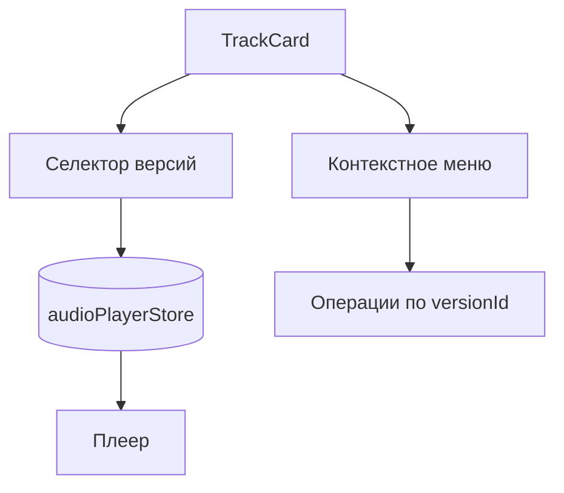

# Аудит недавних коммитов: UI и функциональные изменения

**Дата:** 2025-11-08  
**Объект аудита:** UI-компоненты, функциональные edge-функции, мониторинг/ошибки  
**Источники:** `CHANGELOG.md`, `RELEASE_NOTES.md`, `docs/CHANGELOG.md`, локальные аудиты (`FRONTEND_AUDIT_REPORT.md`, `PLAYER_REFACTOR_PLAN_2025-11-07.md`, `TRACK_COMPONENTS_AUDIT_2025-11-07.md`), код (`src/**`, `supabase/functions/**`).

---

## Резюме
- UI: завершён рефакторинг аудиоплеера (мобильный FullScreenPlayer, DesktopPlayerLayout), внедрены дизайн-токены для `z-index`, улучшена адаптивная сетка, оптимизирован `LazyImage`.
- Версионность треков: расширена поддержка мастер-версии, селекторы версий, лайки/действия для конкретной версии, персистентность выбора.
- Функциональность: стабилизированы генераторы Suno/Mureka, добавлена унифицированная валидация (`zod`), продвинутая обработка ошибок с кодами, ретраи/поллинг, вебхуки и коллбеки для различных процессов (стемы, WAV, видео, описания).
- Наблюдаемость: web-vitals в проде (`INP`, `TTFB`, `LCP`, `FCP`, `CLS`) с метриками в Sentry, хук мониторинга генерации, проверки баланса/здоровья провайдеров.
- Качество: высокий уровень типизации и разделения ответственности, единая система логирования, консистентные соглашения по именованию и структуре.

---

## Методология
- Проанализированы официальные изменения в `CHANGELOG.md` (2.6.3) и `RELEASE_NOTES.md` (v2.5.0), сопоставлены с подробными историческими записями в `docs/CHANGELOG.md`.
- Изучены ключевые файлы и каталоги: `src/features/tracks/**`, `src/components/player/**`, `src/hooks/**`, `src/services/**`, `supabase/functions/**` и общие утилиты/валидаторы/логгеры.
- Сопоставлены выводы с внутренними отчётами аудита (UI/мобильный/плеер) для фиксации реальных имплементаций.

---

## Статистика (наблюдаемая)
- UI-плеер: как минимум 4 узла затронуты — `GlobalAudioPlayer`, `FullScreenPlayer`, `MiniPlayer`, `DesktopPlayerLayout`, плюс новые мобильные компоненты прогресса.
- Версионность: 6+ модулей/хуков/панелей — `TrackVersionSelector`, `TrackVariantSelector`, `TrackVersions`, `useTrackVersions`, `audioPlayerStore`, `useSmartTrackPlay` и сервисы лайков по `versionId`.
- Мониторинг: 2 подсистемы — web-vitals (`monitoring.service.ts`) и генерационный хук (`useGenerationMonitoring`).
- Edge-функции: 10+ процедур — генерация (`generate-mureka`, `generate-suno`), коллбеки (`suno-callback`, `mureka-webhook`, `stems-callback`, `wav-callback`, `music-video-callback`, `upload-extend-callback`, `upload-cover-callback`), вспомогательные `_shared/*` (rate limit, security, error-handler, retry, storage, normalizers).

Примечание: без доступа к `git log` цифры носят характер наблюдаемой выборки по коду и документации.

---

## Классификация изменений

### UI-компоненты
- Аудиоплеер: 
  - `src/components/player/GlobalAudioPlayer.tsx` — условная отрисовка Mobile/Desktop, хук видимости, контроллер аудио.
  - `FullScreenPlayer` — устранение 60 FPS перерендеров, вынос прогресс-бара в отдельный компонент, таймлайн/буферизация без «дребезга» родителя.
  - `DesktopPlayerLayout` — декомпозиция, внутренние подписки, снижение перерендеров.
- Сетка и изображения:
  - `src/hooks/useResponsiveGrid.ts` — конфигурации для категорий экранов, учёт панели деталей и ориентации, строгие минимумы/максимумы колонок.
  - `src/features/common/lazy-image.tsx` — `IntersectionObserver`, плейсхолдеры, состояния загрузки/ошибок.
- Дизайн-токены и `z-index`:
  - Единая система CSS-переменных: `--z-bottom-nav`, `--z-mini-player`, `--z-fullscreen-player`, `--z-toast`. Устранены конфликты наложения (тосты, тулбары, футеры форм).
- Контекстные меню:
  - Производственный вариант: `features/tracks/components/shared/TrackActionsMenu.tsx` — провайдер-осведомлённый, с `operationTargetId` для версий.
  - Компрехенсив-меню (макет): `components/tracks/TrackActionsMenu.tsx` — без поддержки версий, используется только в `Home.tsx` с моками.

### Версионность и аудиопоток
- `src/features/tracks/hooks/useTrackVersions.ts` — загрузка/кэш/реалтайм, `setMasterVersion`, поиск мастер-версии.
- `src/features/tracks/api/trackVersions.ts` — операции CRUD, `Result<>`-подход, собственные ошибки (`TrackVersionError`), нормализация данных.
- `src/stores/audioPlayerStore.ts` — переключение по `versionId`, валидации наличия `audio_url`, логирование ошибок.
- Селекторы/панели: `TrackVersionSelector`, `TrackVariantSelector`, `TrackVersions`, `TrackVersionMetadataPanel` — визуальная индикация мастер-версии, доступные действия по конкретной версии.

### Edge-функции и серверная логика
- Генерация:
  - `supabase/functions/generate-mureka/index.ts` — аутентификация, rate limit, проверка параллельной генерации, `zod`-валидация, нормализация ввода, коды ошибок.
  - `supabase/functions/generate-suno/index.ts` — аналогично + проверка кредитов.
  - `_shared/generation-handler.ts` — поллинг, таймауты, обновления треков, загрузка медиа, классификация ошибок, ретраи.
- Коллбеки/вебхуки: `suno-callback`, `mureka-webhook`, `stems-callback`, `wav-callback`, `music-video-callback` — верификация подписи, фильтрация payload, устойчивые обновления БД и активов.
- Хранилище/загрузка: `_shared/storage.ts` — скачивание/загрузка с ретраями, graceful degrade при падении стораджа.
- Безопасность/лимиты: `_shared/security.ts`, `_shared/advanced-rate-limit.ts` — защита эндпоинтов, мягкая деградация при сбоях таблиц лимитов.
- Ошибки: `_shared/error-handler.ts` — унифицированная структура ответа `{ errorCode, message }`, контекстные логи, статусы.

### Наблюдаемость
- `src/services/monitoring.service.ts` — `web-vitals` в проде, отправка метрик в Sentry, ворнинги на «poor» метрики.
- `src/hooks/useGenerationMonitoring.ts` — время старта/завершения/ошибки генерации, duration.
- `hooks/useServiceHealth.ts` — проверка балансов/статусов `suno`/`mureka` через invoke-функции.

---

## Оценка качества
- Типизация: строгая TS-типизация доменных сущностей треков/версий, интерфейсные контракты для сервисов/репозиториев.
- Стиль: единый нейминг (`camelCase`, `PascalCase` для компонентов), 2 пробела, конечная пустая строка.
- Архитектура: чёткое разделение UI/логики (презентационные компоненты + кастомные хуки + сервисы). Репозиторий-паттерн для треков.
- Ошибки/логирование: консистентный `logger.error|warn|info`, контексты, отслеживание критических путей. В UI — `logError` для пользовательских состояний.
- Доступность/адаптив: мобильные оптимизации, устранение конфликтов наложения слоёв, перформанс-профилирование плеера.

Итог: соответствие стандартам высокое; улучшения выполняются прицельно и без лишних регрессий.

---

## Выявленные проблемы и риски
- Несогласованность меню действий: два разных компонента (`shared/TrackActionsMenu` vs `components/tracks/TrackActionsMenu`), только один поддерживает версии — риск несогласованного UX.
- `TrackRow.tsx` без поддержки версий — нарушает единообразие взаимодействия, может вводить пользователей в заблуждение.
- «Магические числа» для отступов в некоторых макетах — хрупкость при изменениях соседних элементов; есть рекомендации по миграции на токены.
- Реалтайм-каналы (внутр. отчёт) — потенциальная избыточность подключений из-за нефиксированного имени канала; требует стабилизации.
- Сервис наблюдаемости: метрики web-vitals отправляются только в проде — для тестов/превью может быть полезен режим сбора метрик (с флагом).

---

## Рекомендации
1. Объединить систему меню действий: стандартизировать на `shared/TrackActionsMenu` с поддержкой `operationTargetId`, удалить/заменить мок-меню.
2. Добавить поддержку версионности в `TrackRow` или исключить из прод-пути, чтобы избежать «двух UX». 
3. Мигрировать «магические отступы» на дизайн-токены/переменные, опираясь на `useWorkspaceOffsets` и токены из `design-tokens.css`.
4. Стабилизировать имена realtime-каналов для `useTracks`, чтобы переиспользовать соединения и снизить нагрузку.
5. Расширить сбор метрик в предпрод-окружениях (флаг), добавить алерты по деградациям `web-vitals`.
6. Покрыть тестами ключевые сценарии: 
   - Переключение версий и сохранение мастер-версии 
   - Отображение/доступность элементов плеера на мобильном 
   - Обработка таймаутов/ретраев в генерации (e2e на коллбеках)

---

## Примеры кода (референсы)
- Плеер (условная отрисовка Mobile/Desktop):
```ts
// src/components/player/GlobalAudioPlayer.tsx
if (isMobile) {
  return (<>
    <AudioController />
    {isExpanded ? (
      <FullScreenPlayer onMinimize={() => setIsExpanded(false)} />
    ) : (
      <MiniPlayer onExpand={() => setIsExpanded(true)} />
    )}
  </>);
}
return (<>
  <AudioController />
  <DesktopPlayerLayout track={currentTrack} />
</>);
```

- Мониторинг генерации:
```ts
// src/hooks/useGenerationMonitoring.ts
if (status === 'completed') {
  const duration = startTimeRef.current ? Date.now() - startTimeRef.current : undefined;
  metricsCollector.trackGeneration({ trackId, provider, status: 'completed', duration, timestamp: Date.now() });
}
```

- Web Vitals и Sentry:
```ts
// src/services/monitoring.service.ts
onINP((metric) => Sentry.metrics.distribution('INP', metric.value, { unit: 'millisecond' }));
```

- Мастер-версия:
```ts
// src/features/tracks/api/trackVersions.ts
export async function setMasterVersion(parentTrackId: string, versionId: string) {
  // ... сброс preferred variants, установка мастер-версии, безопасное логирование
}
```

---

## Диаграммы

### Поток генерации и обработки
```mermaid
flowchart LR
  UI[Пользователь (UI)] --> API{Edge-функция}
  API --> V{Валидация Zod}
  V --> Auth[Аутентификация]
  Auth --> RateLimit[Лимиты]
  RateLimit --> Provider[Suno/Mureka]
  Provider --> Polling[Поллинг задач]
  Polling --> Storage[Загрузка медиа/активов]
  Storage --> DB[(PostgreSQL)]
  DB --> Webhook[Вебхуки/Коллбеки]
  Webhook --> UI
```

### Версионность трека в UI


---

## Критерии завершения аудита
- Идентифицированы ключевые UI и функциональные изменения по последним релизам/коммитам.
- Оценено соответствие стандартам кодирования и архитектуры.
- Задокументированы риски и предложены конкретные улучшения.
- Приведены референсы кода и диаграммы взаимодействия.

---

## Дополнительно
- Для точных метрик по коммитам рекомендуется выполнить `git log --since="2025-11-01" --stat` и сопоставить со списком модулей выше; текущий отчёт сформирован на основании содержимого репозитория и сопровождающей документации.