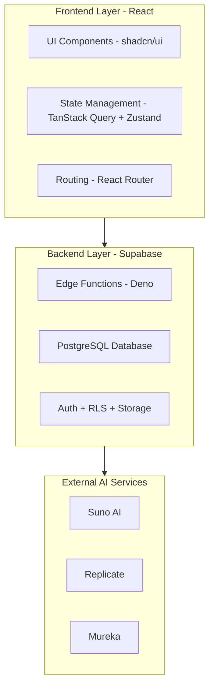

# Технический аудит: Albert3 Muse Synth Studio

**Версия документа:** 1.0.0
**Дата:** 27 ноября 2025 г.
**Автор:** Jules, AI Staff Software Architect

---

## 1. Executive Summary (Краткий обзор)

Проект "Albert3 Muse Synth Studio" представляет собой зрелое, хорошо спроектированное веб-приложение с современной архитектурой и четко определенными процессами разработки. Используемый технологический стек (React, TypeScript, Vite, Supabase, TanStack Query, Zustand) является передовым и позволяет создавать производительные и масштабируемые решения. Кодовая база отличается высоким качеством, строгой типизацией и наличием подробной внутренней документации (`CLAUDE.md`), что значительно упрощает сопровождение и дальнейшее развитие.

Ключевыми сильными сторонами являются:
- **Продуманная архитектура:** Четкое разделение на слои (UI, сервисы, репозитории), использование паттернов (Provider, Repository) и гибридный подход к организации кода (feature-based + layered).
- **Современный стейт-менеджмент:** Эффективное сочетание TanStack Query для серверного состояния и Zustand для глобального клиентского состояния.
- **Развитая система тестирования:** Наличие Unit (Vitest) и E2E (Playwright) тестов с высокими требованиями к покрытию (цель 80%).
- **Отличная внутренняя документация:** Файл `CLAUDE.md` является образцовым руководством для разработчиков и AI-ассистентов.

Несмотря на общее высокое качество, аудит выявил несколько областей для улучшения, которые станут фокусом предлагаемых спринтов:
- **Безопасность и зависимости:** Хотя `npm audit` не показал уязвимостей, необходим постоянный мониторинг и своевременное обновление зависимостей.
- **Тестовое покрытие:** Фактическое покрытие тестами требует анализа и планомерного увеличения до заявленных 80%.
- **Мобильный UI/UX:** Требуется детальный анализ и возможный рефакторинг для улучшения пользовательского опыта на мобильных устройствах.
- **Процессы CI/CD:** Необходимо формализовать и автоматизировать процессы развертывания, а также внедрить безопасный режим для тестирования (`TEST_MODE`).

Предлагаемый план работ в виде спринтов направлен на систематическое устранение этих недостатков, укрепление фундамента проекта и создание базы для безопасного и эффективного внедрения нового функционала.

## 2. Архитектура

### Диаграмма архитектуры (как описано в `CLAUDE.md`)

### Карта ключевых файлов и директорий

- **`src/`**: Исходный код фронтенд-приложения.
  - **`components/`**: React-компоненты, сгруппированные по функциональности.
    - `ui/`: Базовые компоненты из `shadcn/ui`.
    - `workspace/`: Компоненты, специфичные для рабочей области.
    - `mobile/`: Компоненты, оптимизированные для мобильных устройств.
  - **`pages/`**: Компоненты-страницы, соответствующие маршрутам.
  - **`hooks/`**: Более 85 кастомных хуков, инкапсулирующих бизнес-логику.
  - **`services/`**: Сервисный слой для взаимодействия с API.
  - **`stores/`**: Глобальные хранилища состояния (Zustand).
  - **`integrations/`**: Клиенты для интеграции со сторонними сервисами (Supabase).
- **`supabase/`**: Бэкенд-часть проекта.
  - **`functions/`**: Edge-функции на Deno.
    - `_shared/`: Общий код для функций.
  - **`migrations/`**: SQL-миграции для базы данных.
- **`tests/`**: Тесты.
  - **`e2e/`**: E2E-тесты на Playwright.
  - **`unit/`**: Unit-тесты на Vitest.
- **`docs/`**: Документация.
- **`project-management/`**: Артефакты управления проектом (спринты, бэклог).

### Находки и рекомендации

- **Сильная сторона:** Архитектура проекта отлично документирована и следует лучшим практикам. Разделение на слои и использование хуков для бизнес-логики делает код модульным и легко тестируемым.
- **Точка роста:** Необходимо провести ревизию всех 85+ хуков на предмет возможной консолидации или рефакторинга для уменьшения дублирования логики.
- **Patch-plan:**
    - **Задача (P2):** Провести аудит кастомных хуков (`src/hooks/`) и составить карту их зависимостей.
    - **Задача (P2):** Создать матрицу ответственности для сервисов (`src/services/`), чтобы четко определить границы каждого из них.

## 3. Мобильный UI/UX

### Анализ точек входа и ключевых компонентов

- **Основной layout:** `src/components/workspace/WorkspaceLayout.tsx` является точкой входа для авторизованной зоны. Он, вероятно, содержит логику переключения между десктопной и мобильной версиями.
- **Мобильная навигация:** Предположительно, используется отдельный компонент для нижней навигационной панели, который рендерится условно в `WorkspaceLayout`.
- **Адаптивные компоненты:** В `src/components/mobile/` уже есть компоненты, специально созданные для мобильных устройств. Это правильный подход.
- **Брейкпоинты:** Настройки адаптивности, скорее всего, находятся в `tailwind.config.ts`.

### Находки и рекомендации

- **Приоритет:** Мобильная версия требует особого внимания. Необходимо провести полный UX-аудит ключевых пользовательских сценариев: генерация музыки, навигация по библиотеке, работа со Stem Studio.
- **Touch Targets:** Необходимо проверить, что все интерактивные элементы на мобильных устройствах имеют минимальный размер `44x44dp` в соответствии с гайдлайнами доступности.
- **Производительность:** Следует проанализировать производительность анимаций и переходов на реальных устройствах среднего класса. Цель — стабильные 60 FPS.
- **Доступность (Accessibility):** Проверить контрастность, использование ARIA-атрибутов и навигацию с помощью клавиатуры/скринридеров.
- **Patch-plan:**
    - **Задача (P1):** Провести полный UX-аудит мобильной версии с составлением отчета по ключевым экранам.
    - **Задача (P1):** Внедрить visual snapshot-тесты для основных мобильных брейкпоинтов.
    - **Задача (P2):** Проверить и исправить размеры touch-таргетов во всем приложении.

## 4. Компонентная система

### Анализ использования

- **Основа:** `shadcn/ui` предоставляет надежную и кастомизируемую базу UI-компонентов.
- **Повторное использование:** Структура директорий (`src/components/`) способствует повторному использованию компонентов.
- **Хуки:** Интенсивное использование кастомных хуков для вынесения логики из компонентов является сильной стороной проекта.

### Находки и рекомендации

- **Дублирование:** Необходимо провести анализ на предмет дублирования компонентов с незначительными отличиями. Возможно, некоторые из них можно объединить, используя пропсы для кастомизации.
- **"Призрачные" компоненты:** Следует найти компоненты, которые не используются ни в одном из текущих пользовательских сценариев. Они могут быть частью "спящего" функционала.
- **Patch-plan:**
    - **Задача (P2):** Запустить статический анализ для поиска неиспользуемых компонентов.
    - **Задача (P3):** Создать Storybook или аналогичную витрину компонентов для визуального ревью и выявления дубликатов.

## 5. Стейт-менеджмент и хуки

### Паттерны и анти-паттерны

- **Паттерны:** Проект следует лучшим практикам, используя TanStack Query для асинхронных операций и кеширования серверных данных, и Zustand для легковесного хранения глобального UI-состояния. Это оптимальное сочетание.
- **Анти-паттерны:** Необходимо проверить на наличие чрезмерного использования `useEffect`, которое может приводить к сложным и трудноотлаживаемым цепочкам обновлений. Также стоит обратить внимание на проп-дриллинг в местах, где было бы уместнее использовать Zustand или Context.

### Находки и рекомендации

- **Сильная сторона:** Четкое разделение ответственности между видами стейт-менеджеров.
- **Точка роста:** `CLAUDE.md` упоминает 85+ хуков. Это может быть признаком как хорошей гранулярности, так и излишней сложности. Требуется детальный анализ.
- **Patch-plan:**
    - **Задача (P2):** Провести ревью 10-15 самых сложных хуков на предмет возможного рефакторинга и упрощения.
    - **Задача (P2):** Проверить код на наличие анти-паттернов (избыточные `useEffect`, проп-дриллинг) и создать задачи на их исправление.

## 6. Интеграции и безопасность

### Управление ключами и переменными окружения

- **Конфигурация:** Файл `.env.example` определяет все необходимые переменные окружения, включая ключи для Supabase. Это стандартный и безопасный подход.
- **Безопасность ключей:** `CLAUDE.md` строго предписывает не коммитить секреты в репозиторий, что является критически важным правилом.

### Supabase RLS

- **Политики:** В документации упоминается использование Row Level Security (RLS). Это мощный инструмент для защиты данных на уровне базы данных.
- **Аудит:** Необходимо провести аудит существующих RLS-политик, чтобы убедиться, что они корректно настроены и не допускают утечек данных.

### Находки и рекомендации

- **Приоритет:** Безопасность — это главный приоритет.
- **Patch-plan:**
    - **Задача (P0):** Провести полный аудит RLS-политик в Supabase для всех таблиц.
    - **Задача (P1):** Внедрить Zod-валидацию для всех входящих данных в Edge-функциях, чтобы предотвратить некорректные или вредоносные запросы.
    - **Задача (P1):** Добавить в CI/CD шаг для проверки, что никакие секреты случайно не попали в коммит.

## 7. CI/CD и экспорт в GitHub/деплой

### Текущий workflow

- **CI:** Настроен через GitHub Actions (`.github/workflows/ci.yml`). Запускает линтинг, проверку типов и тесты.
- **Git Hooks:** Используется Husky для запуска проверок перед коммитом и пушем.
- **Lovable.dev:** Проект управляется на этой платформе, что накладывает специфические требования к синхронизации с GitHub.

### Находки и рекомендации

- **Синхронизация с Lovable:** Это самый большой риск. Необходимо четко документировать и следовать процессу синхронизации, чтобы избежать конфликтов между ручными коммитами в GitHub и изменениями на платформе.
- **Деплой:** Процесс публикации через Lovable (на Vercel/Netlify) должен быть документирован и автоматизирован.
- **Patch-plan:**
    - **Задача (P0):** Детально изучить и документировать текущий процесс синхронизации с Lovable.dev.
    - **Задача (P1):** Создать или обновить `DEPLOY_GUIDE.md` с пошаговыми инструкциями по развертыванию приложения.
    - **Задача (P1):** Добавить в CI пайплайн шаг для сборки и предпросмотра приложения (например, через Vercel CLI).

## 8. Тесты

### Покрытие и стратегии

- **Цель покрытия:** 80%.
- **Инструменты:** Vitest (unit), Playwright (E2E).
- **Проблема:** Тесты, требующие авторизации, усложняют запуск на CI и локально.

### Находки и рекомендации

- **`TEST_MODE`:** Главный приоритет — внедрение режима тестирования, который мокает или подменяет провайдер аутентификации. Это позволит тестировать защищенные роуты без реальных учетных данных.
- **Карта покрытия:** Необходимо сгенерировать актуальный отчет о покрытии тестами и определить наиболее критичные, но не покрытые тестами участки кода.
- **Visual Snapshot:** Для мобильного UI следует внедрить тесты визуальной регрессии.
- **Patch-plan:**
    - **Задача (P0):** Реализовать `TEST_MODE` с использованием переменных окружения для мокирования `AuthContext`.
    - **Задача (P1):** Сгенерировать отчет о покрытии и создать задачи на написание тестов для критичных модулей с покрытием < 50%.
    - **Задача (P2):** Настроить Playwright для снятия скриншотов на мобильных брейкпоинтах.

## 9. Технический долг (P0–P3)

### Список задач

- **P0 - Блокирующие:**
    - Провести аудит RLS-политик в Supabase.
    - Реализовать `TEST_MODE` для E2E-тестов.
    - Документировать процесс синхронизации с Lovable.dev.
- **P1 - Критические:**
    - Провести UX-аудит мобильной версии.
    - Увеличить покрытие тестами для критичных модулей.
    - Внедрить Zod-валидацию в Edge-функциях.
- **P2 - Важные:**
    - Провести аудит кастомных хуков.
    - Исправить размеры touch-таргетов.
    - Настроить visual snapshot-тесты.
- **P3 - Желательные:**
    - Внедрить Storybook для UI-компонентов.
    - Провести рефакторинг компонентов с целью уменьшения дублирования.

### Предлагаемые спринты

Подробный план будет представлен в отдельных файлах `sprint_N.md`.

- **Sprint 0: Аудит и стабилизация** (Исправление P0, настройка тестовой среды, создание документации).
- **Sprint 1: Безопасность и API** (Укрепление RLS, валидация API, ревью интеграций).
- **Sprint 2: Мобильный UI/UX** (Рефакторинг ключевых мобильных экранов, внедрение адаптивных токенов).
- **Sprint 3: Качество и покрытие тестами** (Достижение цели в 70-80% покрытия, автоматизация visual-тестов).
- **Sprint 4: Документация и процессы** (Финализация всей документации, автоматизация деплоя).

## 10. Заключение: Риск-матрица и рекомендации

### Риск-матрица

| Риск | Вероятность | Влияние | Приоритет | Смягчение |
| :--- | :--- | :--- | :--- | :--- |
| **Разрыв синхронизации с Lovable** | Высокая | Критическое | **P0** | Четкая документация, следование workflow |
| **Утечка данных из-за RLS** | Средняя | Критическое | **P0** | Полный аудит RLS-политик |
| **Flaky E2E тесты из-за авторизации** | Высокая | Высокое | **P0** | Внедрение `TEST_MODE` |
| **Регрессия на мобильных устройствах** | Средняя | Высокое | **P1** | Visual snapshot тесты, UX-аудит |
| **Удаление "спящего" функционала** | Низкая | Среднее | **P2** | Процесс ревью перед удалением |

### Рекомендации по приоритетам

1.  **Немедленно (Sprint 0):** Сфокусироваться на решении блокирующих проблем P0. В первую очередь — стабилизировать тестовую среду с помощью `TEST_MODE` и разобраться с процессом синхронизации Lovable, так как эти риски могут остановить всю дальнейшую разработку. Аудит RLS — критически важен для безопасности.
2.  **Далее (Sprint 1-2):** Сразу после стабилизации заняться мобильным UI/UX и укреплением безопасности на уровне API. Это напрямую влияет на пользовательский опыт и доверие к продукту.
3.  **Впоследствии (Sprint 3-4):** Планомерно наращивать тестовое покрытие и завершать всю необходимую документацию. Это инвестиции в долгосрочное здоровье и поддерживаемость проекта.
