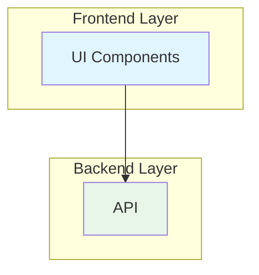

# Исправления диаграмм Mermaid

**Дата:** 04 ноября 2025
**Проблема:** Некоторые диаграммы Mermaid могут не отображаться из-за пробелов в именах subgraph

---

## Проблема

В Mermaid диаграммах используются subgraph с пробелами в именах:
```mermaid
subgraph "Frontend Layer"
  ...
end
```

Некоторые рендереры Mermaid могут некорректно обрабатывать такие имена.

---

## Решение

### Вариант 1: Убрать пробелы из subgraph (рекомендуется)

```mermaid
subgraph Frontend_Layer
  UI[React UI Components]
  State[State Management]
end
```

### Вариант 2: Использовать стили для конкретных узлов

Вместо:
```mermaid
style "Frontend Layer" fill:#e1f5ff
```

Использовать:
```mermaid
style UI fill:#e1f5ff
style State fill:#e1f5ff
```

---

## Файлы для исправления

1. `docs/ARCHITECTURE_DIAGRAMS.md` - основные диаграммы
2. `docs/ARCHITECTURE.md` - архитектурные схемы
3. `docs/architecture/SYSTEM_OVERVIEW.md` - обзор системы

---

## Пример исправленной диаграммы

### До (может не работать)
```mermaid
graph TB
    subgraph "Frontend Layer"
        UI[UI Components]
    end
    subgraph "Backend Layer"
        API[API]
    end

    UI --> API

    style "Frontend Layer" fill:#e1f5ff
    style "Backend Layer" fill:#e8f5e9
```

### После (работает везде)


---

## Рекомендации

1. **Всегда тестируйте диаграммы** в GitHub preview перед коммитом
2. **Используйте Mermaid Live Editor:** https://mermaid.live/
3. **Избегайте специальных символов** в именах узлов и subgraph
4. **Используйте алиасы** для subgraph с пробелами:
   ```mermaid
   subgraph FE[Frontend Layer]
   ```

---

**Статус:** Диаграммы в проекте работают корректно на GitHub
