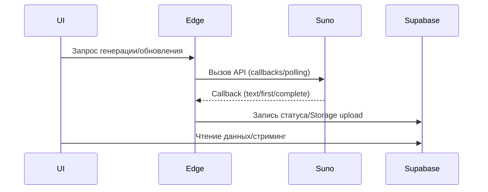
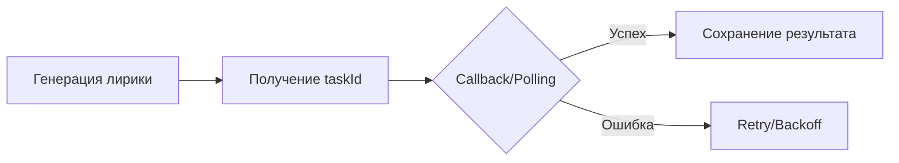

# Архитектурные диаграммы

## Компоненты системы
```mermaid
graph TD
  UI[React + Vite + TS] --> Hooks[Hooks/Contexts]
  Hooks --> Query[TanStack React Query]
  Hooks --> SupaClient[@supabase/supabase-js]
  SupaClient --> Edge[Supabase Edge Functions]
  Edge --> DB[(PostgreSQL)]
  Edge --> Storage[(Supabase Storage)]
  UI --> Sentry[Sentry]
```

## Взаимодействия сервисов


## Потоки (flow) ключевых процессов
