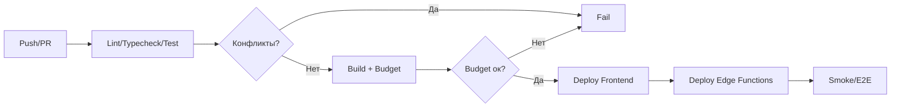

# CI/CD Audit (GitHub Actions/Hooks)

## Хуки
- Husky: pre-commit/pre-push — линт/типизация/тесты.

## CI (GitHub Actions)
- Jobs: typecheck, lint, unit/integration/e2e, bundle-budget, поиск конфликт-маркеров.

## Диаграмма пайплайна

## Рекомендации (TBD)
- Добавить шаг проверки конфликт-маркеров; стабилизировать e2e; бюджеты бандла.