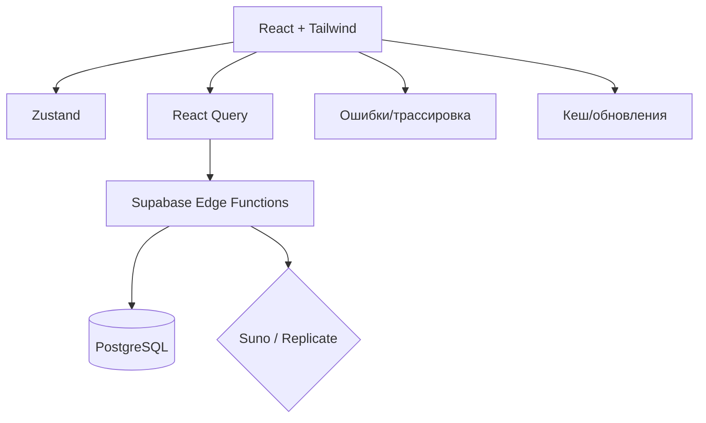

# Технический аудит проекта «Workspace»

Дата: 2025-11-04
Версия аудита: 1.0

## Цели
- Оценить архитектуру, типизацию, производительность и надёжность.
- Проверить работу хуков, интеграций с внешними сервисами и обработку ошибок.
- Обозначить план оптимизации (P0/P1/P2), CI/CD и безопасный деплой.

## Обзор архитектуры
- Фронтенд: `React + Vite + TypeScript + Tailwind`.
- Состояние: локальный `React` + `Zustand` + `React Query` для данных.
- Тесты: `Vitest` (unit/integration), `Playwright` (E2E), настроен `tests/setup.ts`.
- Интеграции: `Supabase (Auth/DB/Edge)`, `Suno`, `Replicate`, `Sentry`.
- Безопасность: CSP в `index.html`, заголовки безопасности, RLS в БД, JWT проверка в Edge функциях.
- Документация: богата, есть гайды по деплою, тестированию и безопасности.

## Качество кода и типизация
- TypeScript строгий (`strict`, `noImplicitAny`, `noUnused*`).
- Обширные unit-тесты присутствуют: `src/**/__tests__`, `tests/unit/**`.
- ESLint покрывает `src` и документацию (через `eslint-plugin-markdown`).
- Рекомендации:
  - Убедиться, что все новые хуки и сервисы имеют тесты минимум на happy-path и основные ошибки.
  - Свести `any` к нулю: использовать доменные типы из `src/types/**` и SSOT для провайдеров.

## Хуки: производительность и стабильность
- Наличие тестов на ключевые хуки: `useTracks`, `useAudioUpload`, `useTrackSync` и др.
- Потенциальные риски:
  - Избыточные подписки на каналы Supabase (проверить отписку `removeChannel`).
  - Мемоизация селекторов Zustand: убедиться в использовании селекторов и равенства (`shallow`).
  - React Query: тюнинг `staleTime`, `cacheTime` для снижения лишних перезапросов.
- Метрики, которые стоит включить:
  - Время рендеринга компонентов (Profiler/`web-vitals`).
  - Количество пересозданий стора и подписок.
  - Размер кеша аудио и время ответа Edge функций.

## Обработка ошибок
- Наличие Sentry и отчётов. Встречаются `console.*` вместо единого логгера.
- Рекомендации:
  - Унифицированный `ErrorBoundary` на уровне `App`/`WorkspaceLayout`.
  - Обёртка API-вызовов в `retryWithBackoff` + централизованный логгер.
  - Graceful degradation: fallback UI для отказов провайдеров (Suno/Replicate).

## Интеграции с внешними сервисами
- Suno/Replicate/Supabase клиенты замоканы в тестах, что хорошо.
- Рекомендации:
  - Добавить контрактные тесты на форматы ответов провайдеров.
  - Ввести защиту от rate-limit: лимитирующий декоратор и троттлинг.

## SEO, PWA и доступность
- `index.html`: тайтл, дескрипшн, OpenGraph, Twitter, CSP — в порядке.
- `public/manifest.json`: PWA-иконки и цвета настроены.
- Service Worker: есть для кеширования аудио и обновлений.
- Недочёты и идеи:
  - Добавить `canonical` и JSON-LD (Organization/WebSite) для улучшения SEO.
  - Внедрить skip-link и чёткие landmark-roles (`header`, `nav`, `main`, `aside`, `footer`).
  - E2E-проверки a11y (axe-core) в ключевых маршрутах.

## GDPR и безопасность
- Реализованы экспорт/удаление данных (Edge функции `gdpr-export`, `gdpr-delete`).
- RLS ограничивает доступ к данным пользователя.
- Настроить «Leaked Password Protection» в Supabase Dashboard.
- Рекомендации:
  - Обновить/добавить страницу Privacy Policy и Cookie Consent (если ещё не в проде).
  - Логи персональных данных: избегать PII в клиентских логах.

## CI/CD и деплой
- Добавлен CI-пайплайн (`.github/workflows/ci.yml`): lint → typecheck → unit-tests → build.
- Скрипт `npm test` добавлен для Vitest.
- Рекомендации:
  - Включить Required Status Checks для `main` в GitHub.
  - Отдельный job для E2E (при наличии секретов окружения) и Lighthouse budgets.
  - Blue-Green стратегия описана в документации — поддержать её алертами и rollback-триггерами.

## Приоритизированный план (Roadmap)
- P0 (критические):
  - Заменить `console` на унифицированный логгер с отправкой в Sentry.
  - Провести ревизию подписок Supabase и гарантировать отписки.
  - Добавить Error Boundary и fallback UI в Workspace.
- P1 (значимые улучшения):
  - Внедрить axe-проверки и Lighthouse budgets в CI.
  - Оптимизировать кэширование React Query и аудио.
  - Добавить контрактные тесты провайдеров.
- P2 (долгосрочные):
  - Ввести SSOT для дизайн-токенов и типизации моделей провайдеров.
  - Перейти на feature flags для рискованных изменений (поэтапный rollout).

## Метрики до/после (предложение)
- Web Vitals: `FCP`, `LCP`, `CLS`, `TTFB`.
- Бандл: суммарный размер и Largest Chunk.
- Хуки: количество ререндеров и среднее время вычислений.
- Ошибки: количество ошибок на тысячу сессий, среднее время до восстановления.

## Вывод
Проект обладает сильной архитектурой, строгой типизацией и хорошим покрытием тестами. Основные улучшения — унификация логирования, усиление a11y/SEO, расширение CI для производительности и автоматизация проверок. Предложенный roadmap позволит безопасно повысить качество и стабильность без даунтайма.