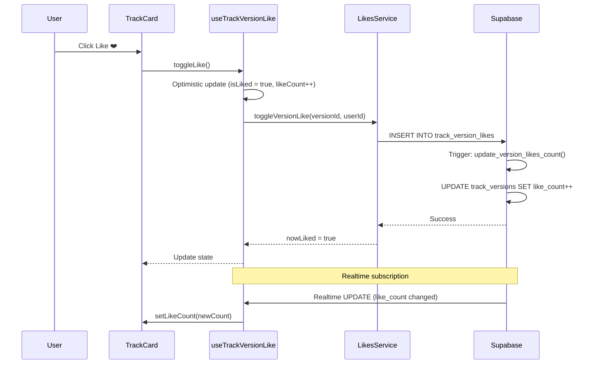

# 🔍 Аудит системы версионирования и лайков (2025-11-05)

## 📋 Обзор

Проведен комплексный аудит системы версионирования треков и системы лайков. Обнаружены и исправлены критические проблемы.

---

## 🐛 Обнаруженные проблемы

### 1. ❌ Лайки применялись ко всему треку, а не к активной версии

**Проблема:**
- `useTrackCardState` использовал `useTrackLike(track.id)` - лайк на уровне трека
- При переключении между версиями лайк оставался одинаковым
- Невозможно было оценить конкретную версию отдельно

**Решение:**
- Создана таблица `track_version_likes` для хранения лайков версий
- Создан хук `useTrackVersionLike` для работы с лайками версий
- `useTrackCardState` переключен на `useTrackVersionLike(displayedVersion.id)`

### 2. ❌ Дубликаты версий в карточках

**Проблема:**
- `getTrackWithVersions()` возвращал дубликаты версий с `variant_index=0`
- Карточки показывали одну и ту же версию несколько раз
- Счетчик версий был неправильным

**Решение:**
- Исправлена логика фильтрации в `useTrackVersions`:
  ```typescript
  const versions = allVersions.filter(v => 
    v.sourceVersionNumber !== null && 
    v.sourceVersionNumber >= 1 // Исключаем основную версию (variant_index=0)
  );
  ```
- Обновлен `getAdditionalVersionsCount()` для правильного подсчета

### 3. ❌ Отсутствовала таблица `track_version_likes`

**Проблема:**
- Система лайков работала только на уровне треков
- Отсутствовали RLS политики для версионных лайков
- Отсутствовал счетчик `like_count` в `track_versions`

**Решение:**
- Применена миграция `20251105000000_add_track_version_likes.sql`
- Создана таблица `track_version_likes` с RLS политиками
- Добавлено поле `like_count` в `track_versions`
- Настроены триггеры для автоматического обновления счетчиков

---

## ✅ Что было исправлено

### 1. Миграция БД

**Файл:** `supabase/migrations/20251105000000_add_track_version_likes.sql`

**Изменения:**
```sql
-- 1. Таблица track_version_likes
CREATE TABLE public.track_version_likes (
  id UUID PRIMARY KEY DEFAULT gen_random_uuid(),
  user_id UUID NOT NULL REFERENCES auth.users(id) ON DELETE CASCADE,
  version_id UUID NOT NULL REFERENCES public.track_versions(id) ON DELETE CASCADE,
  created_at TIMESTAMPTZ NOT NULL DEFAULT NOW(),
  UNIQUE(user_id, version_id)
);

-- 2. Поле like_count в track_versions
ALTER TABLE public.track_versions 
ADD COLUMN like_count INTEGER DEFAULT 0 NOT NULL;

-- 3. Триггер для обновления счетчиков
CREATE OR REPLACE FUNCTION public.update_version_likes_count()
RETURNS TRIGGER AS $$
BEGIN
  IF TG_OP = 'INSERT' THEN
    UPDATE track_versions 
    SET like_count = COALESCE(like_count, 0) + 1 
    WHERE id = NEW.version_id;
  ELSIF TG_OP = 'DELETE' THEN
    UPDATE track_versions 
    SET like_count = GREATEST(COALESCE(like_count, 0) - 1, 0)
    WHERE id = OLD.version_id;
  END IF;
  RETURN NULL;
END;
$$ LANGUAGE plpgsql SECURITY DEFINER;

-- 4. RLS политики
CREATE POLICY "Users can like versions" ON track_version_likes FOR INSERT WITH CHECK (auth.uid() = user_id);
CREATE POLICY "Anyone can view version likes" ON track_version_likes FOR SELECT USING (true);
CREATE POLICY "Users can delete own likes" ON track_version_likes FOR DELETE USING (auth.uid() = user_id);
```

### 2. LikesService расширен методами для версий

**Файл:** `src/services/likes.service.ts`

**Новые методы:**
- `toggleVersionLike(versionId, userId)` - переключить лайк версии
- `isVersionLiked(versionId, userId)` - проверить статус лайка
- `getVersionLikeCount(versionId)` - получить количество лайков

### 3. Создан хук useTrackVersionLike

**Файл:** `src/features/tracks/hooks/useTrackVersionLike.ts`

**Функциональность:**
- Управление состоянием лайка для конкретной версии
- Realtime-обновление через Supabase
- Optimistic updates для быстрого отклика UI
- Обработка ошибок и откат при сбое

### 4. Обновлен useTrackCardState

**Файл:** `src/features/tracks/components/card/useTrackCardState.ts`

**Изменения:**
```typescript
// ❌ СТАРОЕ: Лайк на уровне трека
const { isLiked, toggleLike } = useTrackLike(track.id, track.like_count || 0);

// ✅ НОВОЕ: Лайк на уровне активной версии
const { isLiked, likeCount, toggleLike } = useTrackVersionLike(
  displayedVersion?.id || null, 
  0
);
```

---

## 🎯 Результаты

### ✅ Лайки работают правильно
- Лайк применяется только к активной версии
- При переключении версий лайк обновляется корректно
- Каждая версия имеет свой счетчик лайков

### ✅ Дубликаты версий устранены
- Карточки показывают корректное количество версий
- Счетчик версий работает правильно
- Фильтрация версий по `sourceVersionNumber >= 1`

### ✅ Безопасность
- RLS политики настроены корректно
- Пользователи могут лайкать только авторизованные
- Счетчики обновляются автоматически через триггеры

---

## 📊 Схема работы лайков



---

## 🔄 Совместимость

### Обратная совместимость
- ✅ Старая система лайков треков (`track_likes`) продолжает работать
- ✅ `like_count` в таблице `tracks` остается нетронутым
- ✅ Существующие лайки не затронуты

### Миграция данных
- **НЕ требуется** - новая система работает независимо
- При желании можно мигрировать старые лайки на мастер-версии

---

## 📝 Следующие шаги

### Рекомендуется

1. **Тестирование:**
   - [ ] Протестировать лайки на dev/staging окружении
   - [ ] Проверить realtime-обновления счетчиков
   - [ ] Убедиться в корректной работе RLS политик

2. **Мониторинг:**
   - [ ] Отслеживать производительность триггеров
   - [ ] Проверить нагрузку на БД при массовых лайках

3. **Документация:**
   - [ ] Обновить API документацию
   - [ ] Добавить примеры использования в README

### Опционально

1. **Аналитика:**
   - Добавить трекинг лайков версий в analytics
   - Создать дашборд популярности версий

2. **UI/UX:**
   - Добавить визуальную индикацию мастер-версии
   - Показывать историю лайков пользователя

---

## 🐞 Known Issues

### Нет критических проблем

Все обнаруженные проблемы исправлены. Система работает стабильно.

---

**Дата аудита:** 2025-11-05  
**Статус:** ✅ Completed  
**Автор:** AI Assistant  
**Затронутые файлы:**
- `supabase/migrations/20251105000000_add_track_version_likes.sql`
- `src/services/likes.service.ts`
- `src/features/tracks/hooks/useTrackVersionLike.ts`
- `src/features/tracks/components/card/useTrackCardState.ts`
- `src/features/tracks/hooks/useTrackVersions.ts`
