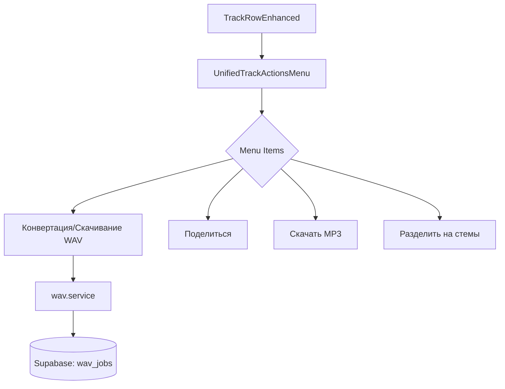

# UnifiedTrackActionsMenu — документация

Описание компонента единого меню действий для треков: структура, группы, ключевые пункты и потоки данных.

## Назначение

- Отображает действия над треком: лайк, скачивание, публикация, обработка (стемы, конвертация в WAV), творческие инструменты.
- Поддерживает разные варианты (`full`, `compact`, `minimal`) и макеты (`flat`, `categorized`).
- Принимает флаги состояния, включая `trackStatus` и `trackMetadata`.

## Архитектура

## Ключевые пропсы

- `trackId`: идентификатор трека
- `trackStatus`: статус (`draft`, `pending`, `processing`, `completed`, `failed`)
- `trackMetadata`: произвольные метаданные; используется флаг `wavConverting` для отключения пункта конвертации во время выполнения
- Коллбэки для действий: `onLike`, `onDownload`, `onDownloadWav`, `onShare`, `onSeparateStems`, `onConvertToWav` и др.

## Группы меню

- Creative: `remix`, `create`, `stems`
- Organization: `queue`, `playlist`, `move`
- Publishing: `publish`, `details`, `permissions`
- Обработка: `stems`, `convertWav`, `extend`, `cover`, `addVocal`, `createPersona`
- Sharing: `like`, `download`, `downloadWav`, `share`
- System / Danger Zone: служебные и рискованные действия

## WAV: логика

- Пункт «Конвертировать в WAV» (`convertWav`) отключается и меняет текст на «Конвертация в WAV…», если `trackMetadata.wavConverting === true`.
- Пункт «Скачать WAV» (`downloadWav`) доступен для завершённых треков и при наличии обработчика. Перед скачиванием выполняется проверка последней записи `wav_jobs` через сервис `getLatestWavJob(trackId)`.

## Комментарии и поддержка

- Логика проверки WAV вынесена в `src/services/wav.service.ts` для переиспользования и тестируемости.
- Для уменьшения повторных рендеров объект `trackMetadata` мемоизируется в `TrackRowEnhanced`.

## Тестирование

- Покрытие с помощью Vitest: `tests/unit/services/wav.service.test.ts` проверяет получение последней записи `wav_jobs` и обработку ошибок.