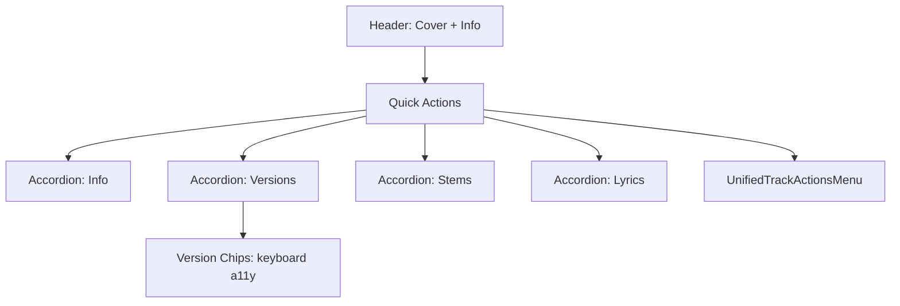

# Компонент: TrackDetailPanel

Описание: компактная панель деталей трека с поддержкой версий, стемов, лайков, скачивания и общего контекстного меню. Реализована с учетом доступности (a11y) и адаптивного отображения.

## Цели

- Единая система управления версиями трека и связанной метаинформацией
- Минималистичный, функциональный и интуитивный UI
- Полная доступность: клавиатура, скринридеры, контраст, логичный фокус

## Структура и состояния

- Блок заголовка: дата создания, длительность активной версии, обложка
- Быстрые действия: воспроизведение, лайк, скачать, поделиться
- Аккордеон секций: Инфо, Версии, Стемы, Лирика
- Контекстное меню: `UnifiedTrackActionsMenu` (версии-ориентированное)

### Состояния

- Загрузка (processing)
- Готово (completed)
- Ошибка (failed)
- Активная/неактивная версия
- Публичный/приватный статус

## API (Props)

- `track`: объект доменной модели трека
- `onClose?`: закрыть панель
- `onDelete?`: удалить трек
- `onDownload?`, `onShare?`, `onSync?` — дополнительные действия

## Доступность (a11y)

- Навигация по версиям через клавиатуру: `role="tablist"`, `role="tab"`, `aria-selected`
- Кнопки быстрых действий имеют `aria-label` и корректные `aria-pressed` для лайка
- Изображения с `alt`, `loading` и `decoding` атрибутами

## Диаграмма



## Пример использования

```tsx
<MinimalDetailPanel
  track={track}
  onClose={() => setOpen(false)}
  onDelete={(id) => deleteTrack(id)}
/>
```

## Ограничения и рекомендации

- Версии без `audio_url` не отображаются как активируемые
- Для больших списков версий используйте виртуализацию
- Иконографии отдавать приоритет над текстом на малых разрешениях