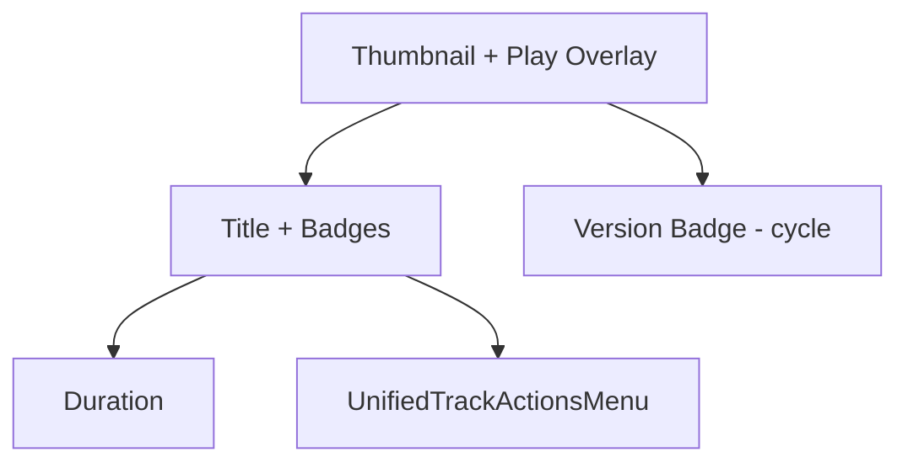

# Компонент: TrackRow (строчный элемент трека)

Описание: элемент списка треков с миниатюрой, заголовком, метками и унифицированным контекстным меню. Поддерживает версии трека и компактный переключатель.

## Цели

- Быстрая навигация и действия по активной версии
- Минималистичный и адаптивный UI
- Единое меню действий во всех компонентах треков

## Структура

- Миниатюра обложки с оверлеем воспроизведения
- Заголовок и краткие метки стиля
- Длительность активной версии
- Компактный переключатель версии (badge `V{n}`)
- Унифицированное контекстное меню (`UnifiedTrackActionsMenu`)

## Доступность

- Кнопка воспроизведения с корректным `aria-label`
- Переключатель версии доступен по клавиатуре (`Enter`/`Space`)
- Фокус-стили и логичный порядок

## Диаграмма



## Пример использования

```tsx
<TrackListItem
  track={track}
  onClick={() => setSelected(track)}
  onShare={() => share(track)}
/>
```

## Ограничения и рекомендации

- Для переключения версии по клику на бадже используется циклический переход
- При большом количестве версий рекомендуется вынести селектор в отдельный компонент