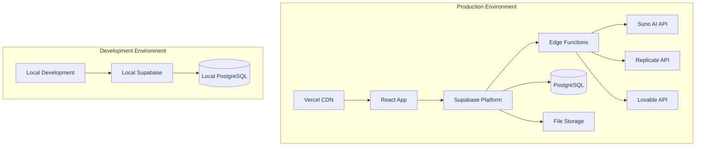

# 🚀 Руководство по развертыванию Albert3 Muse Synth Studio

## 📋 Обзор развертывания

Это руководство описывает процесс развертывания Albert3 Muse Synth Studio - полнофункционального веб-приложения для генерации музыки с использованием ИИ. Проект состоит из фронтенда на React/TypeScript и бэкенда на Supabase Edge Functions.

---

## 🏗️ Архитектура развертывания



---

## 🔧 Предварительные требования

### Системные требования
- **Node.js** >= 18.0.0
- **npm** >= 8.0.0 или **yarn** >= 1.22.0
- **Git** для контроля версий
- **Supabase CLI** для управления бэкендом

### Внешние сервисы
- [Supabase](https://supabase.com) - Backend-as-a-Service
- [Vercel](https://vercel.com) - Хостинг фронтенда
- [Suno AI](https://suno.ai) - API для генерации музыки
- [Replicate](https://replicate.com) - API для обработки аудио
- [Lovable](https://lovable.dev) - API для генерации текстов

---

## 🌍 Варианты развертывания

### 1. 🚀 Быстрое развертывание (Рекомендуется)

#### Шаг 1: Клонирование репозитория
```bash
git clone https://github.com/your-username/albert3-muse-synth-studio.git
cd albert3-muse-synth-studio
```

#### Шаг 2: Установка зависимостей
```bash
npm install
```

#### Шаг 3: Настройка Supabase
```bash
# Установка Supabase CLI
npm install -g supabase

# Логин в Supabase
supabase login

# Создание нового проекта
supabase projects create albert3-muse-synth-studio

# Инициализация локального проекта
supabase init

# Связывание с удаленным проектом
supabase link --project-ref your-project-ref
```

#### Шаг 4: Развертывание на Vercel
```bash
# Установка Vercel CLI
npm install -g vercel

# Развертывание
vercel --prod
```

---

### 2. 🔧 Подробное развертывание

#### A. Настройка Supabase Backend

##### 1. Создание проекта Supabase
1. Перейдите на [supabase.com](https://supabase.com)
2. Создайте новый проект
3. Запишите URL проекта и API ключи

##### 2. Настройка базы данных
```sql
-- Выполните миграции из папки supabase/migrations/
-- Файлы выполняются автоматически при связывании проекта

-- Основные таблицы:
-- - tracks (треки пользователей)
-- - track_likes (лайки треков)
-- - track_versions (версии треков)
-- - track_stems (стемы треков)
-- - user_profiles (профили пользователей)
```

##### 3. Настройка Row Level Security (RLS)
```sql
-- RLS политики уже настроены в миграциях
-- Проверьте их активацию в Supabase Dashboard
ALTER TABLE tracks ENABLE ROW LEVEL SECURITY;
ALTER TABLE track_likes ENABLE ROW LEVEL SECURITY;
ALTER TABLE track_versions ENABLE ROW LEVEL SECURITY;
ALTER TABLE track_stems ENABLE ROW LEVEL SECURITY;
```

##### 4. Развертывание Edge Functions
```bash
# Развертывание всех функций
supabase functions deploy generate-suno
supabase functions deploy generate-lyrics
supabase functions deploy improve-prompt
supabase functions deploy separate-stems
supabase functions deploy generate-music
supabase functions deploy suno-callback
supabase functions deploy stems-callback

# Установка переменных окружения для функций
supabase secrets set SUNO_API_KEY=your_suno_api_key
supabase secrets set REPLICATE_API_KEY=your_replicate_api_key
supabase secrets set LOVABLE_API_KEY=your_lovable_api_key
```

##### 5. Настройка Storage
```bash
# Создание bucket для аудиофайлов
supabase storage create-bucket audio-files --public

# Настройка политик доступа
supabase storage update-policy audio-files \
  --policy-name "Users can upload audio files" \
  --policy-definition "auth.uid() IS NOT NULL"
```

#### B. Настройка Frontend

##### 1. Переменные окружения
Создайте файл `.env.local`:
```bash
# Supabase Configuration
VITE_SUPABASE_URL=https://your-project-ref.supabase.co
VITE_SUPABASE_ANON_KEY=your-anon-key

# Optional: Analytics
VITE_GOOGLE_ANALYTICS_ID=GA_MEASUREMENT_ID
VITE_HOTJAR_ID=your-hotjar-id

# Optional: Error Tracking
VITE_SENTRY_DSN=your-sentry-dsn

# Environment
VITE_ENVIRONMENT=production
```

##### 2. Сборка проекта
```bash
# Сборка для продакшена
npm run build

# Предварительный просмотр сборки
npm run preview
```

##### 3. Развертывание на Vercel

**Автоматическое развертывание:**
1. Подключите GitHub репозиторий к Vercel
2. Настройте переменные окружения в Vercel Dashboard
3. Vercel автоматически развернет при каждом push

**Ручное развертывание:**
```bash
# Установка Vercel CLI
npm install -g vercel

# Логин в Vercel
vercel login

# Развертывание
vercel --prod

# Настройка переменных окружения
vercel env add VITE_SUPABASE_URL
vercel env add VITE_SUPABASE_ANON_KEY
```

---

## 🔐 Настройка безопасности

### 1. Переменные окружения
```bash
# Supabase Edge Functions
SUPABASE_URL=https://your-project.supabase.co
SUPABASE_ANON_KEY=your-anon-key
SUPABASE_SERVICE_ROLE_KEY=your-service-role-key

# External APIs
SUNO_API_KEY=your-suno-api-key
REPLICATE_API_KEY=your-replicate-api-key
LOVABLE_API_KEY=your-lovable-api-key

# Optional Services
GOOGLE_ANALYTICS_ID=your-ga-id
SENTRY_DSN=your-sentry-dsn
HOTJAR_ID=your-hotjar-id
```

### 2. Настройка CORS
```typescript
// В Edge Functions уже настроены CORS заголовки
const corsHeaders = {
  'Access-Control-Allow-Origin': '*',
  'Access-Control-Allow-Headers': 'authorization, x-client-info, apikey, content-type',
  'Access-Control-Allow-Methods': 'POST, GET, OPTIONS, PUT, DELETE',
};
```

### 3. Настройка аутентификации
```bash
# В Supabase Dashboard настройте:
# - Email/Password authentication
# - OAuth providers (Google, GitHub)
# - JWT expiration time
# - Password policies
```

---

## 🌐 Альтернативные платформы развертывания

### 1. Netlify
```bash
# Установка Netlify CLI
npm install -g netlify-cli

# Сборка и развертывание
npm run build
netlify deploy --prod --dir=dist
```

### 2. Railway
```bash
# Создание railway.json
{
  "build": {
    "builder": "NIXPACKS"
  },
  "deploy": {
    "startCommand": "npm run preview",
    "healthcheckPath": "/"
  }
}

# Развертывание через Railway CLI
railway login
railway link
railway up
```

### 3. Render
```yaml
# render.yaml
services:
  - type: web
    name: albert3-muse-synth-studio
    env: node
    buildCommand: npm install && npm run build
    startCommand: npm run preview
    envVars:
      - key: VITE_SUPABASE_URL
        value: https://your-project.supabase.co
      - key: VITE_SUPABASE_ANON_KEY
        value: your-anon-key
```

### 4. AWS Amplify
```yaml
# amplify.yml
version: 1
frontend:
  phases:
    preBuild:
      commands:
        - npm ci
    build:
      commands:
        - npm run build
  artifacts:
    baseDirectory: dist
    files:
      - '**/*'
  cache:
    paths:
      - node_modules/**/*
```

---

## 🔄 CI/CD Pipeline

### GitHub Actions
Создайте `.github/workflows/deploy.yml`:

```yaml
name: Deploy to Production

on:
  push:
    branches: [main]
  pull_request:
    branches: [main]

jobs:
  test:
    runs-on: ubuntu-latest
    steps:
      - uses: actions/checkout@v4
      - uses: actions/setup-node@v4
        with:
          node-version: '18'
          cache: 'npm'
      
      - name: Install dependencies
        run: npm ci
      
      - name: Run tests
        run: npm test
      
      - name: Run linting
        run: npm run lint
      
      - name: Type check
        run: npm run type-check

  build:
    needs: test
    runs-on: ubuntu-latest
    steps:
      - uses: actions/checkout@v4
      - uses: actions/setup-node@v4
        with:
          node-version: '18'
          cache: 'npm'
      
      - name: Install dependencies
        run: npm ci
      
      - name: Build application
        run: npm run build
        env:
          VITE_SUPABASE_URL: ${{ secrets.VITE_SUPABASE_URL }}
          VITE_SUPABASE_ANON_KEY: ${{ secrets.VITE_SUPABASE_ANON_KEY }}
      
      - name: Upload build artifacts
        uses: actions/upload-artifact@v4
        with:
          name: dist
          path: dist/

  deploy:
    needs: build
    runs-on: ubuntu-latest
    if: github.ref == 'refs/heads/main'
    steps:
      - uses: actions/checkout@v4
      
      - name: Deploy to Vercel
        uses: amondnet/vercel-action@v25
        with:
          vercel-token: ${{ secrets.VERCEL_TOKEN }}
          vercel-org-id: ${{ secrets.VERCEL_ORG_ID }}
          vercel-project-id: ${{ secrets.VERCEL_PROJECT_ID }}
          vercel-args: '--prod'

  deploy-functions:
    needs: test
    runs-on: ubuntu-latest
    if: github.ref == 'refs/heads/main'
    steps:
      - uses: actions/checkout@v4
      
      - name: Setup Supabase CLI
        uses: supabase/setup-cli@v1
        with:
          version: latest
      
      - name: Deploy Edge Functions
        run: |
          supabase functions deploy --project-ref ${{ secrets.SUPABASE_PROJECT_REF }}
        env:
          SUPABASE_ACCESS_TOKEN: ${{ secrets.SUPABASE_ACCESS_TOKEN }}
```

---

## 📊 Мониторинг и логирование

### 1. Настройка Sentry (Error Tracking)
```bash
# Установка Sentry (tracing встроен в @sentry/react v8+)
npm install @sentry/react

# Настройка в main.tsx
import * as Sentry from "@sentry/react";

Sentry.init({
  dsn: import.meta.env.VITE_SENTRY_DSN,
  environment: import.meta.env.VITE_ENVIRONMENT,
});
```

### 2. Google Analytics
```typescript
// Настройка в index.html
<script async src="https://www.googletagmanager.com/gtag/js?id=GA_MEASUREMENT_ID"></script>
<script>
  window.dataLayer = window.dataLayer || [];
  function gtag(){dataLayer.push(arguments);}
  gtag('js', new Date());
  gtag('config', 'GA_MEASUREMENT_ID');
</script>
```

### 3. Supabase Analytics
```sql
-- Настройка логирования в Edge Functions
SELECT * FROM supabase_functions.logs 
WHERE function_name = 'generate-suno' 
ORDER BY created_at DESC;
```

---

## 🧪 Тестирование развертывания

### 1. Smoke Tests
```bash
# Проверка доступности приложения
curl -I https://your-app.vercel.app

# Проверка API эндпоинтов
curl -X POST https://your-project.supabase.co/functions/v1/generate-lyrics \
  -H "Authorization: Bearer test-token" \
  -H "Content-Type: application/json" \
  -d '{"theme": "test"}'
```

### 2. End-to-End тесты
```typescript
// cypress/e2e/deployment.cy.ts
describe('Deployment Tests', () => {
  it('should load the application', () => {
    cy.visit('/');
    cy.contains('Albert3 Muse Synth Studio');
  });

  it('should authenticate users', () => {
    cy.visit('/auth');
    cy.get('[data-testid="email-input"]').type('test@example.com');
    cy.get('[data-testid="password-input"]').type('password123');
    cy.get('[data-testid="login-button"]').click();
  });
});
```

---

## 🔧 Устранение неполадок

### Частые проблемы

#### 1. Ошибки сборки
```bash
# Очистка кэша
npm run clean
rm -rf node_modules package-lock.json
npm install

# Проверка версий Node.js
node --version  # Должно быть >= 18.0.0
npm --version   # Должно быть >= 8.0.0
```

#### 2. Проблемы с Edge Functions
```bash
# Проверка логов функций
supabase functions logs generate-suno

# Локальное тестирование функций
supabase functions serve
curl -X POST http://localhost:54321/functions/v1/generate-suno
```

#### 3. Проблемы с переменными окружения
```bash
# Проверка переменных в Vercel
vercel env ls

# Проверка переменных в Supabase
supabase secrets list
```

#### 4. Проблемы с базой данных
```sql
-- Проверка подключения
SELECT version();

-- Проверка миграций
SELECT * FROM supabase_migrations.schema_migrations;

-- Проверка RLS политик
SELECT * FROM pg_policies WHERE tablename = 'tracks';
```

---

## 📈 Оптимизация производительности

### 1. CDN и кэширование
```javascript
// vercel.json
{
  "headers": [
    {
      "source": "/assets/(.*)",
      "headers": [
        {
          "key": "Cache-Control",
          "value": "public, max-age=31536000, immutable"
        }
      ]
    }
  ]
}
```

### 2. Сжатие ресурсов
```javascript
// vite.config.ts
export default defineConfig({
  build: {
    rollupOptions: {
      output: {
        manualChunks: {
          vendor: ['react', 'react-dom'],
          supabase: ['@supabase/supabase-js'],
        },
      },
    },
  },
});
```

### 3. Мониторинг производительности
```typescript
// Performance monitoring
import { getCLS, getFID, getFCP, getLCP, getTTFB } from 'web-vitals';

getCLS(console.log);
getFID(console.log);
getFCP(console.log);
getLCP(console.log);
getTTFB(console.log);
```

---

## 🔄 Обновления и миграции

### 1. Обновление зависимостей
```bash
# Проверка устаревших пакетов
npm outdated

# Обновление пакетов
npm update

# Обновление major версий
npx npm-check-updates -u
npm install
```

### 2. Миграции базы данных
```bash
# Создание новой миграции
supabase migration new add_new_feature

# Применение миграций
supabase db push

# Откат миграции
supabase db reset
```

### 3. Обновление Edge Functions
```bash
# Развертывание обновленных функций
supabase functions deploy function-name

# Откат к предыдущей версии
supabase functions deploy function-name --version previous
```

---

## 📚 Дополнительные ресурсы

### Документация
- [Supabase Documentation](https://supabase.com/docs)
- [Vercel Documentation](https://vercel.com/docs)
- [Vite Documentation](https://vitejs.dev/guide/)
- [React Documentation](https://react.dev/)

### Инструменты мониторинга
- [Vercel Analytics](https://vercel.com/analytics)
- [Supabase Dashboard](https://supabase.com/dashboard)
- [Google PageSpeed Insights](https://pagespeed.web.dev/)
- [WebPageTest](https://www.webpagetest.org/)

### Сообщество и поддержка
- [Supabase Discord](https://discord.supabase.com/)
- [Vercel Discord](https://discord.gg/vercel)
- [GitHub Issues](https://github.com/your-username/albert3-muse-synth-studio/issues)

---

## 📞 Поддержка

Если у вас возникли проблемы с развертыванием:

1. Проверьте [документацию проекта](../README.md)
2. Изучите [известные проблемы](../README.md#known-issues)
3. Создайте [issue на GitHub](https://github.com/your-username/albert3-muse-synth-studio/issues)
4. Обратитесь к [команде разработки](mailto:support@albert3studio.com)

---

*Руководство обновлено: Январь 2025*  
*Версия: 1.0*