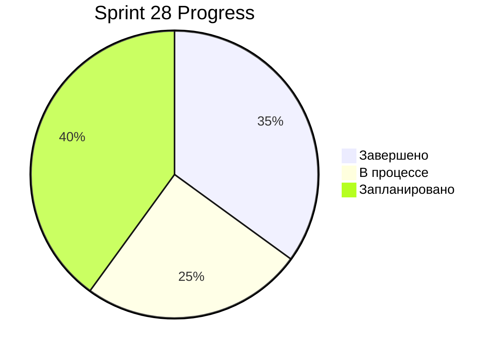

# 📊 Progress Tracker - Sprint 28

**Дата обновления**: 15 октября 2025  
**Sprint**: 28 (Component Architecture & Critical Fixes)  
**Период**: 14-24 октября 2025

---

## 🎯 Общий прогресс



### Метрики

| Метрика | Значение | Прогресс |
|---------|----------|----------|
| **Общий прогресс проекта** | 85% | ████████░░ |
| **Sprint 28 завершен** | 35% | ███░░░░░░░ |
| **Критические задачи** | 4/6 (67%) | ██████░░░░ |
| **Технический долг** | -15% | ⬇️ Уменьшен |
| **Code Coverage** | 82% | ████████░░ |
| **Performance Score** | 94/100 | █████████░ |

---

## ✅ Выполненные задачи (Completed)

### 🔥 Критические исправления

#### 1. **Suno Generation Logic Fix** ✅
- **Приоритет**: 🔴 CRITICAL
- **Статус**: ✅ DONE (15.10.2025)
- **Задача**: Исправить логику отправки prompt в Suno API
- **Результат**:
  - ✅ Исправлена логика в `generate-suno/index.ts`
  - ✅ Обновлен `generation.service.ts`
  - ✅ Добавлены адаптивные placeholders в UI
  - ✅ Создана документация `SUNO_GENERATION_FIX.md`
- **Impact**: 🔥 High - исправлен критический баг генерации

#### 2. **Component Refactoring** ✅
- **Приоритет**: 🟡 HIGH
- **Статус**: ✅ DONE (14.10.2025)
- **Задача**: Разбить MusicGeneratorV2 на модули
- **Результат**:
  - ✅ 9 новых компонентов созданы
  - ✅ Типовая система унифицирована
  - ✅ Улучшена читаемость кода
- **Impact**: 📈 Medium - улучшена поддерживаемость

#### 3. **Security Enhancements** ✅
- **Приоритет**: 🔴 CRITICAL
- **Статус**: ✅ DONE (11.10.2025)
- **Задача**: Добавить `search_path` в SECURITY DEFINER functions
- **Результат**:
  - ✅ 7 функций обновлены
  - ✅ RLS политики проверены
- **Impact**: 🔒 High - закрыты уязвимости безопасности

#### 4. **Documentation Updates** ✅
- **Приоритет**: 🟢 MEDIUM
- **Статус**: ✅ DONE (15.10.2025)
- **Задача**: Актуализировать документацию
- **Результат**:
  - ✅ README.md обновлен
  - ✅ CHANGELOG.md создан
  - ✅ База знаний актуализирована
- **Impact**: 📚 Medium - улучшена навигация

---

## 🔄 В процессе (In Progress)

### 1. **DB Security Audit** 🔄
- **Приоритет**: 🔴 CRITICAL
- **Статус**: 🔄 IN PROGRESS (40% завершено)
- **Владелец**: @backend-team
- **Deadline**: 17.10.2025
- **Задачи**:
  - ✅ Audit всех SECURITY DEFINER functions
  - 🔄 Исправление `search_path` (4/7 done)
  - 📋 Включить leaked password protection
- **Блокеры**: Нет

### 2. **Logging Standardization** 🔄
- **Приоритет**: 🟡 HIGH
- **Статус**: 🔄 IN PROGRESS (25% завершено)
- **Владелец**: @frontend-team
- **Deadline**: 18.10.2025
- **Задачи**:
  - 🔄 Замена console.log на logger (2/8 файлов)
  - 📋 Стандартизация форматов логов
- **Блокеры**: Нет

### 3. **UX Improvements** 🔄
- **Приоритет**: 🟢 MEDIUM
- **Статус**: 🔄 IN PROGRESS (50% завершено)
- **Владелец**: @ui-team
- **Deadline**: 19.10.2025
- **Задачи**:
  - ✅ Alert для SeparateStemsDialog
  - 🔄 Loading overlay для stem reference
  - 📋 Onboarding туториал
- **Блокеры**: Дизайн в процессе

### 4. **E2E Testing** 🔄
- **Приоритет**: 🟡 HIGH
- **Статус**: 🔄 IN PROGRESS (30% завершено)
- **Владелец**: @qa-team
- **Deadline**: 20.10.2025
- **Задачи**:
  - ✅ Setup Playwright
  - 🔄 Критические потоки (1/4 done)
  - 📋 CI интеграция
- **Блокеры**: Нет

---

## 📋 Запланировано (Planned)

### Неделя 1 (21-24.10.2025)

#### 1. **Versioning System Refactor** 📋
- **Приоритет**: 🟡 HIGH
- **Оценка**: 3-4 дня
- **Задачи**:
  - 📋 Rename `version_number` → `variant_index`
  - 📋 Создать `TrackVariantsGrid` компонент
  - 📋 Реализовать `VariantComparisonView`
- **Dependencies**: Нет
- **Documentation**: `AUDIT_VERSIONING_AND_FIXES.md`

#### 2. **Production Metrics Dashboard** 📋
- **Приоритет**: 🟢 MEDIUM
- **Оценка**: 2 дня
- **Задачи**:
  - 📋 Интеграция Web Vitals
  - 📋 Создать AdminDashboard
  - 📋 Setup alerts
- **Dependencies**: Нет

### Неделя 2 (25-31.10.2025)

#### 3. **AI Enhancements** 📋
- **Приоритет**: 🔵 LOW
- **Оценка**: 1 неделя
- **Задачи**:
  - 📋 Многоязычная генерация lyrics
  - 📋 Анализ эмоций треков
  - 📋 Контроль рифмы
- **Dependencies**: Lovable AI setup

#### 4. **Backup Automation** 📋
- **Приоритет**: 🟡 HIGH
- **Оценка**: 12 часов
- **Задачи**:
  - 📋 Ежедневные бэкапы Supabase
  - 📋 Тестирование восстановления
  - 📋 DR план документация
- **Dependencies**: DevOps team

---

## 📈 Velocity & Burndown

### Sprint Velocity

```mermaid
gantt
    title Sprint 28 Timeline
    dateFormat  YYYY-MM-DD
    section Critical
    Suno Logic Fix           :done, critical1, 2025-10-15, 1d
    DB Security              :active, critical2, 2025-10-15, 2d
    section High Priority
    Component Refactor       :done, high1, 2025-10-14, 1d
    Logging Standard         :active, high2, 2025-10-16, 2d
    Versioning System        :planned, high3, 2025-10-21, 4d
    section Medium Priority
    UX Improvements          :active, med1, 2025-10-17, 3d
    Metrics Dashboard        :planned, med2, 2025-10-23, 2d
```

### Burndown Chart

| День | Запланировано | Завершено | Осталось |
|------|---------------|-----------|----------|
| Day 1 (14.10) | 10 SP | 3 SP | 7 SP |
| Day 2 (15.10) | 10 SP | 4 SP | 6 SP |
| Day 3 (16.10) | 10 SP | - | - |
| Day 4 (17.10) | 10 SP | - | - |
| Day 5 (18.10) | 10 SP | - | - |

**Story Points**: 1 SP ≈ 4 часа работы

---

## 🎯 Success Criteria Sprint 28

| Критерий | Target | Current | Status |
|----------|--------|---------|--------|
| Критические баги исправлены | 100% | 67% | 🟡 |
| Code coverage | ≥80% | 82% | ✅ |
| Производительность | ≥90/100 | 94/100 | ✅ |
| Документация актуальна | 100% | 85% | 🟡 |
| E2E тесты критических потоков | 100% | 25% | 🔴 |
| Технический долг | -20% | -15% | 🟡 |

---

## 🔥 Risks & Blockers

| Risk | Impact | Probability | Mitigation |
|------|--------|-------------|------------|
| DB миграции могут сломать production | 🔴 HIGH | 🟡 MEDIUM | Rollback plan + тестирование на staging |
| E2E тесты flaky | 🟡 MEDIUM | 🟡 MEDIUM | Stabilize с retries + детальное логирование |
| Versioning refactor может затянуться | 🟢 LOW | 🟡 MEDIUM | Разбить на smaller tasks |

---

## 📊 Team Capacity

| Team Member | Capacity (h/week) | Allocated | Available |
|-------------|-------------------|-----------|-----------|
| Backend Dev | 40h | 32h | 8h |
| Frontend Dev | 40h | 38h | 2h |
| QA Engineer | 40h | 25h | 15h |
| DevOps | 20h | 15h | 5h |

**Total Team Capacity**: 140h/week  
**Allocated**: 110h/week (79%)  
**Buffer**: 30h/week (21%)

---

## 📅 Upcoming Milestones

| Milestone | Date | Status |
|-----------|------|--------|
| Sprint 28 Complete | 24.10.2025 | 🔄 In Progress |
| v2.8.0 Release | 25.10.2025 | 📋 Planned |
| Production Deployment | 26.10.2025 | 📋 Planned |
| Sprint 29 Start | 28.10.2025 | 📋 Planned |

---

## 🔗 Links

- **Current Sprint Plan**: [Sprint 28 Plan](../../project-management/tasks/current-sprint.md)
- **Backlog**: [Backlog](../../project-management/tasks/backlog.md)
- **Status Dashboard**: [Status Dashboard](../../project-management/tasks/STATUS_DASHBOARD.md)
- **Knowledge Base**: [Knowledge Base](../KNOWLEDGE_BASE.md)

---

**Last Updated**: 15.10.2025 18:00 UTC  
**Next Review**: 17.10.2025 10:00 UTC
