# 🔄 Data Flow Architecture - Albert3 Muse Synth Studio

**Последнее обновление**: 13 октября 2025  
**Версия**: 2.7.1

Этот документ описывает потоки данных в приложении Albert3 Muse Synth Studio, включая взаимодействие между Frontend, Backend (Supabase), внешними API и различными подсистемами.

---

## 📊 Общая схема потоков данных

```mermaid
graph TB
    subgraph "Frontend Layer"
        UI[React Components]
        State[State Management]
        Cache[Client Cache]
        SW[Service Worker]
    end

    subgraph "API Layer"
        Supabase[Supabase Client]
        TanStack[TanStack Query]
    end

    subgraph "Backend Layer"
        Auth[Supabase Auth]
        DB[(PostgreSQL)]
        Storage[Supabase Storage]
        EdgeFunc[Edge Functions]
        Realtime[Realtime Subscriptions]
    end

    subgraph "External Services"
        Suno[Suno AI API]
        Sentry[Sentry Monitoring]
    end

    UI --> State
    State --> TanStack
    TanStack --> Supabase
    UI --> Cache
    Cache --> SW
    
    Supabase --> Auth
    Supabase --> DB
    Supabase --> Storage
    Supabase --> EdgeFunc
    Supabase --> Realtime
    
    EdgeFunc --> Suno
    EdgeFunc --> DB
    EdgeFunc --> Storage
    
    UI --> Sentry
    EdgeFunc --> Sentry
    
    Realtime -.->|Push Updates| UI

    style UI fill:#61DAFB
    style DB fill:#3ECF8E
    style Suno fill:#FF6F61
    style Sentry fill:#362D59
```

---

## 🎵 1. Music Generation Flow

Детальный поток генерации музыки через Suno API с обработкой callbacks и polling.

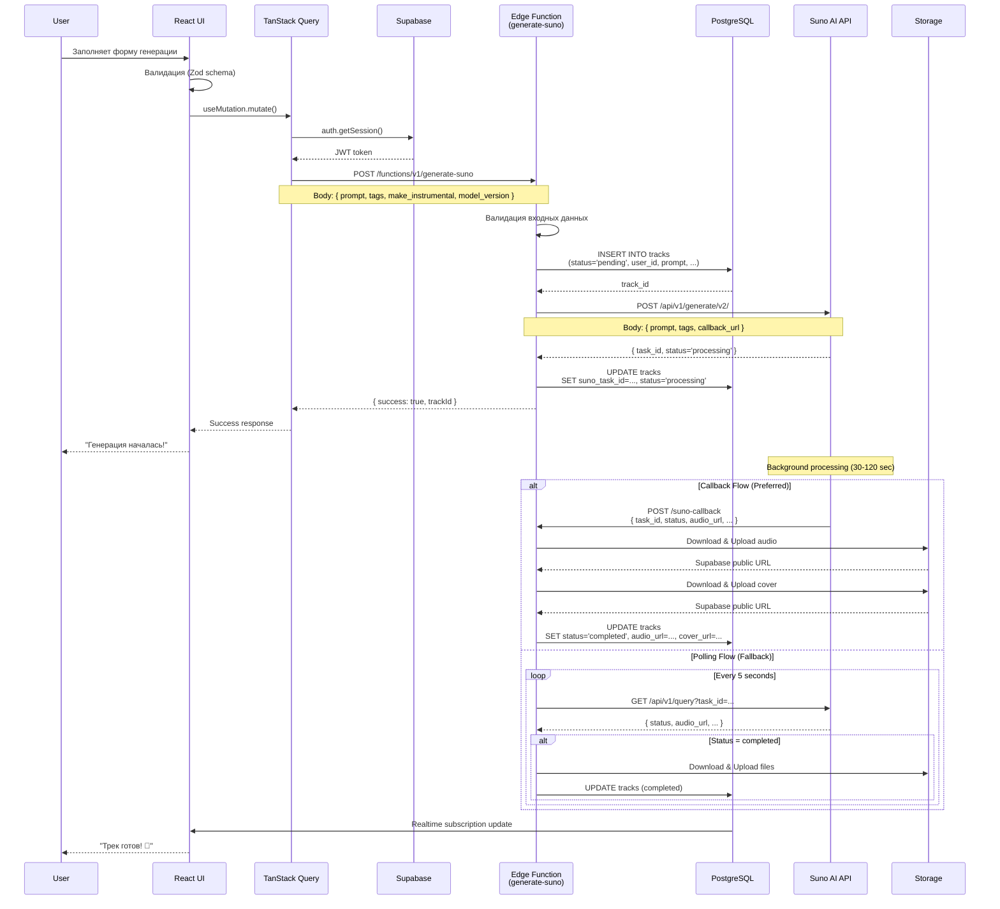

**Ключевые моменты**:
- **Dual-mode**: Callback (приоритет) + Polling (fallback)
- **Storage migration**: Файлы сразу переносятся в Supabase Storage
- **Realtime updates**: UI получает обновления без перезагрузки
- **Error recovery**: Retry mechanism через `track_retry_attempts` таблицу

---

## 🔐 2. Authentication & Authorization Flow

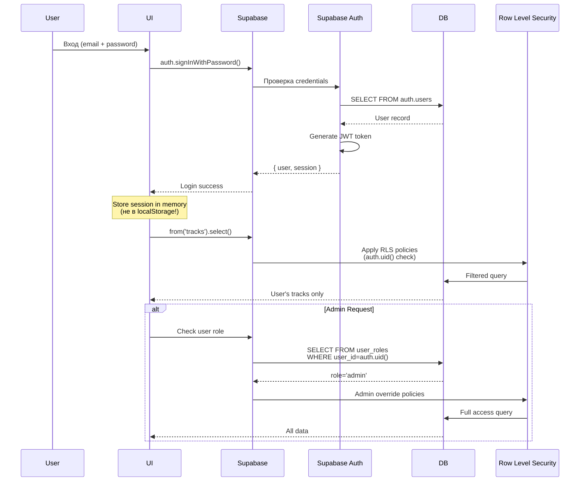

**Security Layers**:
1. **JWT Authentication**: Каждый запрос валидируется
2. **RLS Policies**: Database-level access control
3. **Role-based Access**: `user_roles` таблица с enum `app_role`
4. **Security Definer Functions**: `has_role()` для проверки без рекурсии

---

## 📁 3. File Upload & Storage Flow

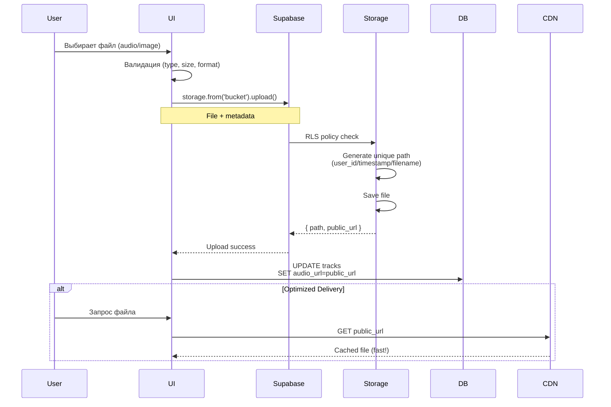

**Storage Buckets**:
- `tracks-audio` (public): Audio файлы треков
- `tracks-covers` (public): Обложки треков
- `tracks-videos` (public): Video файлы
- `reference-audio` (public): Референсные аудио для extend/cover

**Optimizations**:
- Service Worker кэширование
- CDN для статических файлов
- Progressive loading для больших файлов

---

## 🔄 4. Real-time Subscriptions Flow

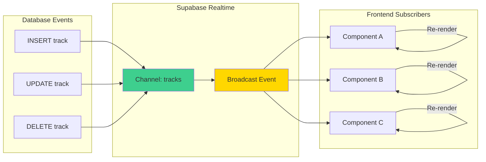

**Пример использования**:
```typescript
useEffect(() => {
  const channel = supabase
    .channel('track-changes')
    .on(
      'postgres_changes',
      {
        event: 'UPDATE',
        schema: 'public',
        table: 'tracks',
        filter: `user_id=eq.${userId}`
      },
      (payload) => {
        queryClient.invalidateQueries(['tracks']);
        toast.success('Трек обновлён!');
      }
    )
    .subscribe();

  return () => supabase.removeChannel(channel);
}, [userId]);
```

---

## 🎛️ 5. Audio Player Data Flow

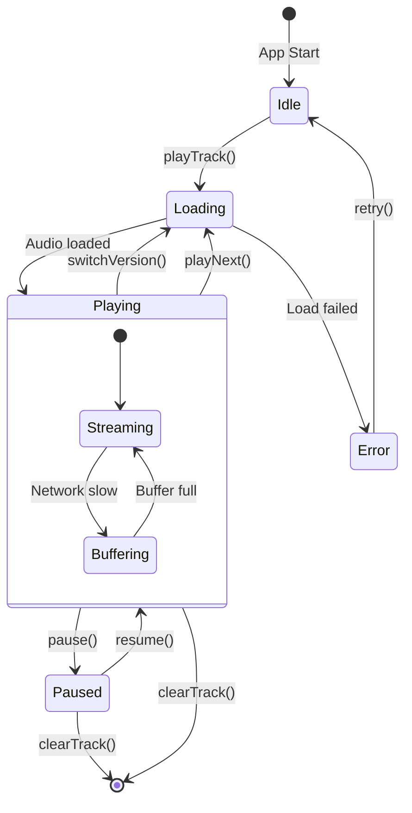

**Context Flow**:
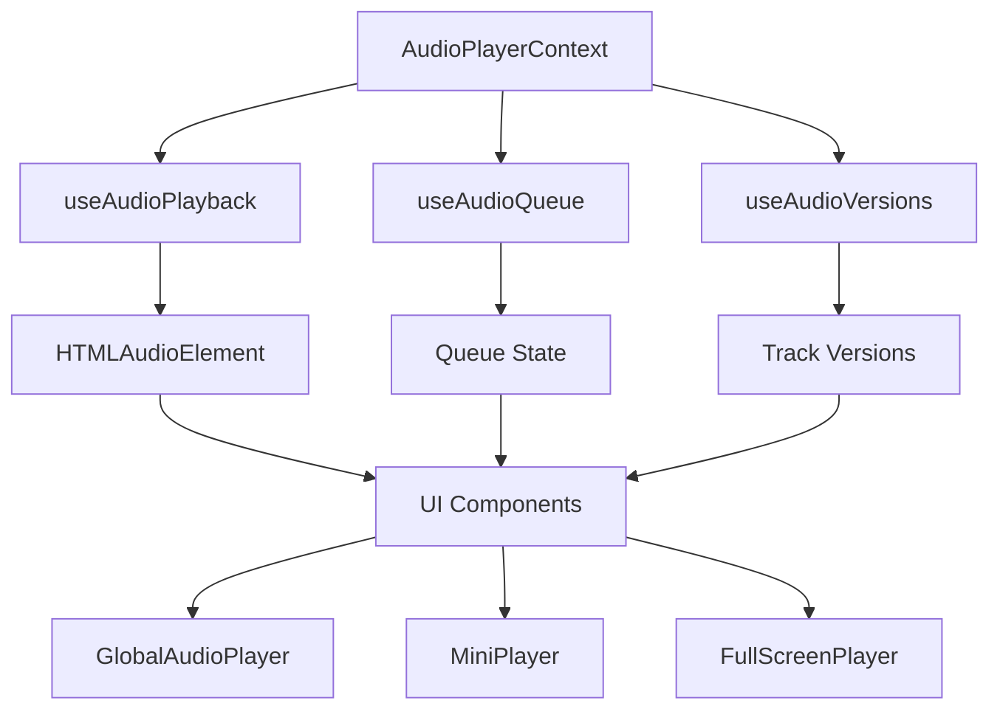

**Data Sources**:
1. **Current Track**: От `useTracks()` hook
2. **Queue**: Локальный state в context
3. **Versions**: От `useTrackVersions()` hook
4. **Audio URL**: Из Supabase Storage (кэшируется Service Worker)

---

## 📊 6. Analytics & Monitoring Flow

```mermaid
graph TB
    subgraph "User Actions"
        A1[Track Play]
        A2[Track Like]
        A3[Generation]
        A4[Error Event]
    end

    subgraph "Frontend Tracking"
        B1[usePlayAnalytics]
        B2[Logger Utility]
        B3[Sentry SDK]
    end

    subgraph "Data Storage"
        C1[Supabase DB<br/>analytics table]
        C2[Sentry Cloud]
    end

    subgraph "Dashboards"
        D1[Admin Analytics]
        D2[Sentry Dashboard]
    end

    A1 --> B1
    A2 --> B1
    A3 --> B2
    A4 --> B3
    
    B1 --> C1
    B2 --> C1
    B3 --> C2
    
    C1 --> D1
    C2 --> D2

    style C1 fill:#3ECF8E
    style C2 fill:#362D59
```

**Tracked Metrics**:
- **User Actions**: Play, Like, Download, Share
- **Generation Metrics**: Success rate, duration, provider
- **Performance**: Web Vitals (LCP, FCP, CLS, TTFB)
- **Errors**: Frontend errors, API failures, edge function crashes

---

## 🔀 7. Track Versioning Flow

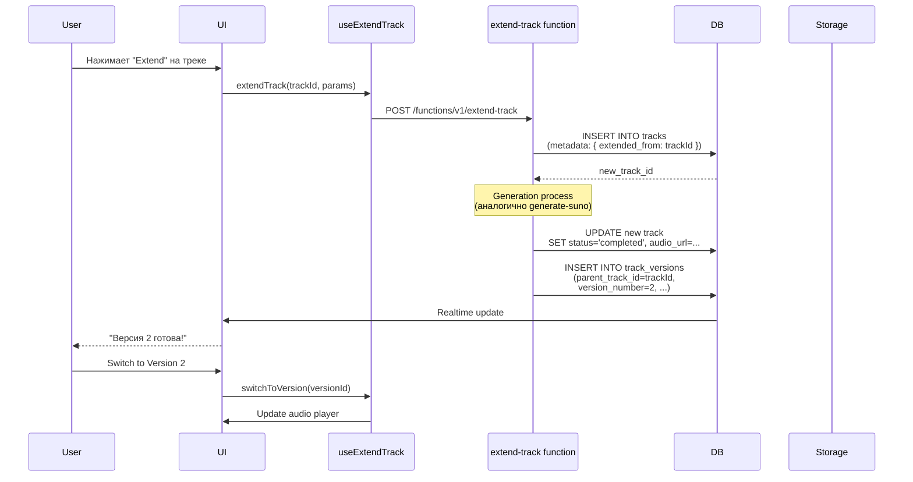

**Version Management**:
- **Master Track**: Оригинальный трек (parent)
- **Versions**: Extend, Cover, Remix варианты
- **Version Selector**: UI компонент для переключения
- **Stems Inheritance**: Stems связаны с версией

---

## 🛠️ 8. Error Handling & Recovery Flow

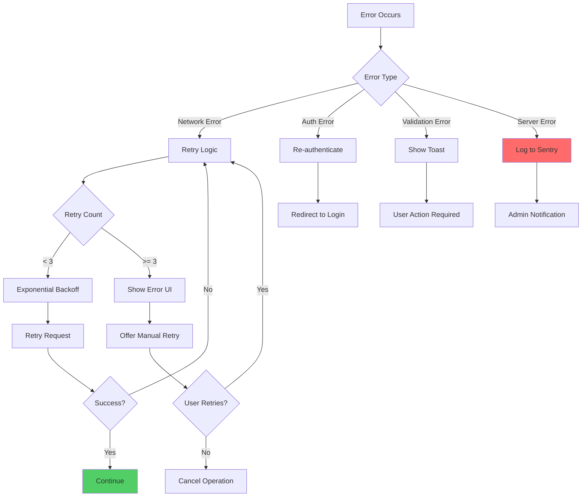

**Error Categories**:
1. **Recoverable**: Network timeouts, temporary API failures
2. **User Actionable**: Validation errors, auth issues
3. **Critical**: Database failures, storage quota exceeded
4. **Silent**: Analytics tracking failures (не блокируют UX)

---

## 🔧 9. Caching Strategy

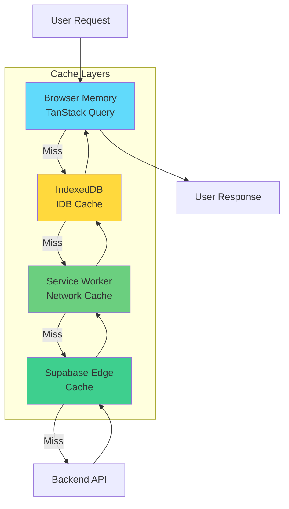

**Cache TTL**:
- **TanStack Query**: 5 минут (tracks list), 1 минута (track details)
- **IndexedDB**: 24 часа (audio metadata)
- **Service Worker**: 7 дней (audio files), 1 день (covers)
- **Supabase Edge**: 5 минут (API responses)

---

## 📈 10. Performance Optimizations

### 10.1 Bundle Splitting
```
Entry Point (main.tsx)
  ├── Core Bundle (~150KB)
  │   ├── React + React Router
  │   ├── Supabase Client
  │   └── TanStack Query
  │
  ├── UI Bundle (~80KB)
  │   ├── shadcn/ui components
  │   └── Lucide icons (tree-shaked)
  │
  └── Feature Bundles (lazy loaded)
      ├── MusicGenerator (~40KB)
      ├── TrackVersions (~30KB)
      ├── StemMixer (~35KB)
      └── Analytics (~25KB)
```

### 10.2 Data Fetching Optimization
```typescript
// ✅ GOOD: Parallel fetching
const [tracks, user, balance] = await Promise.all([
  supabase.from('tracks').select(),
  supabase.from('profiles').select(),
  supabase.functions.invoke('get-balance')
]);

// ❌ BAD: Sequential fetching
const tracks = await supabase.from('tracks').select();
const user = await supabase.from('profiles').select();
const balance = await supabase.functions.invoke('get-balance');
```

---

## 🎯 Key Takeaways

1. **Separation of Concerns**: Frontend (UI/State) ↔ API Layer ↔ Backend (DB/Storage/Functions)
2. **Real-time First**: WebSocket subscriptions для мгновенных обновлений
3. **Progressive Enhancement**: Offline support через Service Worker
4. **Error Resilience**: Multi-layer retry + fallback mechanisms
5. **Performance**: Aggressive caching + lazy loading + code splitting
6. **Security**: RLS + JWT + Role-based access на каждом уровне
7. **Observability**: Sentry + Analytics + Performance monitoring

---

## 🔗 Related Documentation

- [System Architecture](system-architecture.md) - Общая архитектура
- [Music Generation Flow](music-generation-flow.md) - Детали генерации
- [Stem Separation Flow](stem-separation-flow.md) - Обработка стемов
- [Database ERD](database-erd.md) - Схема базы данных
- [User Journey Map](user-journey-map.md) - Пользовательские сценарии

---

*Последнее обновление: 13 октября 2025*  
*Версия: 2.7.1*  
*Статус: Production Ready*
