# 🔄 Data Flow Diagrams

## Music Generation Flow (Suno AI)

```mermaid
sequenceDiagram
    participant User
    participant UI as React UI
    participant Service as GenerationService
    participant Edge as generate-suno
    participant Suno as Suno API
    participant DB as PostgreSQL
    participant Callback as suno-callback
    
    User->>UI: Submit generation form
    UI->>Service: generate({ provider: 'suno', ... })
    Service->>Service: checkDuplicateRequest()
    Service->>Edge: POST /functions/v1/generate-suno
    
    Edge->>Edge: validateParams()
    Edge->>Suno: Check balance
    Suno-->>Edge: balance > 0 ✓
    
    Edge->>DB: INSERT track (status: pending)
    Edge->>Suno: POST /api/v1/generate
    Suno-->>Edge: { taskId: "xxx" }
    Edge->>DB: UPDATE track (status: processing)
    
    Edge-->>Service: { success: true, trackId, taskId }
    Service->>Service: subscribe(trackId)
    Service-->>UI: { trackId, taskId }
    UI-->>User: "Генерация началась..."
    
    Note over Suno,Callback: Background processing
    
    alt Callback Strategy
        Suno->>Callback: POST /suno-callback
        Callback->>DB: UPDATE track (status: completed)
        DB->>Service: Realtime notification
        Service-->>UI: Track completed
        UI-->>User: "Готово! 🎵"
    else Polling Fallback
        Edge->>Suno: GET /record-info (every 5s)
        Suno-->>Edge: { status: "SUCCESS" }
        Edge->>DB: UPDATE track (completed)
        DB->>Service: Realtime notification
        Service-->>UI: Track completed
        UI-->>User: "Готово! 🎵"
    end
```

## Music Generation Flow (Mureka AI)

```mermaid
sequenceDiagram
    participant User
    participant UI
    participant Service as GenerationService
    participant Edge as generate-mureka
    participant Mureka as Mureka API
    participant DB
    
    User->>UI: Submit generation form
    UI->>Service: generate({ provider: 'mureka', ... })
    Service->>Edge: POST /functions/v1/generate-mureka
    
    Edge->>DB: INSERT track (status: pending)
    
    alt Has lyrics
        Edge->>Edge: Use provided lyrics
    else No lyrics
        Edge->>Mureka: POST /v1/lyrics/generate
        Mureka-->>Edge: { variants: [...] }
        Edge->>DB: INSERT lyrics_jobs + variants
        
        alt Multiple variants
            Edge-->>UI: { requiresLyricsSelection: true }
            UI->>User: Show variant selector
            User->>UI: Select variant
            UI->>Edge: Continue with selected variant
        else Single variant
            Edge->>Edge: Auto-select first variant
        end
    end
    
    Edge->>Mureka: POST /v1/song/generate
    Mureka-->>Edge: { task_id: "xxx" }
    Edge->>DB: UPDATE track (mureka_task_id, status: processing)
    Edge-->>Service: { trackId, task_id }
    
    Note over Edge,Mureka: Polling (every 5s, max 2 min)
    
    loop Until completed
        Edge->>Mureka: GET /v1/song/query/{task_id}
        Mureka-->>Edge: { status: "preparing/completed" }
    end
    
    Edge->>DB: UPDATE track (status: completed, audio_url)
    DB->>Service: Realtime notification
    Service-->>UI: Track completed
    UI-->>User: "Готово! 🎵"
```

## Stem Separation Flow

## Track Versioning Flow

## Audio Player State Flow

## Realtime Sync Flow

