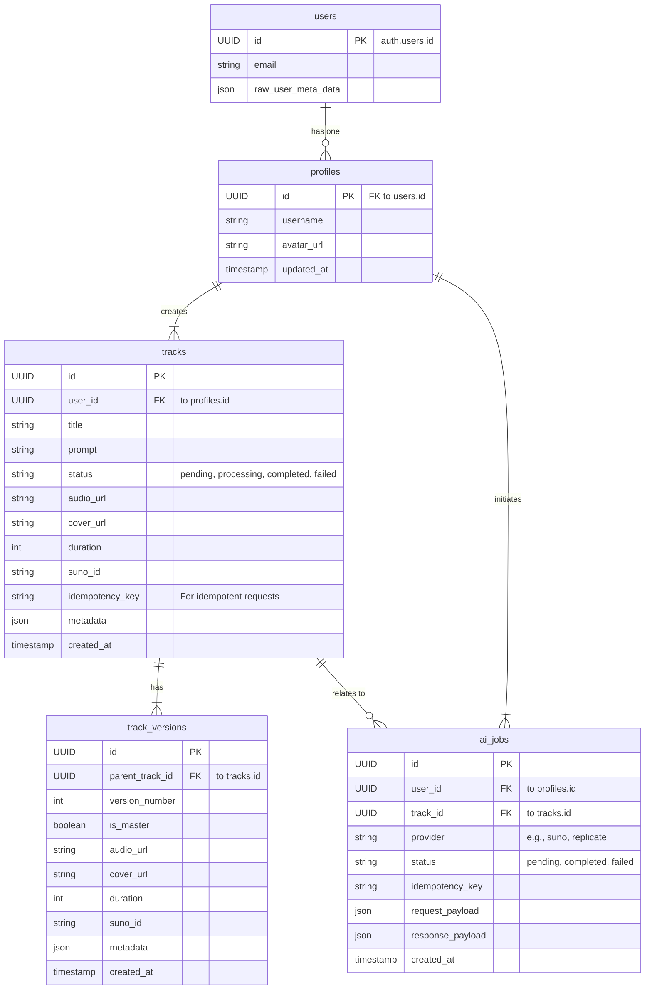

```mermaid
erDiagram
    users {
        UUID id PK "auth.users.id"
        string email
        json raw_user_meta_data
    }

    profiles {
        UUID id PK "FK to users.id"
        string username
        string avatar_url
        timestamp updated_at
    }

    tracks {
        UUID id PK
        UUID user_id FK "to profiles.id"
        string title
        string prompt
        string status "pending, processing, completed, failed"
        string audio_url
        string cover_url
        int duration
        string suno_id
        string idempotency_key "For idempotent requests"
        json metadata
        timestamp created_at
    }

    track_versions {
        UUID id PK
        UUID parent_track_id FK "to tracks.id"
        int version_number
        boolean is_master
        string audio_url
        string cover_url
        int duration
        string suno_id
        json metadata
        timestamp created_at
    }

    ai_jobs {
        UUID id PK
        UUID user_id FK "to profiles.id"
        UUID track_id FK "to tracks.id"
        string provider "e.g., suno, replicate"
        string status "pending, completed, failed"
        string idempotency_key
        json request_payload
        json response_payload
        timestamp created_at
    }

    users ||--o{ profiles : "has one"
    profiles ||--|{ tracks : "creates"
    tracks ||--|{ track_versions : "has"
    profiles ||--|{ ai_jobs : "initiates"
    tracks ||--o{ ai_jobs : "relates to"

```