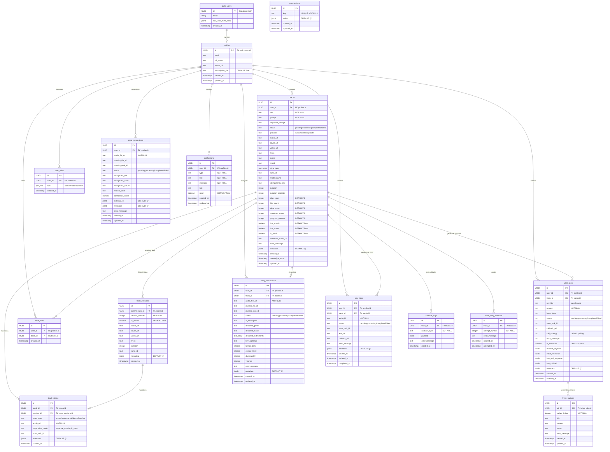

# 🗄️ Entity-Relationship Diagram (ERD) - Albert3 Database



---

## 📊 Таблицы и их назначение

### 👤 **Пользователи и роли**

#### `auth.users` (Supabase Auth)
- **Назначение:** Управляется Supabase Auth
- **Доступ:** Только через Auth API
- **Примечание:** НЕ создавать foreign keys напрямую!

#### `profiles`
- **Назначение:** Дополнительная информация о пользователе
- **Триггер:** Создается автоматически при регистрации (`handle_new_user()`)
- **RLS:** Пользователь видит только свой профиль

#### `user_roles`
- **Назначение:** Роли пользователей (admin/moderator/user)
- **Использование:** Проверка через `has_role(user_id, role)`
- **RLS:** Админы управляют всеми ролями

---

### 🎵 **Треки и версии**

#### `tracks` (Центральная таблица)
- **Назначение:** Основная таблица с музыкальными треками
- **Поля:**
  - `status`: pending → processing → completed/failed
  - `provider`: suno, mureka, replicate
  - `metadata`: Гибкое хранилище для Suno API response
- **RLS:** 
  - Пользователь видит свои треки
  - Публичные треки (`is_public=true`) видят все

#### `track_versions`
- **Назначение:** Версии треков (extend, cover, variations)
- **Связь:** `parent_track_id` → `tracks.id`
- **Триггер:** Auto-create при `metadata.extended_from` или `is_cover`

#### `track_stems`
- **Назначение:** Разделенные аудио компоненты (vocals, instrumental, drums, etc.)
- **Режимы:**
  - `separate_vocal`: vocals + instrumental
  - `split_stem`: 12 компонентов

---

### 📝 **Генерация текстов**

#### `lyrics_jobs`
- **Назначение:** Задачи генерации текстов песен
- **Provider:** suno, lovable
- **Стратегия:** callback или polling

#### `lyrics_variants`
- **Назначение:** Варианты текстов для одной задачи
- **Связь:** `job_id` → `lyrics_jobs.id`
- **Обычно:** 2-3 варианта на задачу

---

### 🎼 **Анализ и распознавание**

#### `song_descriptions`
- **Назначение:** AI-анализ аудио (жанр, темп, настроение)
- **Provider:** Mureka API
- **Результат:** Описание + параметры (BPM, key, energy)

#### `song_recognitions`
- **Назначение:** Распознавание существующих песен
- **Provider:** Mureka API
- **Результат:** Название, исполнитель, альбом

---

### 🔄 **Конвертация и обработка**

#### `wav_jobs`
- **Назначение:** Конвертация треков в WAV формат
- **Provider:** Suno API
- **Использование:** Для профессиональной обработки

#### `callback_logs`
- **Назначение:** Логирование webhook callbacks
- **Данные:** payload + error_message
- **Retention:** 30 дней

#### `track_retry_attempts`
- **Назначение:** История попыток генерации
- **Использование:** Debugging failed generations

---

### 🔔 **Уведомления**

#### `notifications`
- **Назначение:** In-app уведомления
- **Типы:** track, like, error
- **RLS:** Пользователь видит только свои

---

### ⚙️ **Настройки**

#### `app_settings`
- **Назначение:** Глобальные настройки приложения
- **Примеры:** credit_mode, maintenance_mode
- **RLS:** Админы управляют, все читают

---

## 🔐 Row-Level Security (RLS) Policies

### Основные паттерны:

#### 1. **Owner Access** (Пользователь видит только свое)
```sql
-- tracks: Users can view their own tracks
USING (auth.uid() = user_id)
```

#### 2. **Public Access** (Публичные данные видят все)
```sql
-- tracks: Public tracks are viewable by everyone
USING (is_public = true OR auth.uid() = user_id)
```

#### 3. **Admin Access** (Админы видят всё)
```sql
-- tracks: Admins can view all tracks
USING (has_role(auth.uid(), 'admin'))
```

#### 4. **Related Access** (Доступ через связь)
```sql
-- track_stems: Users can view stems of their own tracks
USING (EXISTS (
  SELECT 1 FROM tracks
  WHERE tracks.id = track_stems.track_id
    AND tracks.user_id = auth.uid()
))
```

---

## 🔄 Триггеры и автоматизация

### `handle_new_user()` (on auth.users INSERT)
```sql
-- Создает profile при регистрации
INSERT INTO public.profiles (id, email, full_name)
VALUES (NEW.id, NEW.email, NEW.raw_user_meta_data->>'full_name');
```

### `update_updated_at_column()` (on UPDATE)
```sql
-- Автоматическое обновление updated_at
NEW.updated_at = now();
```

### `update_track_likes_count()` (on track_likes INSERT/DELETE)
```sql
-- Синхронизация счетчика лайков
UPDATE tracks SET like_count = like_count + 1 WHERE id = NEW.track_id;
```

### `notify_track_ready()` (on tracks UPDATE)
```sql
-- Создание уведомления при статусе completed/failed
IF NEW.status = 'completed' THEN
  INSERT INTO notifications (user_id, type, title, message) ...
END IF;
```

### `notify_track_liked()` (on track_likes INSERT)
```sql
-- Уведомление автора о лайке
INSERT INTO notifications (user_id, type, title, message)
VALUES (track_owner_id, 'like', 'Новый лайк', ...);
```

### `create_version_from_extended_track()` (on tracks UPDATE)
```sql
-- Автоматическое создание версии из extended/cover трека
IF NEW.metadata ? 'extended_from' OR NEW.metadata ? 'is_cover' THEN
  INSERT INTO track_versions (...) ...
END IF;
```

---

## 📈 Индексы для производительности

**Рекомендуемые индексы:**

```sql
-- tracks
CREATE INDEX idx_tracks_user_id ON tracks(user_id);
CREATE INDEX idx_tracks_status ON tracks(status);
CREATE INDEX idx_tracks_is_public ON tracks(is_public);
CREATE INDEX idx_tracks_created_at ON tracks(created_at DESC);

-- track_versions
CREATE INDEX idx_track_versions_parent ON track_versions(parent_track_id);
CREATE INDEX idx_track_versions_master ON track_versions(is_master);

-- track_likes
CREATE INDEX idx_track_likes_track ON track_likes(track_id);
CREATE INDEX idx_track_likes_user ON track_likes(user_id);

-- lyrics_jobs
CREATE INDEX idx_lyrics_jobs_user ON lyrics_jobs(user_id);
CREATE INDEX idx_lyrics_jobs_status ON lyrics_jobs(status);
```

---

## 🔍 Полезные запросы

### Статистика пользователя
```sql
SELECT
  COUNT(*) as total_tracks,
  SUM(play_count) as total_plays,
  SUM(like_count) as total_likes,
  SUM(download_count) as total_downloads
FROM tracks
WHERE user_id = 'user-uuid';
```

### Топ треки за неделю
```sql
SELECT id, title, play_count, like_count
FROM tracks
WHERE created_at > NOW() - INTERVAL '7 days'
ORDER BY play_count DESC
LIMIT 10;
```

### Треки со стемами
```sql
SELECT t.*, COUNT(ts.id) as stem_count
FROM tracks t
LEFT JOIN track_stems ts ON ts.track_id = t.id
WHERE t.user_id = 'user-uuid'
GROUP BY t.id
HAVING COUNT(ts.id) > 0;
```

---

*Последнее обновление: 13 октября 2025*  
*Версия: 1.0.0*
