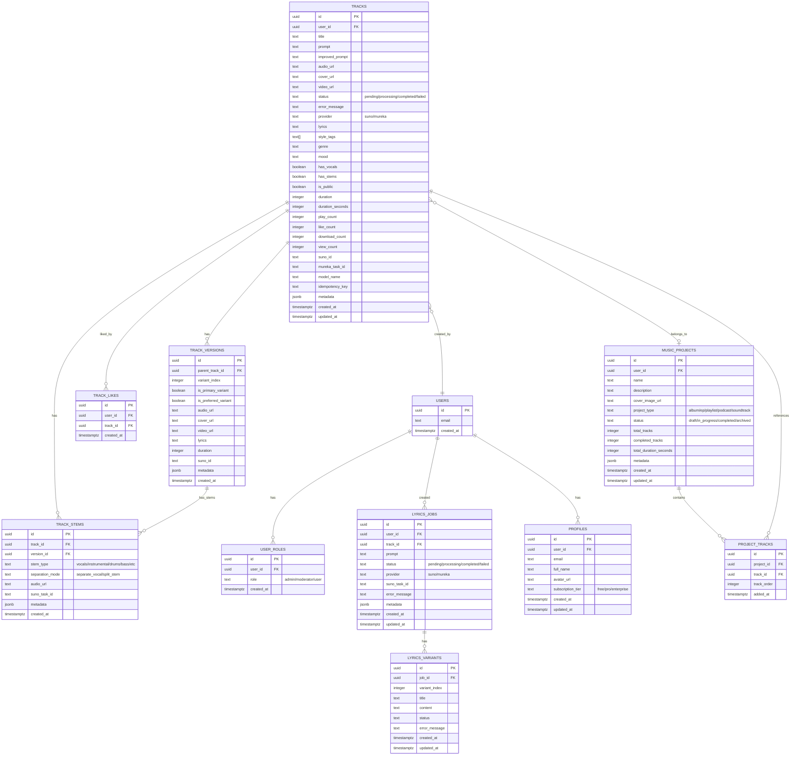

# 🗄️ Database Schema

## Entity Relationship Diagram



## Table Indexes

### Performance Optimization Indexes

```sql
-- Tracks table (most queried)
CREATE INDEX idx_tracks_user_id ON tracks(user_id);
CREATE INDEX idx_tracks_status ON tracks(status);
CREATE INDEX idx_tracks_provider ON tracks(provider);
CREATE INDEX idx_tracks_created_at ON tracks(created_at DESC);
CREATE INDEX idx_tracks_user_status ON tracks(user_id, status);
CREATE INDEX idx_tracks_public ON tracks(is_public) WHERE is_public = true;
CREATE INDEX idx_tracks_suno_id ON tracks(suno_id) WHERE suno_id IS NOT NULL;
CREATE INDEX idx_tracks_mureka_id ON tracks(mureka_task_id) WHERE mureka_task_id IS NOT NULL;

-- Track versions
CREATE INDEX idx_track_versions_parent ON track_versions(parent_track_id);
CREATE UNIQUE INDEX idx_track_versions_unique ON track_versions(parent_track_id, variant_index);

-- Track stems
CREATE INDEX idx_track_stems_track ON track_stems(track_id);
CREATE INDEX idx_track_stems_version ON track_stems(version_id);

-- Track likes
CREATE UNIQUE INDEX idx_track_likes_unique ON track_likes(user_id, track_id);

-- Music projects
CREATE INDEX idx_projects_user ON music_projects(user_id);
CREATE INDEX idx_projects_status ON music_projects(status);

-- Lyrics jobs
CREATE INDEX idx_lyrics_jobs_track ON lyrics_jobs(track_id);
CREATE INDEX idx_lyrics_jobs_status ON lyrics_jobs(status);
```

## Row Level Security Policies

### Tracks Table RLS

```sql
-- Users can view own tracks
CREATE POLICY "tracks_select_own"
  ON tracks FOR SELECT
  USING (auth.uid() = user_id);

-- Public tracks viewable by everyone
CREATE POLICY "tracks_select_public"
  ON tracks FOR SELECT
  USING (is_public = true OR auth.uid() = user_id);

-- Admins can view all
CREATE POLICY "tracks_select_admin"
  ON tracks FOR SELECT
  USING (
    EXISTS (
      SELECT 1 FROM user_roles
      WHERE user_id = auth.uid() AND role = 'admin'
    )
  );

-- Users can create own tracks
CREATE POLICY "tracks_insert_own"
  ON tracks FOR INSERT
  WITH CHECK (auth.uid() = user_id);

-- Users can update own tracks
CREATE POLICY "tracks_update_own"
  ON tracks FOR UPDATE
  USING (auth.uid() = user_id);

-- Users can delete own tracks
CREATE POLICY "tracks_delete_own"
  ON tracks FOR DELETE
  USING (auth.uid() = user_id);
```

## Database Functions

### Update Timestamps Trigger

```sql
CREATE OR REPLACE FUNCTION update_updated_at_column()
RETURNS TRIGGER AS $$
BEGIN
  NEW.updated_at = NOW();
  RETURN NEW;
END;
$$ LANGUAGE plpgsql;

CREATE TRIGGER update_tracks_updated_at
  BEFORE UPDATE ON tracks
  FOR EACH ROW
  EXECUTE FUNCTION update_updated_at_column();

CREATE TRIGGER update_profiles_updated_at
  BEFORE UPDATE ON profiles
  FOR EACH ROW
  EXECUTE FUNCTION update_updated_at_column();
```

### Auto-Update Project Stats

```sql
CREATE OR REPLACE FUNCTION update_project_stats()
RETURNS TRIGGER AS $$
BEGIN
  UPDATE music_projects
  SET 
    total_tracks = (
      SELECT COUNT(*) FROM project_tracks 
      WHERE project_id = NEW.project_id
    ),
    completed_tracks = (
      SELECT COUNT(*) FROM project_tracks pt
      JOIN tracks t ON t.id = pt.track_id
      WHERE pt.project_id = NEW.project_id AND t.status = 'completed'
    ),
    total_duration_seconds = (
      SELECT COALESCE(SUM(t.duration_seconds), 0) FROM project_tracks pt
      JOIN tracks t ON t.id = pt.track_id
      WHERE pt.project_id = NEW.project_id
    )
  WHERE id = NEW.project_id;
  
  RETURN NEW;
END;
$$ LANGUAGE plpgsql;

CREATE TRIGGER update_project_stats_on_track_add
  AFTER INSERT ON project_tracks
  FOR EACH ROW
  EXECUTE FUNCTION update_project_stats();
```

## Materialized Views

### User Statistics View

```sql
CREATE MATERIALIZED VIEW user_stats AS
SELECT 
  user_id,
  COUNT(*) as total_tracks,
  SUM(CASE WHEN status = 'completed' THEN 1 ELSE 0 END) as completed_tracks,
  SUM(play_count) as total_plays,
  SUM(like_count) as total_likes,
  SUM(download_count) as total_downloads,
  SUM(duration_seconds) as total_duration_seconds,
  COUNT(DISTINCT provider) as providers_used,
  MAX(created_at) as last_generation
FROM tracks
GROUP BY user_id;

-- Refresh daily
CREATE INDEX idx_user_stats_user_id ON user_stats(user_id);
```

### Top Genres View

```sql
CREATE MATERIALIZED VIEW analytics_top_genres AS
SELECT 
  genre,
  COUNT(*) as track_count,
  SUM(play_count) as total_plays,
  AVG(like_count) as avg_likes
FROM tracks
WHERE genre IS NOT NULL
GROUP BY genre
ORDER BY track_count DESC;
```
