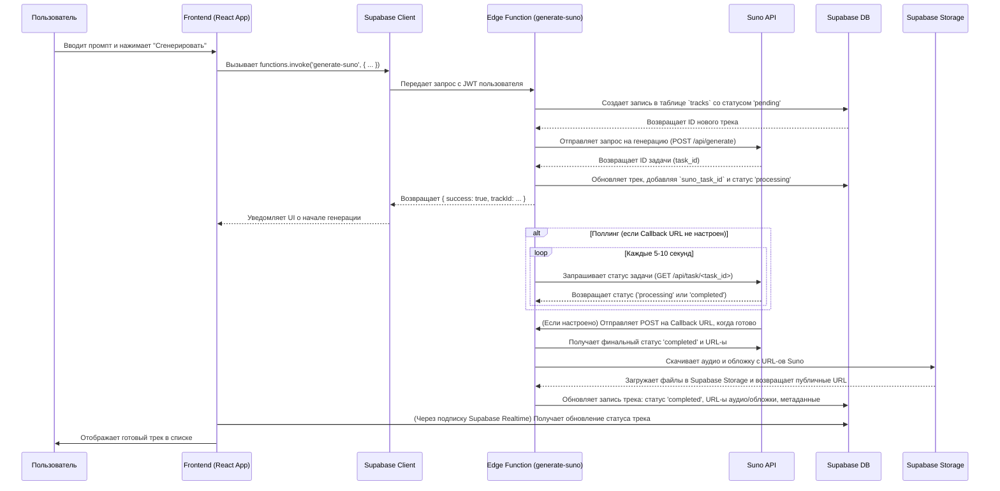

```mermaid
sequenceDiagram
    participant User as Пользователь
    participant FE as Frontend (React App)
    participant Supabase as Supabase Client
    participant EdgeFunc as Edge Function (generate-suno)
    participant Suno as Suno API
    participant DB as Supabase DB
    participant Storage as Supabase Storage

    User->>FE: Вводит промпт и нажимает "Сгенерировать"
    FE->>Supabase: Вызывает functions.invoke('generate-suno', { ... })
    Supabase->>EdgeFunc: Передает запрос с JWT пользователя

    EdgeFunc->>DB: Создает запись в таблице `tracks` со статусом 'pending'
    DB-->>EdgeFunc: Возвращает ID нового трека

    EdgeFunc->>Suno: Отправляет запрос на генерацию (POST /api/generate)
    Suno-->>EdgeFunc: Возвращает ID задачи (task_id)

    EdgeFunc->>DB: Обновляет трек, добавляя `suno_task_id` и статус 'processing'
    EdgeFunc-->>Supabase: Возвращает { success: true, trackId: ... }
    Supabase-->>FE: Уведомляет UI о начале генерации

    alt Поллинг (если Callback URL не настроен)
        loop Каждые 5-10 секунд
            EdgeFunc->>Suno: Запрашивает статус задачи (GET /api/task/<task_id>)
            Suno-->>EdgeFunc: Возвращает статус ('processing' или 'completed')
        end
    end

    Suno->>EdgeFunc: (Если настроено) Отправляет POST на Callback URL, когда готово

    EdgeFunc->>Suno: Получает финальный статус 'completed' и URL-ы
    EdgeFunc->>Storage: Скачивает аудио и обложку с URL-ов Suno
    Storage-->>EdgeFunc: Загружает файлы в Supabase Storage и возвращает публичные URL

    EdgeFunc->>DB: Обновляет запись трека: статус 'completed', URL-ы аудио/обложки, метаданные

    FE->>DB: (Через подписку Supabase Realtime) Получает обновление статуса трека
    FE->>User: Отображает готовый трек в списке
```