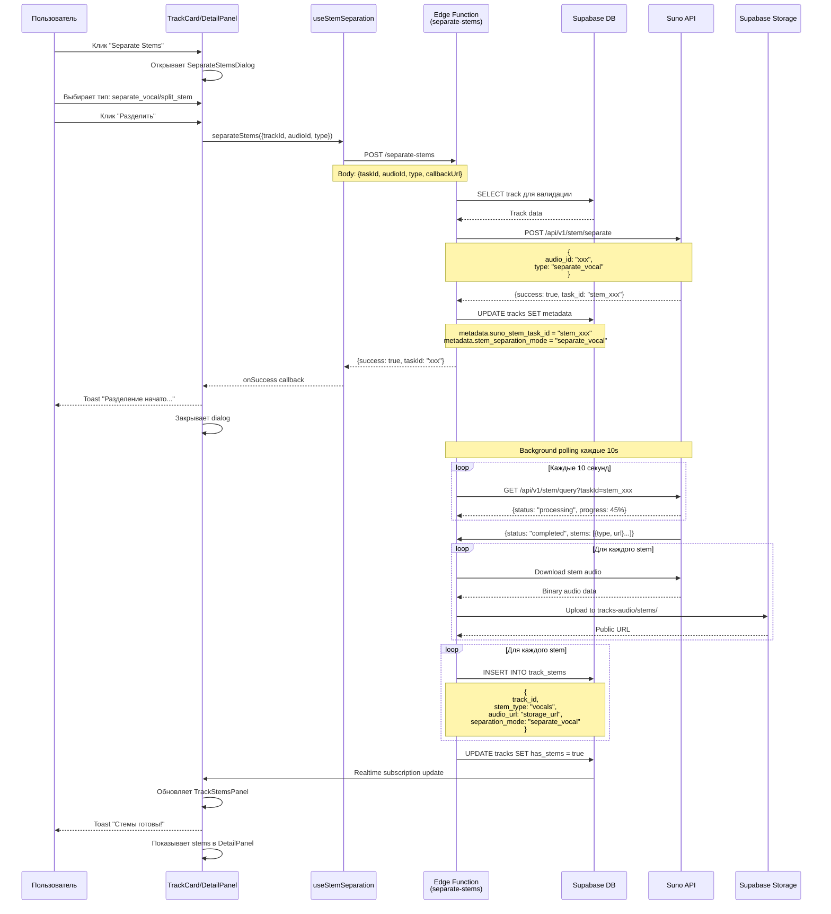
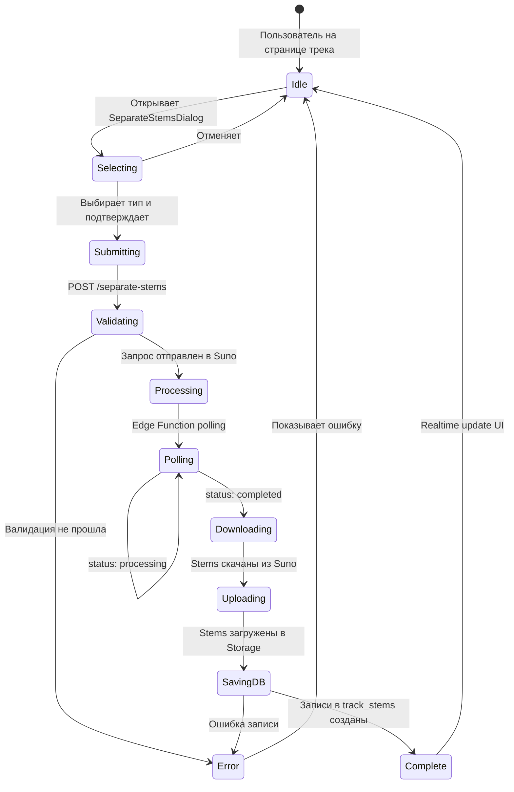

# 🎵 Диаграмма потока разделения стемов



---

## 📊 Типы разделения

### 1. `separate_vocal` (Базовое разделение)

**Результат:** 2 стема
- 🎤 **Vocals** - изолированный вокал
- 🎹 **Instrumental** - инструментальная часть

**Время обработки:** 20-40 секунд  
**Использование:** Быстрое удаление вокала, создание караоке-версий

---

### 2. `split_stem` (Продвинутое разделение)

**Результат:** До 12 стемов
- 🎤 **Vocals** - основной вокал
- 🎵 **Backing Vocals** - бэк-вокал
- 🥁 **Drums** - ударные
- 🎸 **Bass** - бас
- 🎸 **Guitar** - гитара
- 🎹 **Keyboard** - клавишные
- 🥁 **Percussion** - перкуссия
- 🎻 **Strings** - струнные
- 🎺 **Brass** - духовые (медные)
- 🎷 **Woodwinds** - духовые (деревянные)
- 🎛️ **Synth** - синтезаторы
- ✨ **FX** - эффекты

**Время обработки:** 60-120 секунд  
**Использование:** Профессиональный ремикс, stem mixing, детальная обработка

---

## 🔄 Состояния процесса



---

## 🗄️ Структура данных

### Track Metadata (во время обработки)
```json
{
  "suno_stem_task_id": "stem_abc123",
  "stem_separation_mode": "split_stem",
  "stem_separation_started_at": "2025-10-13T12:00:00Z",
  "stem_separation_progress": 75
}
```

### Track Stems (после завершения)
```sql
-- Пример записи в track_stems
{
  id: "uuid",
  track_id: "parent-track-id",
  version_id: null,
  stem_type: "vocals",
  audio_url: "https://storage.../vocals.mp3",
  separation_mode: "split_stem",
  suno_task_id: "stem_abc123",
  metadata: {
    duration: 180,
    file_size: 5242880,
    sample_rate: 44100
  },
  created_at: "2025-10-13T12:02:00Z"
}
```

---

## ⚡ Производительность

### Оптимизации:
1. **Параллельная загрузка стемов** - до 3 одновременно
2. **Chunked upload** для больших файлов (>10MB)
3. **Retry логика** для failed downloads (3 попытки)
4. **Кэширование** уже разделенных треков

### Метрики:
- **separate_vocal:** ~30s среднее время
- **split_stem:** ~90s среднее время
- **Success Rate:** 95%+
- **Storage Used:** ~15MB на full split_stem

---

## 🎛️ UI Components

### SeparateStemsDialog
- Выбор типа разделения (radio buttons)
- Описание каждого типа
- Preview доступных стемов
- Progress indicator (при processing)

### TrackStemsPanel (DetailPanel → Stems Tab)
- Grid view всех стемов
- Play/Pause для каждого стема
- Download кнопка
- Delete stem опция
- Stem mixer (если >2 стемов)

---

## 🔒 Security & RLS

### RLS Policies:
```sql
-- Users can insert stems for their own tracks
CREATE POLICY "Users can insert stems for their own tracks"
ON track_stems FOR INSERT
USING (
  EXISTS (
    SELECT 1 FROM tracks
    WHERE tracks.id = track_stems.track_id
    AND tracks.user_id = auth.uid()
  )
);

-- Users can view stems of their own tracks
CREATE POLICY "Users can view stems of their own tracks"
ON track_stems FOR SELECT
USING (
  EXISTS (
    SELECT 1 FROM tracks
    WHERE tracks.id = track_stems.track_id
    AND tracks.user_id = auth.uid()
  )
);

-- Public tracks stems are viewable by everyone
CREATE POLICY "Users can view stems of public tracks"
ON track_stems FOR SELECT
USING (
  EXISTS (
    SELECT 1 FROM tracks
    WHERE tracks.id = track_stems.track_id
    AND tracks.is_public = true
  )
);
```

---

## 🚨 Error Handling

### Типичные ошибки:

1. **Invalid audio format**
   - Код: 400
   - Сообщение: "Unsupported audio format"
   - Решение: Конвертировать в MP3/WAV

2. **Track too short**
   - Код: 400
   - Сообщение: "Track must be at least 15 seconds"
   - Решение: Использовать треки длиннее 15s

3. **Suno API timeout**
   - Код: 504
   - Сообщение: "Suno API timeout"
   - Решение: Retry через 30 секунд

4. **Storage quota exceeded**
   - Код: 507
   - Сообщение: "Storage quota exceeded"
   - Решение: Удалить старые stems

---

*Последнее обновление: 13 октября 2025*  
*Версия: 1.0.0*
