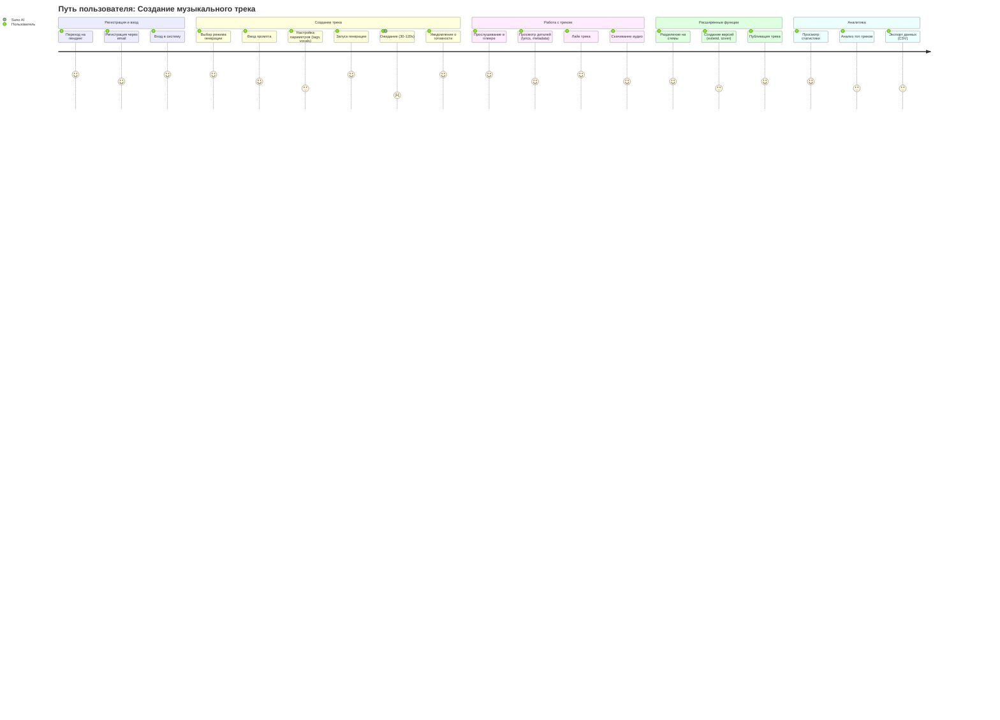
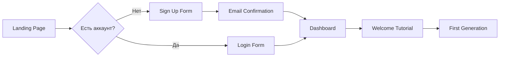
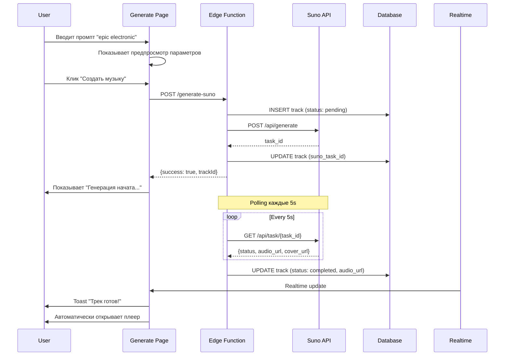
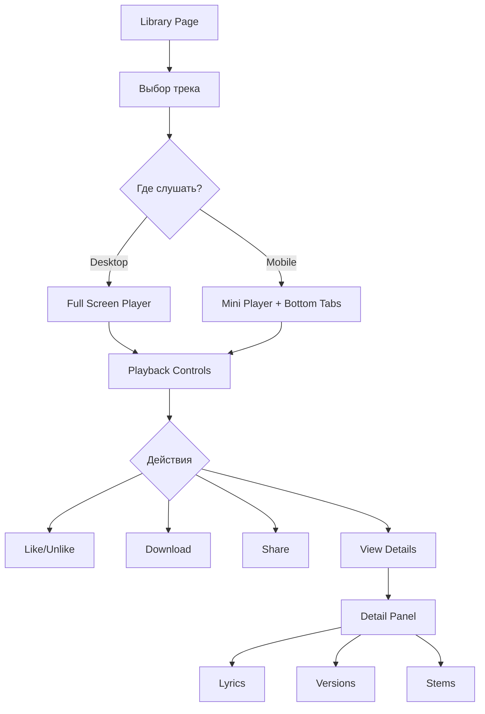
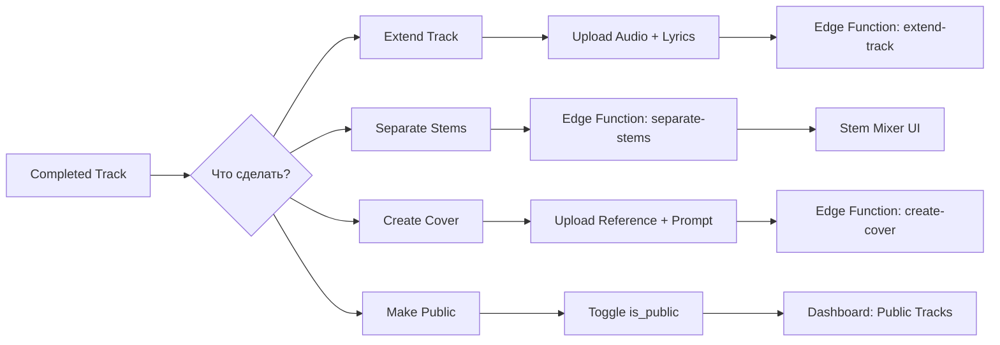
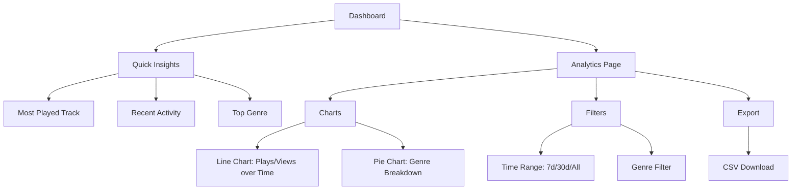
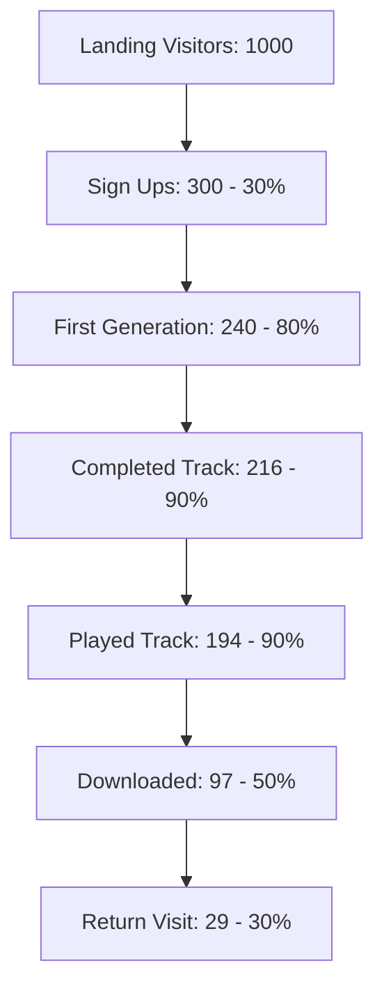

# 🗺️ User Journey Map - Albert3 Muse Synth Studio



---

## 📍 Детальные этапы путешествия

### 1️⃣ **Onboarding (Первое посещение)**



**Touchpoints:**
- 🌐 Landing Page с hero section
- 📝 Регистрация (email + password)
- ✉️ Подтверждение email (опционально)
- 🎯 Dashboard с Quick Start Guide

**Pain Points:**
- Сложность регистрации → **Решение:** Auto-confirm email (dev mode)
- Непонятно что делать → **Решение:** Welcome Tutorial с подсказками

---

### 2️⃣ **Генерация музыки (Core Flow)**



**Touchpoints:**
- 🎛️ Generate Page (Simple/Custom Mode)
- ⚙️ Параметры (Prompt, Tags, Vocals, Model)
- 🚀 Кнопка "Создать музыку" с анимацией
- ⏳ Progress Indicator (30-120s wait time)
- 🔔 Toast Notification "Трек готов!"
- 🎵 Auto-open Player

**Emotions:**
- 😊 **Excitement** при вводе промпта
- 😰 **Anxiety** во время ожидания (30-120s)
- 🎉 **Joy** при получении результата
- 😤 **Frustration** если generation failed

**Pain Points:**
- Долгое ожидание → **Решение:** Progress indicator с estimated time
- Неясный статус → **Решение:** Realtime updates с анимацией
- Ошибка генерации → **Решение:** Auto-retry + helpful error messages

---

### 3️⃣ **Прослушивание и управление (Playback Flow)**



**Touchpoints:**
- 📚 Library Page с grid/list view
- 🎵 Global Audio Player (mini/full screen)
- 💜 Like/Unlike button
- 📥 Download button
- 📊 Detail Panel (tabs: Details, Versions, Stems)

**Emotions:**
- 😍 **Love** при прослушивании удачного трека
- 🤔 **Curiosity** при просмотре деталей (lyrics, metadata)
- 😌 **Satisfaction** при скачивании

---

### 4️⃣ **Расширенные функции (Power User Flow)**



**Touchpoints:**
- 🎛️ TrackCard Dropdown Menu (More Options)
- ➕ Extend Track Dialog
- 🎤 Separate Stems Dialog
- 🎨 Create Cover Dialog
- 🌍 Make Public Switch

**Emotions:**
- 💪 **Empowerment** при использовании advanced features
- 🎨 **Creativity** при создании stem mixes
- 🤝 **Community** при публикации треков

---

### 5️⃣ **Аналитика и мониторинг (Analytics Flow)**



**Touchpoints:**
- 📊 Dashboard (Quick Insights)
- 📈 Analytics Page (Charts + Filters)
- 📥 CSV Export
- 🔍 Track Detail Modal

**Emotions:**
- 📊 **Insight** при анализе trends
- 🎯 **Achievement** при росте metrics
- 💼 **Professionalism** при экспорте данных

---

## 🎭 Personas (User Archetypes)

### 👤 **Casual Creator (Основная аудитория - 60%)**
**Характеристики:**
- 🎵 Любит музыку, но не музыкант
- 📱 Использует преимущественно мобильные устройства
- ⏱️ Хочет быстрых результатов (< 2 мин)

**Journey:**
1. Видит рекламу/ссылку → Landing
2. Быстрая регистрация (< 1 мин)
3. Генерация первого трека (Simple Mode)
4. Слушает, лайкает, скачивает
5. Возвращается раз в неделю для новых треков

**Needs:**
- ✅ Простой интерфейс
- ✅ Быстрая генерация
- ✅ Mobile-first design

---

### 🎨 **Content Creator (20%)**
**Характеристики:**
- 🎥 YouTube/TikTok creator
- 💼 Нужна музыка для видео
- 📊 Интересуется аналитикой

**Journey:**
1. Регистрация с целью
2. Генерация 5-10 треков в сессию
3. Скачивание для использования в видео
4. Возвращается 2-3 раза в неделю
5. Использует analytics для отслеживания популярности

**Needs:**
- ✅ Bulk generation
- ✅ High quality export
- ✅ Usage analytics

---

### 🎼 **Music Producer (15%)**
**Характеристики:**
- 🎛️ Профессионал или advanced hobbyist
- 🔊 Использует DAW (Ableton, FL Studio)
- 🎚️ Нужен контроль над stems

**Journey:**
1. Регистрация после исследования
2. Генерация треков с custom параметрами
3. Разделение на stems
4. Экспорт stems в DAW
5. Создание extended versions и covers

**Needs:**
- ✅ Stem separation
- ✅ Custom parameters
- ✅ High-quality WAV export

---

### 🧪 **Experimenter (5%)**
**Характеристики:**
- 🤖 Tech-savvy early adopter
- 🔬 Тестирует edge cases
- 📝 Пишет фидбек

**Journey:**
1. Beta testing
2. Пробует все функции
3. Находит баги и отправляет feedback
4. Использует API (если есть)

**Needs:**
- ✅ Advanced features
- ✅ API access
- ✅ Developer documentation

---

## 🔥 Critical User Paths (CUP)

### 🎯 **CUP #1: First Track Generation**
**Success Rate Target:** > 90%

```
Landing → Sign Up → Dashboard → Generate → Listen
```

**Optimization:**
- ✅ Auto-confirm email (dev mode)
- ✅ Welcome tutorial с примерами
- ✅ Pre-filled prompt examples
- ✅ Progress indicator с ETA

---

### 🎯 **CUP #2: Track Playback**
**Success Rate Target:** > 95%

```
Library → Click Play → Player Opens → Audio Loads → Playback Starts
```

**Optimization:**
- ✅ Preload audio при hover
- ✅ Fast player open animation
- ✅ Error handling с retry

---

### 🎯 **CUP #3: Download Track**
**Success Rate Target:** > 85%

```
Track Card → Click Download → Browser Download Starts
```

**Optimization:**
- ✅ Direct download (no modal)
- ✅ Analytics tracking
- ✅ Toast "Downloaded successfully"

---

## 📊 Metrics & KPIs

### Conversion Funnel



**Key Metrics:**
- 📈 **Conversion Rate (Landing → Sign Up):** 30%
- 🎵 **Activation Rate (Sign Up → First Generation):** 80%
- ✅ **Success Rate (Generation → Completed):** 90%
- 🔁 **Retention Rate (7-day):** 30%

---

## 🛠️ Оптимизация Journey

### Quick Wins
1. ✅ **Reduce Generation Time:** Оптимизация polling (5s → 3s)
2. ✅ **Improve Loading States:** Skeleton loaders везде
3. ✅ **Add Onboarding Tutorial:** Guided tour для новых users

### Medium-term
4. ⏳ **Bulk Generation:** Создание нескольких треков одновременно
5. ⏳ **Playlist Feature:** Группировка треков
6. ⏳ **Collaboration:** Шаринг треков с другими пользователями

### Long-term
7. 🔮 **AI-Powered Recommendations:** Suggest prompts based on history
8. 🔮 **Social Features:** Comments, likes, follows
9. 🔮 **Monetization:** Premium features, credits system

---

*Последнее обновление: 13 октября 2025*  
*Версия: 1.0.0*
