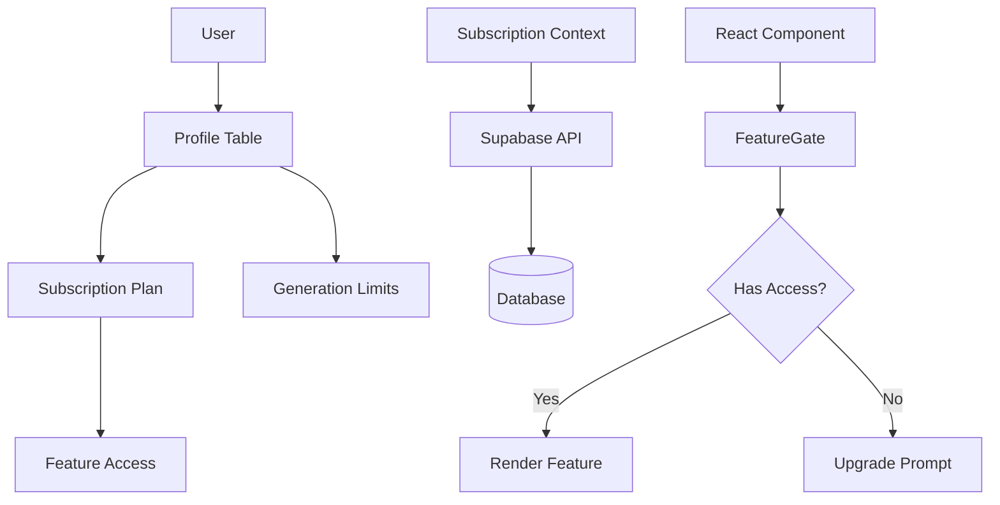

# Subscription System Documentation

## Overview

Comprehensive subscription management system with four tiers: Free, Pro, Studio, and Enterprise. Provides feature gating, generation limits, and AI-powered upgrades.

## Architecture



## Database Schema

### Tables

**subscription_plans**
- Defines all available subscription tiers
- Features stored as JSONB array
- Price in monthly/annual options

**generation_limits**
- Tracks daily generation usage per user
- Auto-resets at midnight
- NULL limit = unlimited

### Key Functions

**check_generation_limit(user_id)**
- Returns true if user can generate
- Respects daily limits
- Auto-creates limit record if missing

**increment_generation_usage(user_id)**
- Increments usage counter
- Updates both generation_limits and profiles tables

**reset_daily_generation_limits()**
- Resets all daily counters
- Should run via cron every 24h

## Frontend Integration

### SubscriptionProvider

Wrap your app root:
```tsx
<SubscriptionProvider>
  <App />
</SubscriptionProvider>
```

### useSubscription Hook

```tsx
const { 
  plan,                    // Current plan data
  limits,                  // Generation limits
  canAccess,              // Check feature access
  checkGenerationLimit,   // Check if can generate
  upgradeRequired,        // Get required plan
} = useSubscription();
```

### FeatureGate Component

```tsx
<FeatureGate feature="creative_director">
  <CreativeDirectorPanel />
</FeatureGate>
```

## Subscription Tiers

### Free
- 10 monthly credits
- 3 per day limit
- 2 max projects
- Basic features only

### Pro ($19.99/mo)
- 100 monthly credits
- 20 per day
- 10 projects
- AI actions, stems, DAW

### Studio ($49.99/mo)
- 500 monthly credits
- 100 per day
- 50 projects
- Creative Director, advanced DAW

### Enterprise ($199.99/mo)
- 9999 credits
- Unlimited daily
- Unlimited projects
- Collaboration, admin panel

## Feature Permissions

See `FEATURE_PERMISSIONS` in `FeatureGate.tsx` for full mapping.

## Migration Guide

Run migrations in order:
1. `20251117000000_subscription_system.sql`
2. Update existing users automatically via migration

## TODO
- [ ] Stripe payment integration
- [ ] Subscription history tracking
- [ ] Grace period for expired plans
- [ ] Usage analytics dashboard
