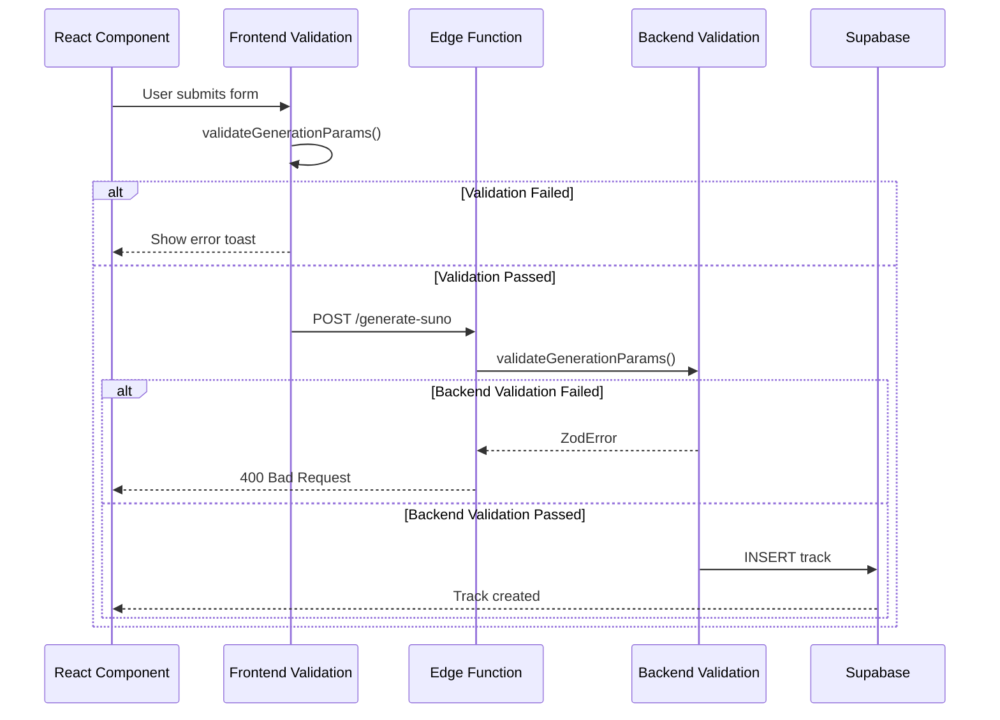

# Backend-Frontend Synchronization Guide

**Version**: 3.1.0  
**Last Updated**: 2025-11-02  
**Status**: Active

## 📋 Overview

Этот документ описывает, как синхронизированы валидация и типы между Frontend (React/TypeScript) и Backend (Deno Edge Functions).

## 🔄 Shared Validation Schemas

### Location

- **Frontend**: `src/utils/provider-validation.ts`
- **Backend**: `supabase/functions/_shared/provider-validation.ts`

### ⚠️ CRITICAL: Keep in Sync

Эти два файла **ДОЛЖНЫ** быть идентичны (за исключением import statements):

```typescript
// Frontend (TypeScript)
import { z } from 'zod';

// Backend (Deno)
import { z } from "https://deno.land/x/zod@v3.22.4/mod.ts";
```

### Synchronization Checklist

При изменении validation schemas:

- [ ] Обновить `src/utils/provider-validation.ts` (Frontend)
- [ ] Обновить `supabase/functions/_shared/provider-validation.ts` (Backend)
- [ ] Запустить тесты: `npm test`
- [ ] Проверить Edge Functions: `supabase functions serve`
- [ ] Обновить версию в `CHANGELOG.md`

## 📦 Provider Types

### Single Source of Truth

```typescript
// src/config/provider-models.ts - ЕДИНСТВЕННОЕ место определения
export type MusicProvider = 'suno' | 'mureka';
```

### Re-exports

```typescript
// src/services/providers/types.ts
export type { MusicProvider } from '@/config/provider-models';

// src/types/providers.ts
export type { MusicProvider } from '@/config/provider-models';
```

### ❌ ЗАПРЕЩЕНО

```typescript
// ❌ НЕ делайте так!
export type MusicProvider = 'suno' | 'mureka'; // Дублирование!
```

## 🎯 Validation Flow

### Frontend → Backend Flow



### Double Validation Why?

**Почему валидация на обоих уровнях?**

1. **Frontend Validation**:
   - ✅ Быстрый feedback для пользователя
   - ✅ Не тратим network запрос на заведомо невалидные данные
   - ✅ UX: instant error messages

2. **Backend Validation**:
   - 🔒 **Security**: Защита от обхода Frontend validation
   - 🔒 Защита от прямых API calls (Postman, curl, etc.)
   - 🔒 Защита от измененных client-side скриптов

## 🛠️ Implementation Examples

### Frontend Usage

```typescript
import { validateGenerationParams } from '@/utils/provider-validation';
import { toast } from 'sonner';

// В React component
const handleGenerate = async (params: unknown) => {
  try {
    // Валидация перед отправкой
    const validatedParams = validateGenerationParams(params);
    
    // Отправка на Backend
    const { data, error } = await supabase.functions.invoke('generate-suno', {
      body: validatedParams
    });
    
    if (error) throw error;
    
    toast.success('Track generation started!');
  } catch (error) {
    if (error instanceof z.ZodError) {
      // Показываем первую ошибку валидации
      toast.error(error.errors[0].message);
    } else {
      toast.error('Failed to generate track');
    }
  }
};
```

### Backend Usage (Edge Function)

```typescript
import { serve } from "https://deno.land/std@0.168.0/http/server.ts";
import { validateGenerationParams } from "../_shared/provider-validation.ts";
import { corsHeaders } from "../_shared/cors.ts";

serve(async (req) => {
  if (req.method === "OPTIONS") {
    return new Response(null, { headers: corsHeaders });
  }

  try {
    const body = await req.json();
    
    // Валидация входных данных
    const validatedParams = validateGenerationParams(body);
    
    // Продолжаем обработку...
    // ...
    
  } catch (error) {
    if (error.name === 'ZodError') {
      return new Response(
        JSON.stringify({
          error: 'Validation failed',
          details: error.errors
        }),
        { 
          status: 400,
          headers: { ...corsHeaders, 'Content-Type': 'application/json' }
        }
      );
    }
    
    // Другие ошибки...
  }
});
```

## 📊 Model Validation

### Supported Models

| Provider | Models | Default |
|----------|--------|---------|
| **Suno** | V5, V4_5PLUS, V4_5, V4, V3_5 | V5 |
| **Mureka** | auto, mureka-6, mureka-7.5, mureka-o1 | auto |

### Validation Examples

```typescript
// ✅ Valid
validateGenerationParams({
  provider: 'suno',
  prompt: 'Epic music',
  modelVersion: 'V5'
});

// ❌ Invalid - wrong model for provider
validateGenerationParams({
  provider: 'suno',
  prompt: 'Epic music',
  modelVersion: 'mureka-o1' // Mureka model for Suno!
});
// Throws: "Invalid Suno model. Must be one of: V5, V4_5PLUS, V4_5, V4, V3_5"

// ❌ Invalid - unsupported feature
validateGenerationParams({
  provider: 'mureka',
  prompt: 'Epic music',
  customMode: true // Suno-only feature!
});
// Throws: "Custom mode is not supported by Mureka"
```

## 🔍 Testing Validation

### Frontend Tests

```typescript
// src/utils/__tests__/provider-validation.test.ts
import { describe, it, expect } from 'vitest';
import { validateGenerationParams } from '../provider-validation';

describe('Provider Validation', () => {
  it('should validate Suno params', () => {
    const params = {
      provider: 'suno',
      prompt: 'Test',
      modelVersion: 'V5'
    };
    
    expect(() => validateGenerationParams(params)).not.toThrow();
  });

  it('should reject invalid Suno model', () => {
    const params = {
      provider: 'suno',
      prompt: 'Test',
      modelVersion: 'invalid'
    };
    
    expect(() => validateGenerationParams(params)).toThrow();
  });
});
```

### Backend Tests

```typescript
// supabase/functions/tests/validation.test.ts
import { assertEquals, assertExists } from "https://deno.land/std@0.192.0/testing/asserts.ts";
import { validateGenerationParams } from "../_shared/provider-validation.ts";

Deno.test("should validate Suno params", () => {
  const params = {
    provider: "suno",
    prompt: "Test",
    modelVersion: "V5"
  };
  
  const result = validateGenerationParams(params);
  assertExists(result);
  assertEquals(result.provider, "suno");
});

Deno.test("should reject invalid Mureka model", () => {
  const params = {
    provider: "mureka",
    prompt: "Test",
    modelVersion: "V5" // Suno model for Mureka!
  };
  
  try {
    validateGenerationParams(params);
    throw new Error("Should have thrown");
  } catch (error) {
    assertEquals(error.name, "ZodError");
  }
});
```

## 🚨 Common Pitfalls

### ❌ Pitfall 1: Забыть обновить Backend при изменении Frontend

```typescript
// Frontend - добавили новый параметр
export const GenerationParamsSchema = z.object({
  // ...
  newFeature: z.boolean().optional(), // ✅ Добавлено
});

// Backend - забыли обновить!
export const GenerationParamsSchema = z.object({
  // ...
  // ❌ newFeature отсутствует!
});
```

**Последствия**: Backend отклонит валидные запросы с Frontend

**Решение**: Всегда обновляйте оба файла синхронно

---

### ❌ Pitfall 2: Разные версии Zod

```typescript
// Frontend
import { z } from 'zod'; // v4.1.12

// Backend
import { z } from "https://deno.land/x/zod@v3.22.4/mod.ts"; // v3.22.4
```

**Последствия**: Разное поведение validation

**Решение**: Держите версии Zod близкими (major version должна совпадать)

---

### ❌ Pitfall 3: Hardcoded модели вместо использования констант

```typescript
// ❌ Плохо
if (modelVersion !== 'V5' && modelVersion !== 'V4') {
  throw new Error('Invalid model');
}

// ✅ Хорошо
import { getValidModelsForProvider } from '@/utils/provider-validation';

if (!getValidModelsForProvider(provider).includes(modelVersion)) {
  throw new Error('Invalid model');
}
```

## 📝 Maintenance Checklist

При добавлении нового провайдера:

- [ ] Добавить в `MusicProvider` type (`src/config/provider-models.ts`)
- [ ] Добавить модели в `PROVIDER_MODELS` (`src/config/provider-models.ts`)
- [ ] Обновить validation schemas (Frontend + Backend)
- [ ] Создать adapter (`src/services/providers/adapters/`)
- [ ] Добавить в `ProviderFactory.createAdapter()`
- [ ] Написать unit tests
- [ ] Обновить `PROVIDER_MIGRATION_GUIDE.md`
- [ ] Обновить `CHANGELOG.md`

При добавлении нового параметра генерации:

- [ ] Определить, для какого провайдера (общий / Suno / Mureka)
- [ ] Добавить в соответствующую schema (Frontend + Backend)
- [ ] Добавить validation rules если нужно
- [ ] Обновить TypeScript types
- [ ] Обновить UI компоненты
- [ ] Написать тесты
- [ ] Обновить документацию

## 🔗 Related Documentation

- [Provider Migration Guide](./PROVIDER_MIGRATION_GUIDE.md)
- [Music Providers Guide](../MUSIC_PROVIDERS_GUIDE.md)
- [Knowledge Base](../KNOWLEDGE_BASE.md)

---

*Last Updated: 2025-11-02 | Version: 3.1.0*
