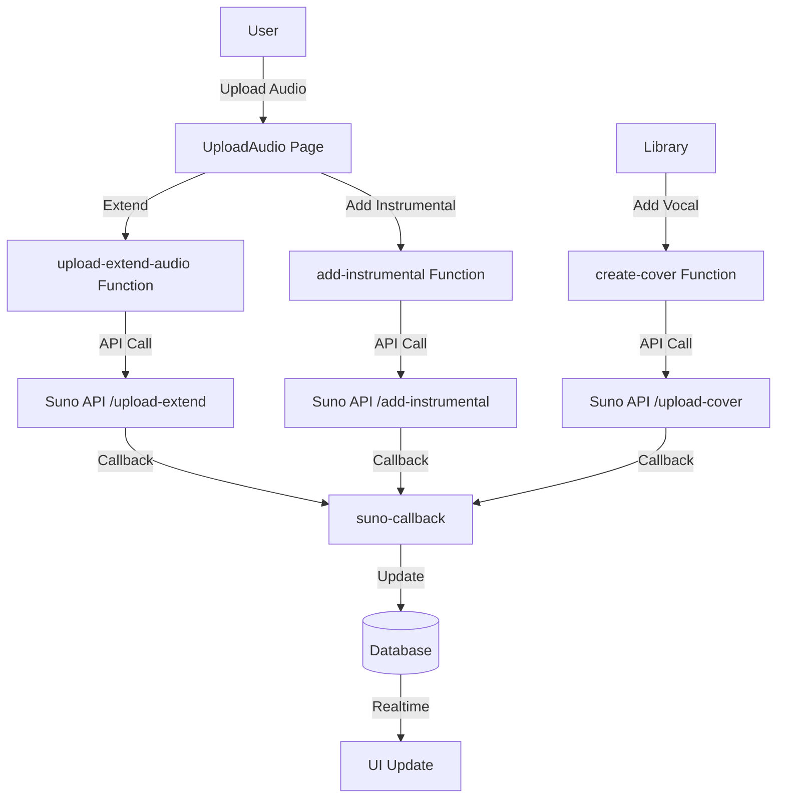
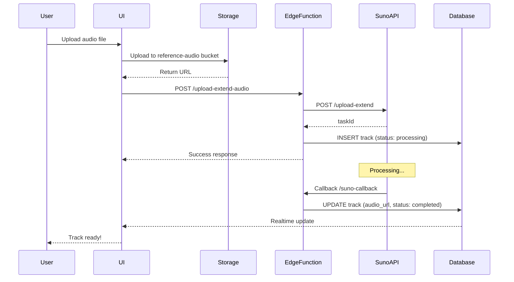
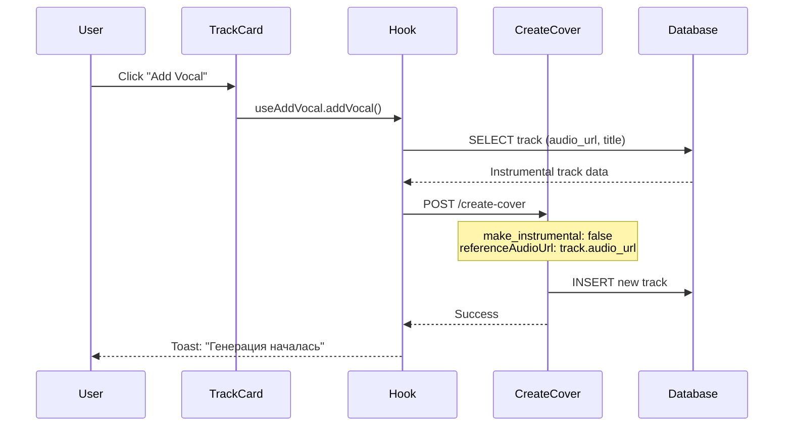

# 🎵 Upload & Extend Audio Guide

## Обзор

Система Upload & Extend позволяет пользователям:
1. **Загружать и расширять аудио** - продолжить существующий трек
2. **Добавлять инструментал** к вокальным дорожкам
3. **Добавлять вокал** к инструментальным дорожкам

---

## 🏗️ Архитектура



---

## 📁 Компоненты системы

### Edge Functions

#### 1. `upload-extend-audio`
**Назначение:** Загрузка аудио и его расширение

**Endpoint:** `/functions/v1/upload-extend-audio`

**Параметры:**
```typescript
{
  uploadUrl: string;              // URL загруженного аудио
  defaultParamFlag: boolean;      // Использовать стандартные параметры
  instrumental?: boolean;         // Инструментал или с вокалом
  prompt?: string;                // Описание стиля
  style?: string;                 // Стиль музыки (требуется если defaultParamFlag=true)
  title?: string;                 // Название (требуется если defaultParamFlag=true)
  continueAt?: number;            // Время продолжения в секундах (требуется если defaultParamFlag=true)
  model?: 'V3_5' | 'V4' | 'V4_5' | 'V4_5PLUS' | 'V5';
  negativeTags?: string;
  vocalGender?: 'm' | 'f';
  styleWeight?: number;           // 0-1
  weirdnessConstraint?: number;   // 0-1
  audioWeight?: number;           // 0-1
}
```

**Suno API Endpoint:** `POST /api/v1/generate/upload-extend`

**Пример:**
```typescript
const { data, error } = await supabase.functions.invoke('upload-extend-audio', {
  body: {
    uploadUrl: 'https://storage.example.com/audio.mp3',
    defaultParamFlag: true,
    style: 'rock',
    title: 'Extended Rock Track',
    continueAt: 30,
    model: 'V4_5PLUS'
  }
});
```

---

#### 2. `add-instrumental`
**Назначение:** Добавление инструментала к вокальной дорожке

**Endpoint:** `/functions/v1/add-instrumental`

**Параметры:**
```typescript
{
  uploadUrl: string;              // URL вокальной дорожки
  title: string;                  // Название
  negativeTags: string;           // Нежелательные инструменты
  tags: string;                   // Стиль инструментала
  vocalGender?: 'm' | 'f';
  styleWeight?: number;
  weirdnessConstraint?: number;
  audioWeight?: number;
  model?: 'V4_5PLUS' | 'V5';
}
```

**Suno API Endpoint:** `POST /api/v1/generate/add-instrumental`

**Пример:**
```typescript
const { data, error } = await supabase.functions.invoke('add-instrumental', {
  body: {
    uploadUrl: 'https://storage.example.com/vocals.mp3',
    title: 'Rock Instrumental Version',
    negativeTags: 'drums, bass',
    tags: 'rock, energetic',
    model: 'V4_5PLUS'
  }
});
```

---

### React Hooks

#### `useUploadExtendAudio`
```typescript
const { uploadExtend, isUploading } = useUploadExtendAudio();

await uploadExtend({
  audioFile: File,
  defaultParamFlag: true,
  style: 'rock',
  title: 'My Track',
  continueAt: 30
});
```

#### `useAddInstrumental`
```typescript
const { addInstrumental, isGenerating } = useAddInstrumental();

await addInstrumental({
  audioFile: File,
  title: 'Instrumental Version',
  negativeTags: 'drums',
  tags: 'rock, energetic'
});
```

#### `useAddVocal`
```typescript
const { addVocal, isGenerating } = useAddVocal();

await addVocal({
  trackId: 'track-uuid',
  vocalText: 'Custom vocal lyrics',
  vocalStyle: 'pop'
});
```

---

## 🎨 UI Components

### UploadAudio Page
**Путь:** `/workspace/upload-audio`

**Вкладки:**
1. **Extend Audio** - расширение существующего трека
2. **Add Instrumental** - добавление инструментала к вокалу

**Функционал:**
- Upload audio file
- Preview audio
- Configure generation parameters
- Track generation progress

---

### Track Context Menu
**Локация:** `TrackCard.tsx`, `TrackListItem.tsx`

**Опция "Добавить вокал":**
- Отображается только на инструментальных треках (`has_vocals = false`)
- Открывает `AddVocalDialog`
- Использует `create-cover` endpoint для генерации вокала

---

## 🔄 Поток данных

### Upload & Extend Flow



---

### Add Vocal Flow



---

## 📊 Database Schema

### tracks table

**Ключевые поля для Upload & Extend:**

```sql
metadata: {
  "operation": "upload_extend" | "add_instrumental",
  "suno_task_id": "string",
  "upload_url": "string",
  "continue_at": number,
  "default_param_flag": boolean,
  "negative_tags": "string",
  "original_tags": "string"
}
```

---

## 🧪 Тестирование

### Unit Tests

**Hooks:**
```bash
# useAddVocal tests
npm run test src/hooks/__tests__/useAddVocal.test.ts
```

### Integration Tests

**Edge Functions:**
```bash
# upload-extend-audio tests
deno test supabase/functions/tests/upload-extend-audio.test.ts

# add-instrumental tests
deno test supabase/functions/tests/add-instrumental.test.ts
```

### E2E Tests

**Playwright:**
```bash
# Upload & Extend scenarios
npx playwright test tests/e2e/upload-audio.spec.ts
```

---

## 🔍 Troubleshooting

### Проблема: 404 при вызове функции

**Причина:** Функция не зарегистрирована в `supabase/config.toml`

**Решение:**
```toml
[functions.upload-extend-audio]
verify_jwt = true

[functions.add-instrumental]
verify_jwt = true
```

---

### Проблема: Suno API возвращает ошибку

**Проверить:**
1. SUNO_API_KEY настроен
2. Формат uploadUrl корректен
3. Аудио файл доступен для загрузки
4. Параметры валидны

**Логи:**
```typescript
// Проверить edge function logs
supabase functions logs upload-extend-audio
supabase functions logs add-instrumental
```

---

### Проблема: Трек не обновляется в UI

**Причина:** Realtime subscriptions не активны

**Решение:**
```sql
-- Enable realtime for tracks table
ALTER PUBLICATION supabase_realtime ADD TABLE public.tracks;
```

---

## 📈 Метрики производительности

### Время обработки

| Операция | Среднее время | Максимум |
|----------|---------------|----------|
| Upload & Extend | 60-90 сек | 120 сек |
| Add Instrumental | 60-90 сек | 120 сек |
| Add Vocal | 60-90 сек | 120 сек |

### Rate Limits

| Endpoint | Лимит |
|----------|-------|
| upload-extend-audio | 10 req/min |
| add-instrumental | 10 req/min |
| create-cover (add vocal) | 10 req/min |

---

## 🔐 Безопасность

### RLS Policies

**reference-audio bucket:**
```sql
-- Users can upload to their own folder
CREATE POLICY "Users can upload own audio"
ON storage.objects FOR INSERT
WITH CHECK (
  bucket_id = 'reference-audio' AND
  auth.uid()::text = (storage.foldername(name))[1]
);

-- Users can read their own audio
CREATE POLICY "Users can read own audio"
ON storage.objects FOR SELECT
USING (
  bucket_id = 'reference-audio' AND
  auth.uid()::text = (storage.foldername(name))[1]
);
```

### JWT Validation

Все Edge Functions требуют авторизации:
```toml
[functions.upload-extend-audio]
verify_jwt = true

[functions.add-instrumental]
verify_jwt = true
```

---

## 📚 Дополнительные ресурсы

- [Suno API Documentation](https://docs.sunoapi.org)
- [Upload And Extend API](https://docs.sunoapi.org/api/upload-extend)
- [Add Instrumental API](https://docs.sunoapi.org/api/add-instrumental)
- [Project Roadmap](../ROADMAP.md)
- [Technical Debt Plan](../../project-management/TECHNICAL_DEBT_PLAN.md)

---

**Последнее обновление:** 2025-10-11  
**Версия:** 2.6.3
