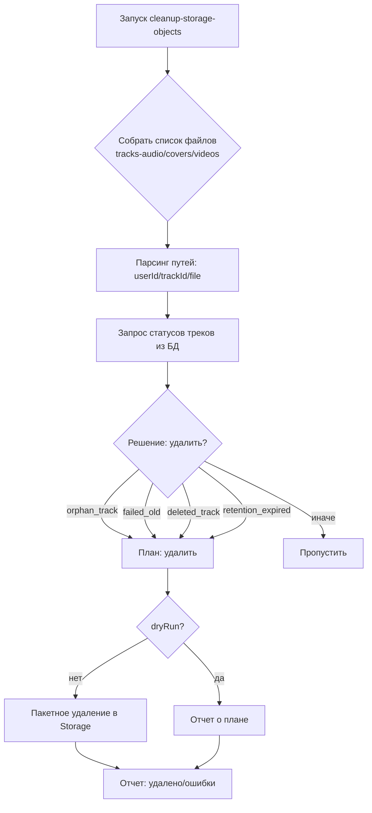

# 🧹 Storage Cleanup System

Статус: ✅ Готово к использованию  
Версия: 1.0  
Дата: 2025-11-08

---

## 🎯 Цель

Автоматически очищать Supabase Storage от:
- Осиротевших файлов (трек удален из БД)
- Файлов failed-треков, старше порогового срока
- Файлов удаленных пользователем треков
- Файлов, чья ретенция хранения истекла

## 🔧 Архитектура

### Edge Function: `cleanup-storage-objects`

Расположение: `supabase/functions/cleanup-storage-objects/index.ts`

Поддерживаемые бакеты:
- `tracks-audio`
- `tracks-covers`
- `tracks-videos`

Логика:
- Рекурсивный обход директорий и файлов
- Парсинг путей вида `userId/trackId/fileName`
- Сверка с БД (`tracks.id`, `status`, `deleted_at`)
- Решение об удалении по правилам
- Пакетное удаление по бакетам

### Визуализация



---

## ⚙️ Параметры

Тело запроса (JSON):

```json
{
  "retentionDays": 90,
  "failedRetentionDays": 7,
  "dryRun": true,
  "maxDeletesPerRun": 500
}
```

- `retentionDays` — общий срок хранения для обычных треков
- `failedRetentionDays` — срок хранения для `status='failed'`
- `dryRun` — только планирование без удаления
- `maxDeletesPerRun` — ограничение на одно выполнение

---

## 🚀 Примеры вызова

```bash
curl -X POST \
  -H "Authorization: Bearer $SUPABASE_SERVICE_ROLE_KEY" \
  -H "Content-Type: application/json" \
  -d '{"dryRun": true, "retentionDays": 120}' \
  "$SUPABASE_URL/functions/v1/cleanup-storage-objects"
```

Удаление (без dryRun):

```bash
curl -X POST \
  -H "Authorization: Bearer $SUPABASE_SERVICE_ROLE_KEY" \
  -H "Content-Type: application/json" \
  -d '{"dryRun": false, "failedRetentionDays": 14, "maxDeletesPerRun": 200}' \
  "$SUPABASE_URL/functions/v1/cleanup-storage-objects"
```

---

## 🗓️ Cron-расписание

Рекомендуемый график: ежедневно в `04:00 UTC`.

SQL-пример (использует `pg_cron`):

```sql
SELECT cron.schedule(
  'cleanup-storage-objects-daily',
  '0 4 * * *',
  $$
  SELECT net.http_post(
    url := '<SUPABASE_URL>/functions/v1/cleanup-storage-objects',
    headers := '{"Content-Type": "application/json", "Authorization": "Bearer <SUPABASE_SERVICE_ROLE_KEY>"}'::jsonb,
    body := '{"dryRun": false, "retentionDays": 90, "failedRetentionDays": 7, "maxDeletesPerRun": 500}'::jsonb
  ) as request_id;
  $$
);
```

Проверка заданий:

```sql
SELECT * FROM cron.job;
SELECT * FROM cron.job_run_details
WHERE jobid = (SELECT jobid FROM cron.job WHERE jobname = 'cleanup-storage-objects-daily')
ORDER BY start_time DESC
LIMIT 20;
```

---

## 📈 Мониторинг

- Логи функции в Supabase Dashboard (`Functions → Logs`)
- Алерты при количестве ошибок > 0
- Метрики: `candidates`, `deleted`, `errors`, `durationMs`

---

## ✅ Чек-лист внедрения

- [x] Создать функцию `cleanup-storage-objects`
- [x] Настроить секреты (`SUPABASE_SERVICE_ROLE_KEY`)
- [x] Запустить в режиме `dryRun` и проверить план
- [x] Включить удаление (`dryRun=false`) с ограничением
- [x] Добавить cron-задачу
- [x] Настроить мониторинг и алерты

---

## 🧪 Тестирование

- Unit-тесты: `supabase/functions/_shared/storage-cleanup_test.ts`
- Проверка корректности парсинга путей и правил принятия решения

---

## 🛠️ Troubleshooting

- Нет объектов в планах → проверьте, что бакеты: `tracks-audio`, `tracks-covers`, `tracks-videos` существуют
- Ошибки удаления → проверьте права Service Role, наличие файлов
- Перегрузка по времени → уменьшите `maxDeletesPerRun`, увеличьте время cron