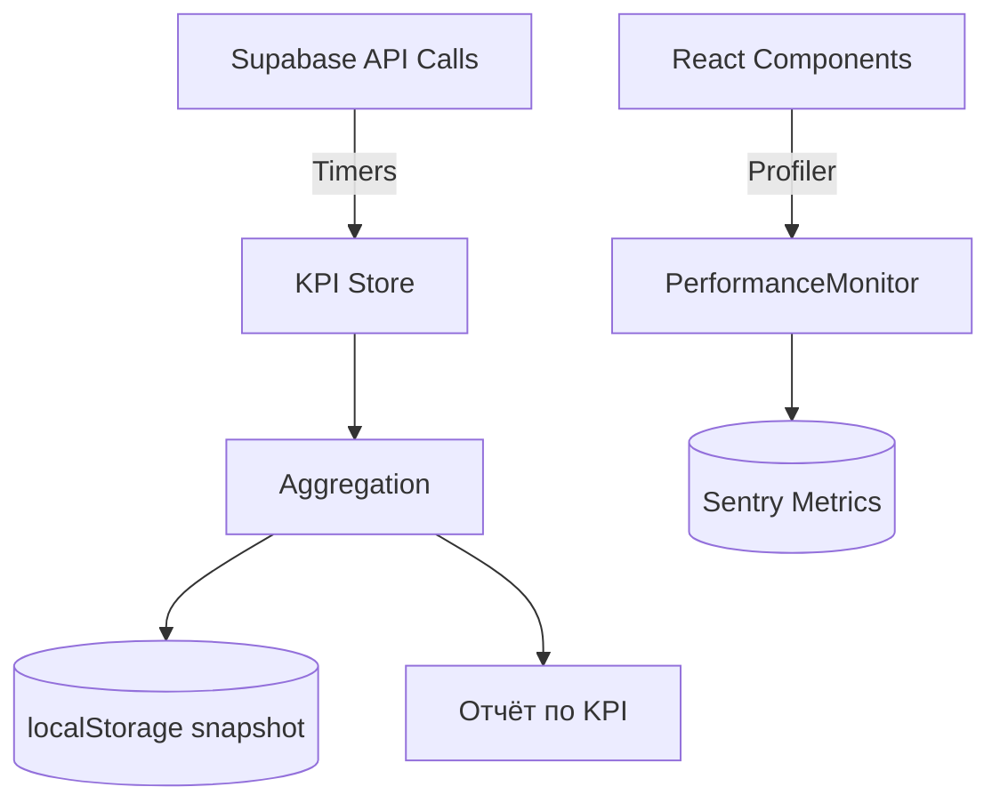

# KPI Мониторинг и Профилирование рендера

Этот документ описывает внедрённую систему мониторинга KPI и интеграцию React Profiler для оценки производительности фронтенда.

## Цели
- Измерять скорость обработки данных (`data_processing`)
- Замерять латентность вызовов Edge Functions (`api_latency`)
- Отслеживать использование памяти (`memory_used`)
- Контролировать частоту ошибок (`error_rate`)

## Архитектура метрик



## Компоненты

- `src/utils/performanceMonitor.ts`
  - Общий монитор: таймеры, запись метрик, Web Vitals, мониторинг памяти
- `src/utils/kpi.ts`
  - KPI-хранилище: таймеры, агрегация, снапшот, экспорт в JSON
- `src/App.tsx`
  - Интеграция React Profiler: запись метрик рендера и отправка в Sentry
- `src/services/api.service.ts`
  - Инструментирование ключевых Supabase вызовов: `improve-prompt`, `get-balance`

## Использование

```ts
import { startKpiTimer, endKpiTimer, getKpiSnapshot } from '@/utils/kpi';

const t = `process:tracks:${Date.now()}`;
startKpiTimer(t);
// ... обработка данных ...
endKpiTimer(t, 'data_processing', { items: 120 });

// Получить агрегаты
const kpis = getKpiSnapshot();
```

## Пороговые значения
- Рендер компонента: предупреждение при `> 1000ms`
- API вызовы: уведомления при `> 10000ms` (настроено в `PerformanceMonitor`)

## Отчётность

- Снапшоты KPI сохраняются в `localStorage` с ключом `kpi:snapshot`
- Метрики отправляются в Sentry (`performance.component_render`, `api.response_time`)

## План расширения

- Инструментирование остальных Supabase вызовов (пакетно)
- Экспорт агрегатов в `docs/audit` для спринтов
- Дашборд KPI в DEV-виджете