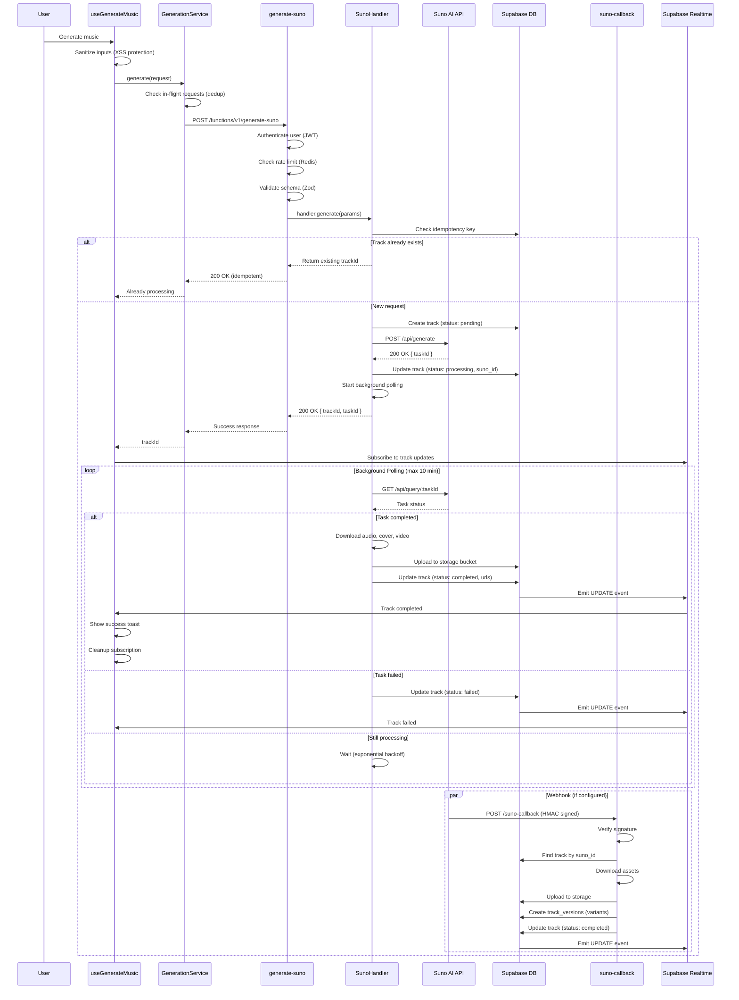
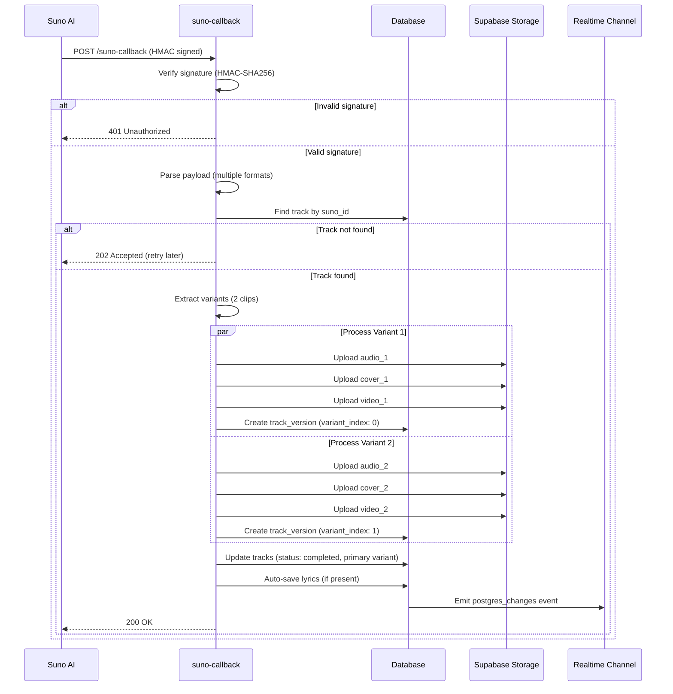
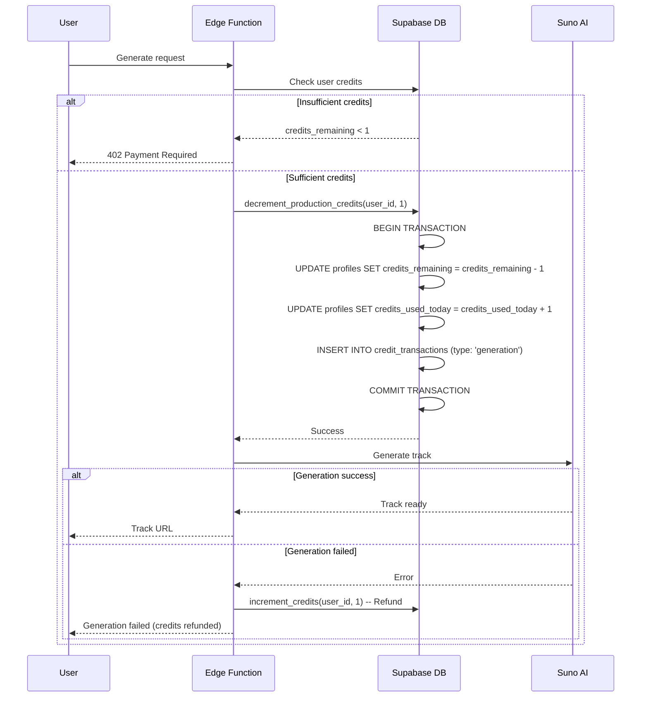

# 03_GENERATION_ENGINE.md - Music Generation System Specification

**Version:** 1.0.0
**Last Updated:** 2025-11-20
**Status:** Production

---

## 📋 Table of Contents

1. [System Overview](#system-overview)
2. [Architecture](#architecture)
3. [Provider Abstraction](#provider-abstraction)
4. [API Flow](#api-flow)
5. [Idempotency](#idempotency)
6. [Rate Limiting](#rate-limiting)
7. [Webhook System](#webhook-system)
8. [Realtime Updates](#realtime-updates)
9. [Retry & Error Handling](#retry--error-handling)
10. [Credit System](#credit-system)
11. [Security](#security)
12. [Performance Optimizations](#performance-optimizations)

---

## System Overview

The Generation Engine is the core system responsible for AI music generation through external providers (Suno AI, Mureka, Minimax). It implements a **distributed, fault-tolerant architecture** with the following key characteristics:

### Key Metrics
- **Throughput:** 10 requests/min per user (rate limit)
- **Latency:** 30-90 seconds average generation time
- **Timeout:** 10 minutes max processing time
- **Success Rate:** 95%+ (with retry mechanism)
- **Idempotency:** 100% (prevents duplicate charges)

### Components
```
┌─────────────────────────────────────────────────────────────┐
│                      Frontend Layer                          │
│  ┌──────────────┐  ┌──────────────┐  ┌──────────────┐     │
│  │useGenerateMusic│→│GenerationService│→│Edge Function│     │
│  └──────────────┘  └──────────────┘  └──────────────┘     │
└─────────────────────────────────────────────────────────────┘
                              ↓
┌─────────────────────────────────────────────────────────────┐
│                   Edge Function Layer (Deno)                 │
│  ┌──────────────┐  ┌──────────────┐  ┌──────────────┐     │
│  │generate-suno │→│SunoHandler   │→│Suno AI API  │     │
│  │              │  │(polling)     │  │(REST/WS)    │     │
│  └──────────────┘  └──────────────┘  └──────────────┘     │
└─────────────────────────────────────────────────────────────┘
                              ↓
┌─────────────────────────────────────────────────────────────┐
│                      Webhook + Realtime                      │
│  ┌──────────────┐  ┌──────────────┐  ┌──────────────┐     │
│  │suno-callback │→│Track Update  │→│Realtime      │     │
│  │(HMAC verify) │  │(storage)     │  │(Postgres)    │     │
│  └──────────────┘  └──────────────┘  └──────────────┘     │
└─────────────────────────────────────────────────────────────┘
```

---

## Architecture

### Design Patterns

#### 1. Template Method Pattern (GenerationHandler)
Abstract base class that defines the generation workflow:

```typescript
abstract class GenerationHandler<TParams> {
  // Template method (fixed workflow)
  async generate(params: TParams): Promise<GenerationResponse> {
    // 1. Validate parameters (provider-specific)
    await this.validateProviderParams(params);

    // 2. Check idempotency (universal)
    const existingTrack = await this.checkIdempotency(params.idempotencyKey);
    if (existingTrack) return { success: true, trackId: existingTrack.id };

    // 3. Create track record (universal)
    const { trackId } = await this.createTrackRecord(params);

    // 4. Call provider API (provider-specific)
    const taskId = await this.callProviderAPI(params, trackId);

    // 5. Update track with task ID (universal)
    await this.updateTrackTaskId(trackId, taskId);

    // 6. Start background polling (universal)
    this.startPolling(trackId, taskId);

    return { success: true, trackId, taskId };
  }

  // Abstract methods (provider-specific)
  protected abstract callProviderAPI(params: TParams, trackId: string): Promise<string>;
  protected abstract pollTaskStatus(taskId: string): Promise<ProviderTrackData>;
  protected abstract validateProviderParams(params: TParams): Promise<void>;
  protected abstract buildMetadata(params: TParams): Record<string, unknown>;
}
```

#### 2. Strategy Pattern (Providers)
Concrete implementations for each provider:

```
GenerationHandler (abstract)
     ↑
     ├─ SunoGenerationHandler
     ├─ MurekaGenerationHandler (future)
     └─ MinimaxGenerationHandler (future)
```

#### 3. Observer Pattern (Realtime Updates)
Frontend subscribes to track changes via Supabase Realtime:

```typescript
RealtimeSubscriptionManager.subscribeToTrack(trackId, (payload) => {
  const track = payload.new;
  if (track.status === 'completed') {
    // Update UI
  }
});
```

---

## Provider Abstraction

### Base Interface

```typescript
interface BaseGenerationParams {
  trackId?: string;
  title?: string;
  prompt: string;
  lyrics?: string;
  styleTags?: string[];
  hasVocals?: boolean;
  modelVersion?: string;
  idempotencyKey?: string;
  projectId?: string;
}
```

### Suno-Specific Extensions

```typescript
interface SunoGenerationParams extends BaseGenerationParams {
  customMode?: boolean;         // true = lyrics mode, false = prompt mode
  make_instrumental?: boolean;  // Remove vocals
  negativeTags?: string;        // Excluded styles
  vocalGender?: 'm' | 'f';      // Voice gender
  styleWeight?: number;         // 0.0-1.0
  weirdnessConstraint?: number; // 0.0-1.0 (creativity)
  audioWeight?: number;         // 0.0-1.0 (reference audio influence)
  referenceAudioUrl?: string;   // URL to reference track
  personaId?: string;           // Voice persona ID
}
```

### Provider Features Matrix

| Feature | Suno | Mureka | Minimax |
|---------|------|--------|---------|
| **Prompt Generation** | ✅ | ✅ | ✅ |
| **Lyrics Generation** | ✅ | ❌ | ❌ |
| **Voice Personas** | ✅ | ❌ | ❌ |
| **Reference Audio** | ✅ | ✅ | ❌ |
| **Stem Separation** | ✅ | ❌ | ❌ |
| **Track Variants** | ✅ (2 variants) | ❌ | ❌ |
| **Video Output** | ✅ | ❌ | ❌ |
| **Max Duration** | 4min | 3min | 2min |
| **Typical Latency** | 30-60s | 20-40s | 15-30s |

---

## API Flow

### Sequence Diagram: Complete Generation Flow



### Critical Paths

#### Happy Path (30-60 seconds)
```
User Input → Edge Function (1s) → Suno API (30-60s) → Webhook (5s) → Realtime (instant) → UI Update
```

#### Fallback Path (10 minutes)
```
User Input → Edge Function → Suno API (timeout) → Polling (10 min max) → Mark Failed → UI Update
```

---

## Idempotency

### Implementation

**Problem:** Multiple identical requests can cause duplicate charges and database inconsistency.

**Solution:** Idempotency keys with database-level uniqueness.

```typescript
// Client generates idempotency key
const idempotencyKey = crypto.randomUUID();

const result = await GenerationService.generate({
  prompt: "epic orchestral music",
  idempotencyKey,
});

// Edge Function checks idempotency
const existingTrack = await supabase
  .from('tracks')
  .select('id, status, metadata')
  .eq('idempotency_key', idempotencyKey)
  .eq('user_id', userId)
  .maybeSingle();

if (existingTrack) {
  return { success: true, trackId: existingTrack.id, message: 'Already processed' };
}
```

### Database Constraint

```sql
CREATE UNIQUE INDEX idx_tracks_idempotency_key_user_id
ON tracks(idempotency_key, user_id)
WHERE idempotency_key IS NOT NULL;
```

### Idempotency Window
- **Duration:** Indefinite (keys never expire)
- **Scope:** Per user (same key for different users is allowed)
- **Behavior:** Return existing track if key matches

---

## Rate Limiting

### Configuration

```typescript
// Redis-based rate limiting (distributed)
const rateLimitConfig = {
  GENERATION: {
    max: 10,        // 10 requests
    window: 60000,  // per minute
    strategy: 'token_bucket'
  }
};

// Check rate limit
const result = await checkRateLimitRedis(userId, 'GENERATION');

if (!result.allowed) {
  return new Response(JSON.stringify({
    error: 'Rate limit exceeded',
    resetAt: result.resetAt,
    retryAfter: result.retryAfter,
    remaining: result.remaining
  }), {
    status: 429,
    headers: {
      'X-RateLimit-Limit': '10',
      'X-RateLimit-Remaining': result.remaining.toString(),
      'X-RateLimit-Reset': Math.ceil(result.resetAt / 1000).toString(),
      'Retry-After': result.retryAfter.toString()
    }
  });
}
```

### Rate Limit Tiers

| Plan | Generations/Min | Generations/Day | Concurrent |
|------|-----------------|-----------------|------------|
| **Free** | 3 | 10 | 1 |
| **Pro** | 10 | 100 | 3 |
| **Premium** | 30 | Unlimited | 10 |

### Implementation Details

**Storage:** Redis (Upstash)
**Algorithm:** Token Bucket
**Granularity:** Per user + per endpoint
**Sync:** Automatic (Redis handles distributed state)

---

## Webhook System

### Webhook Flow



### Signature Verification

```typescript
// HMAC-SHA256 verification
async function verifyWebhookSignature(
  body: string,
  signature: string,
  secret: string
): Promise<boolean> {
  const encoder = new TextEncoder();
  const key = await crypto.subtle.importKey(
    'raw',
    encoder.encode(secret),
    { name: 'HMAC', hash: 'SHA-256' },
    false,
    ['verify']
  );

  const signatureBytes = Uint8Array.from(
    signature.match(/.{1,2}/g)!.map(byte => parseInt(byte, 16))
  );

  const isValid = await crypto.subtle.verify(
    'HMAC',
    key,
    signatureBytes,
    encoder.encode(body)
  );

  return isValid;
}
```

### Payload Formats

Suno sends webhooks in multiple formats. Handler supports all:

**Format 1: Nested data**
```json
{
  "data": {
    "data": [
      { "id": "abc", "audioUrl": "...", "status": "SUCCESS" },
      { "id": "def", "audioUrl": "...", "status": "SUCCESS" }
    ],
    "task_id": "task-123",
    "callbackType": "first"
  }
}
```

**Format 2: Array data**
```json
{
  "data": [
    { "id": "abc", "audioUrl": "...", "status": "SUCCESS" }
  ],
  "taskId": "task-123"
}
```

**Format 3: Single object**
```json
{
  "id": "abc",
  "audioUrl": "...",
  "status": "SUCCESS",
  "taskId": "task-123"
}
```

### Callback Types

| Callback Type | Description | Action |
|---------------|-------------|--------|
| **text** | Lyrics generated | Ignore (wait for audio) |
| **first** | First clip ready | Process immediately (fast UI update) |
| **audio** | All clips ready | Process all variants |
| **complete** | Full generation done | Final update |

---

## Realtime Updates

### Subscription Pattern

```typescript
// Centralized subscription manager (prevents duplicates)
const unsubscribe = RealtimeSubscriptionManager.subscribeToTrack(
  trackId,
  (payload: RealtimePostgresChangesPayload) => {
    const track = payload.new;

    if (track.status === 'completed') {
      showToast('Track ready!');
      onSuccess();
      cleanup();
    } else if (track.status === 'failed') {
      showToast('Generation failed', { variant: 'destructive' });
      cleanup();
    }
  }
);

// Automatic cleanup on unmount
useEffect(() => () => unsubscribe(), []);
```

### Subscription Manager Features

1. **Deduplication:** Same trackId = single subscription
2. **Automatic Cleanup:** Garbage collection after inactivity
3. **Reconnection:** Auto-reconnect on network failure
4. **Logging:** Centralized logging for debugging

### Realtime vs Polling

| Method | Latency | Scalability | Reliability |
|--------|---------|-------------|-------------|
| **Realtime** | <1s | High (WebSocket) | 99.9% |
| **Polling** | 10s | Medium (HTTP) | 100% (fallback) |

**Strategy:** Use both
- Primary: Realtime (fast)
- Fallback: Polling (reliable)

---

## Retry & Error Handling

### Exponential Backoff

```typescript
class PollingConfig {
  initialInterval = 2000;     // 2s
  maxInterval = 30000;        // 30s
  backoffMultiplier = 1.5;    // 1.5x each retry
  maxAttempts = 120;          // ~10 minutes max
}

const poll = async (attemptNumber: number) => {
  try {
    const result = await checkTaskStatus(taskId);

    if (result.status === 'completed') {
      await handleSuccess(result);
      return;
    }

    if (result.status === 'failed') {
      await handleFailure(result);
      return;
    }

    // Calculate next interval
    const nextInterval = Math.min(
      initialInterval * Math.pow(backoffMultiplier, attemptNumber),
      maxInterval
    );

    setTimeout(() => poll(attemptNumber + 1), nextInterval);

  } catch (error) {
    logger.error('Polling error', { error, attemptNumber });
    // Retry on error
    setTimeout(() => poll(attemptNumber + 1), maxInterval);
  }
};
```

### Timeout Protection

```typescript
const MAX_PROCESSING_TIME = 10 * 60 * 1000; // 10 minutes
const pollingStartTime = Date.now();

const poll = async () => {
  const elapsedTime = Date.now() - pollingStartTime;

  if (elapsedTime > MAX_PROCESSING_TIME) {
    await markTrackFailed(trackId, 'Processing timeout (10 minutes)');
    return;
  }

  // Continue polling...
};
```

### Error Categories

| Error Type | HTTP Code | Retry Strategy | User Message |
|------------|-----------|----------------|--------------|
| **Rate Limit** | 429 | Wait until resetAt | "Too many requests. Try again in X minutes." |
| **Insufficient Credits** | 402 | No retry | "Insufficient credits. Please upgrade." |
| **Invalid Input** | 400 | No retry | "Invalid prompt. Please check your input." |
| **Provider Error** | 500 | Retry 3x | "Generation failed. Retrying..." |
| **Timeout** | 504 | No retry | "Generation timed out. Please try again." |
| **Network Error** | - | Retry 5x | "Network error. Retrying..." |

---

## Credit System

### Credit Deduction Flow



### Database Functions

```sql
-- Decrement credits (atomic)
CREATE OR REPLACE FUNCTION decrement_production_credits(
  user_uuid UUID,
  amount INTEGER
) RETURNS BOOLEAN AS $$
BEGIN
  -- Check if user has enough credits
  IF (SELECT credits_remaining FROM profiles WHERE id = user_uuid) < amount THEN
    RAISE EXCEPTION 'Insufficient credits';
  END IF;

  -- Deduct credits
  UPDATE profiles
  SET
    credits_remaining = credits_remaining - amount,
    credits_used_today = credits_used_today + amount,
    updated_at = NOW()
  WHERE id = user_uuid;

  -- Log transaction
  INSERT INTO credit_transactions (user_id, amount, type, created_at)
  VALUES (user_uuid, -amount, 'generation', NOW());

  RETURN TRUE;
END;
$$ LANGUAGE plpgsql SECURITY DEFINER;
```

### Credit Costs

| Operation | Cost (Credits) | Notes |
|-----------|----------------|-------|
| **Generate Track** | 1 | Per track (2 variants) |
| **Extend Track** | 0.5 | Continuation |
| **Replace Section** | 0.5 | Edit part |
| **Generate Lyrics** | 0.1 | Text only |
| **Create Persona** | 0 | Free feature |
| **Separate Stems** | 0.5 | Audio processing |

### Daily Limits Reset

```sql
-- CRON job (runs at 00:00 UTC)
SELECT cron.schedule(
  'reset-daily-credits',
  '0 0 * * *', -- Every day at midnight UTC
  $$
  UPDATE profiles
  SET
    credits_used_today = 0,
    last_credit_reset_at = NOW()
  WHERE last_credit_reset_at < CURRENT_DATE;
  $$
);
```

---

## Security

### Input Sanitization

```typescript
// XSS protection
function sanitizePrompt(prompt: string): string {
  return prompt
    .replace(/<script[^>]*>.*?<\/script>/gi, '')
    .replace(/<[^>]+>/g, '')
    .replace(/javascript:/gi, '')
    .replace(/on\w+=/gi, '')
    .trim()
    .substring(0, 3000); // Max 3000 chars
}

function sanitizeLyrics(lyrics: string): string {
  return lyrics
    .replace(/<script[^>]*>.*?<\/script>/gi, '')
    .replace(/<[^>]+>/g, '')
    .trim()
    .substring(0, 5000); // Max 5000 chars
}

function sanitizeTitle(title: string): string {
  return title
    .replace(/[<>'"]/g, '')
    .trim()
    .substring(0, 100);
}
```

### SQL Injection Prevention

**Always use parameterized queries:**

```typescript
// ✅ SAFE
const { data } = await supabase
  .from('tracks')
  .select('*')
  .eq('user_id', userId)
  .eq('status', 'completed');

// ❌ UNSAFE (DON'T DO THIS)
const query = `SELECT * FROM tracks WHERE user_id = '${userId}'`;
```

### CSRF Protection

Edge Functions use JWT tokens + CORS headers:

```typescript
const corsHeaders = {
  'Access-Control-Allow-Origin': ALLOWED_ORIGINS,
  'Access-Control-Allow-Methods': 'POST, OPTIONS',
  'Access-Control-Allow-Headers': 'Authorization, Content-Type',
  'Access-Control-Max-Age': '86400',
};
```

### Webhook Security

1. **Signature Verification:** HMAC-SHA256
2. **Timestamp Check:** Reject old webhooks (> 5 min)
3. **Idempotency:** Ignore duplicate webhooks
4. **Rate Limiting:** Max 100 webhooks/min per provider

---

## Performance Optimizations

### 1. Request Deduplication

```typescript
// Prevent duplicate in-flight requests
private static pendingRequests = new Map<string, Promise<GenerationResult>>();

static generate(request: GenerationRequest): Promise<GenerationResult> {
  const requestKey = `${request.provider}:${request.prompt}:${request.idempotencyKey}`;

  const pending = this.pendingRequests.get(requestKey);
  if (pending) {
    logger.info('Deduplicating request', { requestKey });
    return pending; // Return existing promise
  }

  const promise = this.generateInternal(request);
  this.pendingRequests.set(requestKey, promise);

  // Cleanup after 5 seconds
  setTimeout(() => this.pendingRequests.delete(requestKey), 5000);

  return promise;
}
```

### 2. Realtime Subscription Deduplication

```typescript
// Centralized subscription manager
class RealtimeSubscriptionManager {
  private static channels = new Map<string, RealtimeChannel>();

  static subscribeToTrack(trackId: string, callback: Callback): UnsubscribeFn {
    const channelKey = `track:${trackId}`;

    // Reuse existing channel
    let channel = this.channels.get(channelKey);
    if (!channel) {
      channel = this.createChannel(trackId);
      this.channels.set(channelKey, channel);
    }

    // Add callback to channel
    channel.on('postgres_changes', callback);

    return () => channel.off('postgres_changes', callback);
  }
}
```

### 3. Database Query Optimization

```typescript
// ❌ SLOW: N+1 query problem
const tracks = await getTracks(userId);
for (const track of tracks) {
  const versions = await getVersions(track.id); // N queries
}

// ✅ FAST: Single query with JOIN
const { data } = await supabase
  .from('tracks')
  .select(`
    *,
    track_versions (*)
  `)
  .eq('user_id', userId);
```

### 4. Caching Strategy

```typescript
// React Query cache configuration
const queryClient = new QueryClient({
  defaultOptions: {
    queries: {
      staleTime: 5 * 60 * 1000,  // 5 minutes
      gcTime: 10 * 60 * 1000,     // 10 minutes
      retry: 3,
      retryDelay: (attemptIndex) => Math.min(1000 * 2 ** attemptIndex, 30000),
    },
  },
});
```

### 5. Storage Optimizations

```typescript
// Parallel uploads (faster)
await Promise.all([
  downloadAndUploadAudio(audioUrl, trackId),
  downloadAndUploadCover(coverUrl, trackId),
  downloadAndUploadVideo(videoUrl, trackId),
]);

// Stream uploads (lower memory)
const response = await fetch(audioUrl);
const stream = response.body;
await supabase.storage
  .from('tracks')
  .upload(`${userId}/${trackId}/audio.mp3`, stream, {
    contentType: 'audio/mpeg',
    upsert: true,
  });
```

### 6. Edge Function Cold Start Optimization

```typescript
// Lazy import heavy dependencies
const { verifyWebhookSignature } = await import('../_shared/webhook-verify.ts');

// Reuse Supabase client (singleton)
let cachedSupabaseClient: SupabaseClient | null = null;

function getSupabaseClient(): SupabaseClient {
  if (!cachedSupabaseClient) {
    cachedSupabaseClient = createClient(SUPABASE_URL, SUPABASE_KEY);
  }
  return cachedSupabaseClient;
}
```

---

## Monitoring & Observability

### Key Metrics

```typescript
// Sentry custom metrics
trackGenerationEvent('started', trackId, provider, {
  promptLength: prompt.length,
  modelVersion,
});

trackGenerationEvent('completed', trackId, provider, {
  duration,
  audioSize,
});

trackGenerationEvent('failed', trackId, provider, {
  errorMessage,
  errorCode,
});
```

### Logging Strategy

```typescript
// Structured logging
logger.info('Generation started', 'GenerationService', {
  userId,
  trackId,
  provider,
  promptLength: prompt.length,
  hasLyrics: !!lyrics,
});

// Error logging with context
logger.error('Generation failed', error, 'GenerationService', {
  userId,
  trackId,
  provider,
  duration: Date.now() - startTime,
  errorCode: error.code,
});
```

### Health Checks

```sql
-- Function: check_stuck_tracks
CREATE OR REPLACE FUNCTION check_stuck_tracks()
RETURNS TABLE(track_id UUID, status TEXT, stuck_minutes INTEGER) AS $$
BEGIN
  RETURN QUERY
  SELECT
    id,
    status,
    EXTRACT(EPOCH FROM (NOW() - updated_at)) / 60 AS stuck_minutes
  FROM tracks
  WHERE
    status IN ('pending', 'processing')
    AND updated_at < NOW() - INTERVAL '10 minutes';
END;
$$ LANGUAGE plpgsql;
```

---

## Error Recovery

### Auto-Recovery Strategies

#### 1. Stuck Track Detection

```typescript
// Monitor service (runs every 5 minutes)
async function detectStuckTracks() {
  const { data: stuckTracks } = await supabase
    .rpc('check_stuck_tracks');

  for (const track of stuckTracks) {
    logger.warn('Stuck track detected', { trackId: track.track_id });

    // Mark as failed
    await supabase
      .from('tracks')
      .update({
        status: 'failed',
        error_message: 'Processing timeout (auto-recovery)',
      })
      .eq('id', track.track_id);
  }
}
```

#### 2. Webhook Retry

```typescript
// Suno retries webhook if we return 202 Accepted
if (!track) {
  return new Response(JSON.stringify({
    ok: false,
    message: 'track_not_found_yet',
    retry: true
  }), {
    status: 202, // Tells Suno to retry
    headers: corsHeaders
  });
}
```

#### 3. Credit Refunds

```typescript
// Automatic refund on failure
if (track.status === 'failed') {
  await supabase.rpc('increment_credits', {
    user_uuid: track.user_id,
    amount: 1,
  });

  logger.info('Credits refunded', { trackId: track.id, userId: track.user_id });
}
```

---

## Testing Strategy

### Unit Tests

```typescript
describe('SunoGenerationHandler', () => {
  it('should handle idempotency correctly', async () => {
    const key = 'test-key-123';

    // First request
    const result1 = await handler.generate({ ...params, idempotencyKey: key });
    expect(result1.success).toBe(true);

    // Second request (duplicate)
    const result2 = await handler.generate({ ...params, idempotencyKey: key });
    expect(result2.trackId).toBe(result1.trackId);
  });

  it('should handle timeout correctly', async () => {
    const result = await handler.generateWithTimeout(params, 1000); // 1s timeout
    expect(result.error).toContain('timeout');
  });
});
```

### Integration Tests

```typescript
describe('Generation E2E', () => {
  it('should complete full generation flow', async () => {
    const trackId = await startGeneration(params);

    // Wait for completion (with timeout)
    const track = await waitForCompletion(trackId, { timeout: 120000 });

    expect(track.status).toBe('completed');
    expect(track.audio_url).toBeTruthy();
    expect(track.track_versions).toHaveLength(2); // 2 variants
  });
});
```

---

## Deployment

### Environment Variables

```bash
# Edge Function env
SUPABASE_URL=https://xxx.supabase.co
SUPABASE_SERVICE_ROLE_KEY=xxx
SUNO_API_KEY=xxx
SUNO_WEBHOOK_SECRET=xxx
SUNO_CALLBACK_URL=https://xxx.supabase.co/functions/v1/suno-callback
REDIS_URL=redis://xxx (Upstash)

# Frontend env
VITE_SUPABASE_URL=https://xxx.supabase.co
VITE_SUPABASE_PUBLISHABLE_KEY=xxx
```

### Deployment Checklist

- [ ] Edge Functions deployed
- [ ] Webhook endpoint verified
- [ ] HMAC secret configured
- [ ] Rate limits tested
- [ ] Credit system verified
- [ ] Realtime subscriptions working
- [ ] Sentry configured
- [ ] Monitoring dashboards created

---

## Troubleshooting

### Common Issues

#### 1. Stuck Tracks

**Symptoms:** Track stuck in `processing` status for > 10 minutes

**Causes:**
- Webhook not received (check Suno logs)
- Polling timeout reached
- Network error during storage upload

**Solutions:**
1. Check Edge Function logs: `supabase functions logs generate-suno`
2. Check webhook logs: `supabase functions logs suno-callback`
3. Manually mark as failed: `UPDATE tracks SET status = 'failed' WHERE id = 'xxx'`
4. Run auto-recovery: `SELECT check_stuck_tracks()`

#### 2. Duplicate Subscriptions

**Symptoms:** Multiple realtime events for single track update

**Causes:**
- Component remounting
- Subscription not cleaned up

**Solutions:**
1. Use RealtimeSubscriptionManager (centralized)
2. Cleanup in useEffect: `useEffect(() => () => unsubscribe(), [])`
3. Check subscription count: `RealtimeSubscriptionManager.getActiveCount()`

#### 3. Rate Limit Issues

**Symptoms:** 429 errors, even with valid rate limit

**Causes:**
- Redis connection issues
- Clock skew (distributed systems)

**Solutions:**
1. Check Redis status: `await redis.ping()`
2. Reset rate limit: `await redis.del(`rate_limit:${userId}:GENERATION`)`
3. Increase window: Change from 1 min to 5 min

---

## Future Improvements

### Phase 2: Advanced Features

1. **Batch Generation** — Generate multiple tracks in parallel
2. **Priority Queue** — Premium users get faster processing
3. **Smart Retry** — ML-based retry with adjusted parameters
4. **Preview Mode** — 15-second preview before full generation
5. **Cost Optimization** — Dynamic provider selection based on cost/speed

### Phase 3: Scalability

1. **Message Queue** — Replace polling with event-driven architecture (NATS/RabbitMQ)
2. **Horizontal Scaling** — Multiple Edge Function instances with load balancing
3. **CDN Integration** — Distribute audio files via CloudFlare CDN
4. **Regional Deployment** — Edge Functions in multiple regions

---

## References

- [Suno AI API Documentation](https://suno.ai/docs)
- [Supabase Edge Functions Guide](https://supabase.com/docs/guides/functions)
- [Supabase Realtime Guide](https://supabase.com/docs/guides/realtime)
- [HMAC Signature Verification](https://www.rfc-editor.org/rfc/rfc2104)
- [Token Bucket Algorithm](https://en.wikipedia.org/wiki/Token_bucket)

---

**Document Version:** 1.0.0
**Last Updated:** 2025-11-20
**Maintained By:** HOW2AI-AGENCY Development Team
