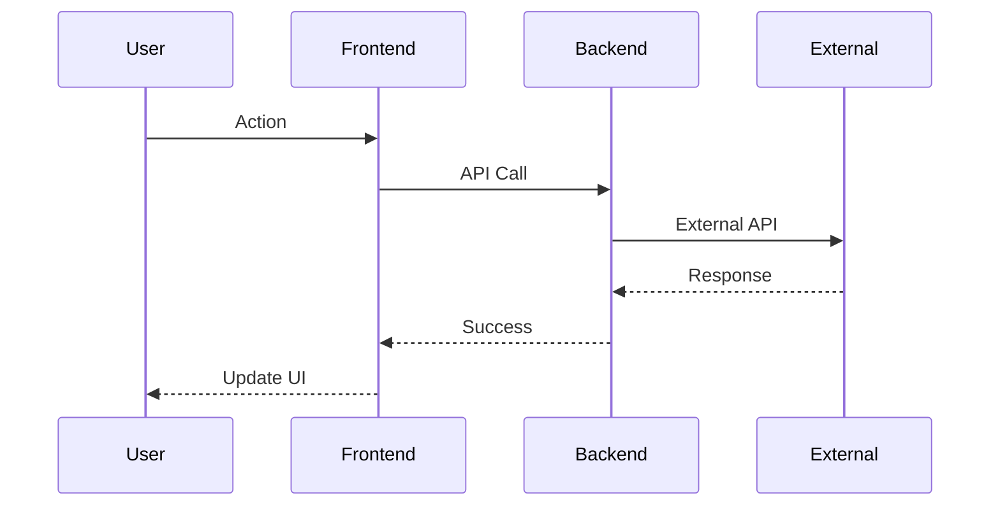
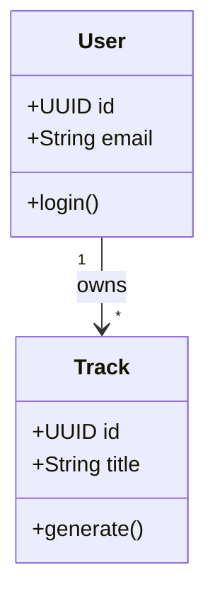
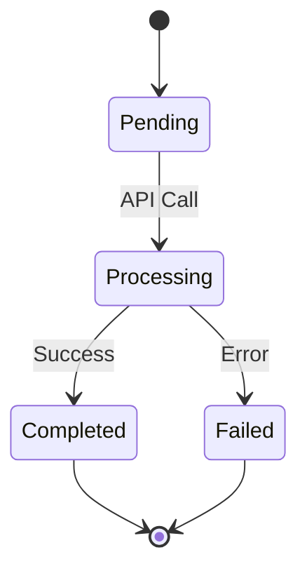

# Technical Specifications - AI-Ready Documentation

This directory contains **Technical Specifications** optimized for AI code generation tools (Claude Code, Gemini-CLI, GitHub Copilot).

---

## 📚 Specification Files

| File | Purpose | Status | For AI Agents |
|------|---------|--------|---------------|
| **[00_SYSTEM_CONTEXT.md](./00_SYSTEM_CONTEXT.md)** | High-level overview, tech stack, architecture principles | ✅ Complete | System understanding |
| **[01_DATABASE_SCHEMA.md](./01_DATABASE_SCHEMA.md)** | PostgreSQL schema, RLS policies, triggers, functions | 📝 TODO | Database operations |
| **[02_AUTH_AND_ROLES.md](./02_AUTH_AND_ROLES.md)** | Authentication flows, permission matrix, RLS rules | 📝 TODO | Auth implementation |
| **[03_GENERATION_ENGINE.md](./03_GENERATION_ENGINE.md)** | Music generation system, providers, webhooks, realtime | ✅ Complete | Generation features |
| **[04_LYRICS_SYSTEM.md](./04_LYRICS_SYSTEM.md)** | Lyrics generation, variants, auto-save, editor | 📝 TODO | Lyrics features |
| **[05_AUDIO_PLAYER.md](./05_AUDIO_PLAYER.md)** | Audio playback, queue, visualization, controls | 📝 TODO | Player features |
| **[06_PROJECT_MANAGEMENT.md](./06_PROJECT_MANAGEMENT.md)** | Projects (albums), track organization, AI context | 📝 TODO | Project features |
| **[07_ANALYTICS.md](./07_ANALYTICS.md)** | Event tracking, dashboards, user metrics | 📝 TODO | Analytics features |

---

## 🎯 Purpose

These specifications serve as **context for AI coding assistants**:

### For Claude Code / Gemini-CLI
- **Accurate Code Generation:** Specs provide domain knowledge
- **Consistent Patterns:** Follow established architecture
- **Reduce Hallucinations:** Detailed API contracts prevent guessing
- **Faster Onboarding:** New AI sessions understand system quickly

### For Human Developers
- **Single Source of Truth:** All decisions documented
- **Onboarding Guide:** New team members read specs first
- **Refactoring Reference:** Understand impact of changes

---

## 📝 Specification Format

Each spec follows this structure:

```markdown
# XX_TITLE.md

## System Overview
- High-level description
- Key metrics
- Components diagram

## Architecture
- Design patterns used
- Sequence diagrams
- Data flow diagrams

## API Contracts
- Request/Response types
- Error codes
- Rate limits

## Implementation Details
- Code examples
- Database queries
- Edge cases

## Testing
- Test scenarios
- Mock data
- Integration tests

## Deployment
- Environment variables
- Configuration
- Monitoring

## Troubleshooting
- Common issues
- Solutions
- Recovery procedures
```

---

## 🔧 How to Use

### For AI Code Generation

**Example prompt to Claude Code:**

```
Read the following specifications:
- docs/specs/00_SYSTEM_CONTEXT.md (system overview)
- docs/specs/03_GENERATION_ENGINE.md (generation system)

Then implement a new feature: "Add batch generation support"

Requirements:
1. Generate multiple tracks in parallel
2. Show progress for each track
3. Handle partial failures gracefully
```

**AI will:**
1. Read specs to understand existing patterns
2. Follow idempotency, rate limiting, and error handling patterns
3. Generate code consistent with architecture
4. Include tests and error handling

---

### For Code Reviews

**Checklist:**
- [ ] Does PR follow patterns in specs?
- [ ] Are specs updated if architecture changed?
- [ ] New features documented in appropriate spec?
- [ ] Sequence diagrams updated if flow changed?

---

## 🚀 Creating New Specs

When adding a new specification:

1. **Copy template:**
   ```bash
   cp docs/specs/_TEMPLATE.md docs/specs/08_NEW_FEATURE.md
   ```

2. **Fill sections:**
   - System Overview (what + why)
   - Architecture (how)
   - API Contracts (interfaces)
   - Implementation (code examples)
   - Testing (scenarios)

3. **Add Mermaid diagrams:**
   - Sequence diagrams for flows
   - Class diagrams for entities
   - State machines for workflows

4. **Review with AI:**
   - Ask Claude Code to review spec for completeness
   - Check if AI can understand and generate code from spec

5. **Update README:**
   - Add to specification files table
   - Link from root README.md

---

## 🎨 Mermaid Diagram Standards

### Sequence Diagrams



### Class Diagrams



### State Machines



---

## 📊 Specification Quality Metrics

**Good Specification:**
- ✅ AI can generate 80%+ correct code from it
- ✅ Covers happy path + error cases
- ✅ Includes code examples
- ✅ Has sequence diagrams for flows
- ✅ Lists all environment variables
- ✅ Documents rate limits and timeouts

**Needs Improvement:**
- ❌ Too high-level (no implementation details)
- ❌ Missing error codes
- ❌ No diagrams (hard to visualize)
- ❌ Outdated (doesn't match current code)

---

## 🔄 Maintenance

### When to Update Specs

1. **Architecture Change:** New pattern introduced
2. **API Change:** Request/response format changed
3. **New Provider:** Added Mureka/Minimax support
4. **Performance Fix:** Changed timeout/retry logic
5. **Security Update:** New sanitization/validation

### Update Process

```bash
# 1. Edit spec
vim docs/specs/03_GENERATION_ENGINE.md

# 2. Validate diagrams render
# (Check GitHub preview)

# 3. Test with AI
# Ask Claude Code to implement feature using updated spec

# 4. Commit with clear message
git add docs/specs/03_GENERATION_ENGINE.md
git commit -m "docs(specs): update generation engine timeout handling"
```

---

## 🎓 Best Practices

### For AI Agents

1. **Always read 00_SYSTEM_CONTEXT.md first** — Understand overall system
2. **Read relevant spec before generating code** — Follow patterns
3. **Check for updates** — Specs may have changed since last session
4. **Ask clarifying questions** — If spec is ambiguous

### For Developers

1. **Update specs BEFORE code** — Design first
2. **Use specs in PRs** — Reference spec sections
3. **Keep specs concise** — Too long = AI context limit
4. **Add real code examples** — Not pseudo-code

---

## 📚 Related Documentation

- [../ARCHITECTURE.md](../ARCHITECTURE.md) — Visual system architecture
- [../DATABASE_STRUCTURE.md](../DATABASE_STRUCTURE.md) — Database reference (for humans)
- [../api/](../api/) — API documentation (OpenAPI/GraphQL)
- [../../README.md](../../README.md) — Project overview

---

## 🤝 Contributing

See [CONTRIBUTING.md](../../CONTRIBUTING.md) for contribution guidelines.

**Quick Start:**

```bash
# 1. Read existing specs
cat docs/specs/*.md

# 2. Identify gaps
# (Missing features, outdated info)

# 3. Create/Update spec
vim docs/specs/XX_FEATURE.md

# 4. Test with AI
# Ask Claude Code to implement feature

# 5. Submit PR
gh pr create --title "docs(specs): add XX feature specification"
```

---

**Specifications Version:** 1.0.0
**Last Updated:** 2025-11-20
**Maintained By:** HOW2AI-AGENCY Development Team
