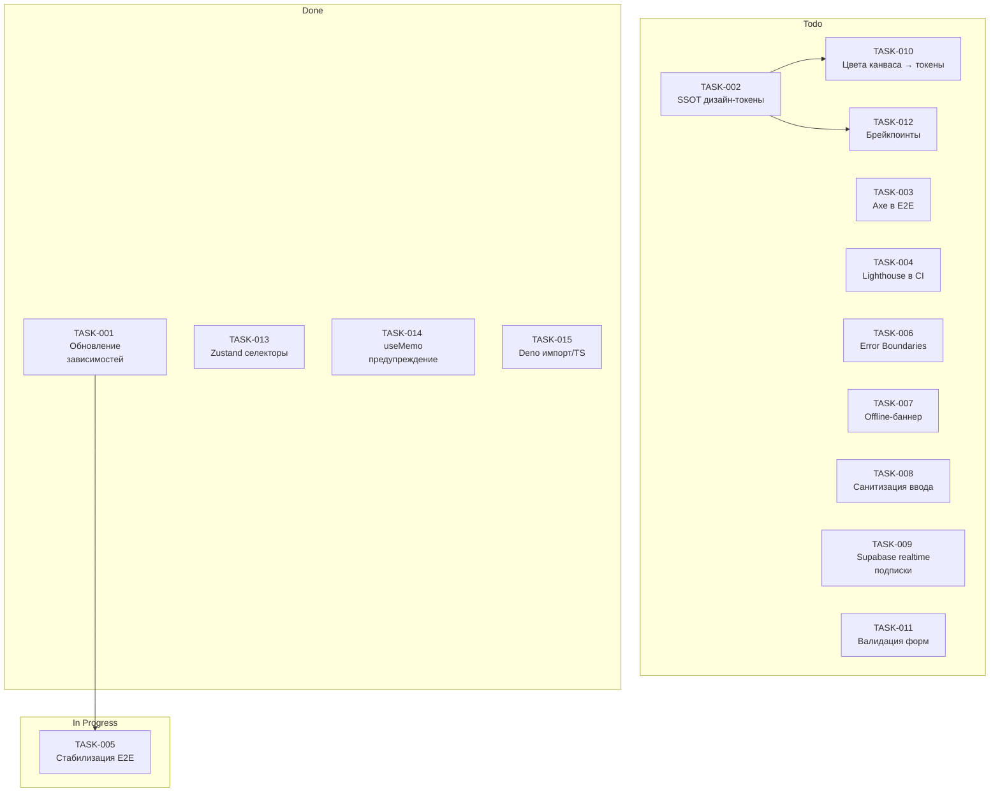

# Синхронизация спринта — 2025-11-09

## Обзор статусов
- `Todo`: 9
- `In Progress`: 1 (TASK-005)
- `Done`: 4 (TASK-001, TASK-013, TASK-014, TASK-015)

## Доска спринта (Mermaid)

## Чек-лист ревизии задач
- Обновить статусы и даты: выполнено для `TASK-005` (2025-11-09), добавлены новые `done`-задачи (TASK-013, TASK-014, TASK-015)
- Уточнить приоритеты: оставить `high` для `TASK-004` (CI перформанс), `TASK-009` (подписки), `TASK-005` (E2E)
- Проверить ответственных: назначить владельцев на `TASK-006` и `TASK-009` (Frontend/Platform)
- Согласовать сроки: подтвердить оценки и дедлайны на планировании (след. митинг)

## Оптимизация интерфейса
- Улучшение юзабилити и навигации
  - Единая логика состояний в аудиоплеере (устранены лишние ререндеры)
  - Категоризация действий в TrackActionsMenu стабилизирована
- Производительность рендера
  - Селекторы Zustand переписаны на стабильные ссылки
  - Убраны лишние зависимости в `useMemo`
- Визуальные элементы по гайдлайнам
  - Подготовлен план переноса канвас-цветов в дизайн-токены (зависит от TASK-002)

## Кросс-девайс, доступность и загрузка ресурсов
- Тестирование на устройствах
  - Проверка основных брейкпоинтов запланирована (TASK-012)
- Доступность (a11y)
  - Интеграция Axe в E2E-тесты в планах (TASK-003)
- Оптимизация загрузки
  - Внедрение `loading="lazy"` для не-герой изображений треков и персон (в работе)

## Решения и согласование
- Изменения задокументированы в `TASKS.json` и текущем отчёте
- Предлагается приоритезировать `TASK-004`, `TASK-009`, `TASK-006` на следующий спринт
- Необходимы подтверждения ответственных и дедлайнов на командном митинге