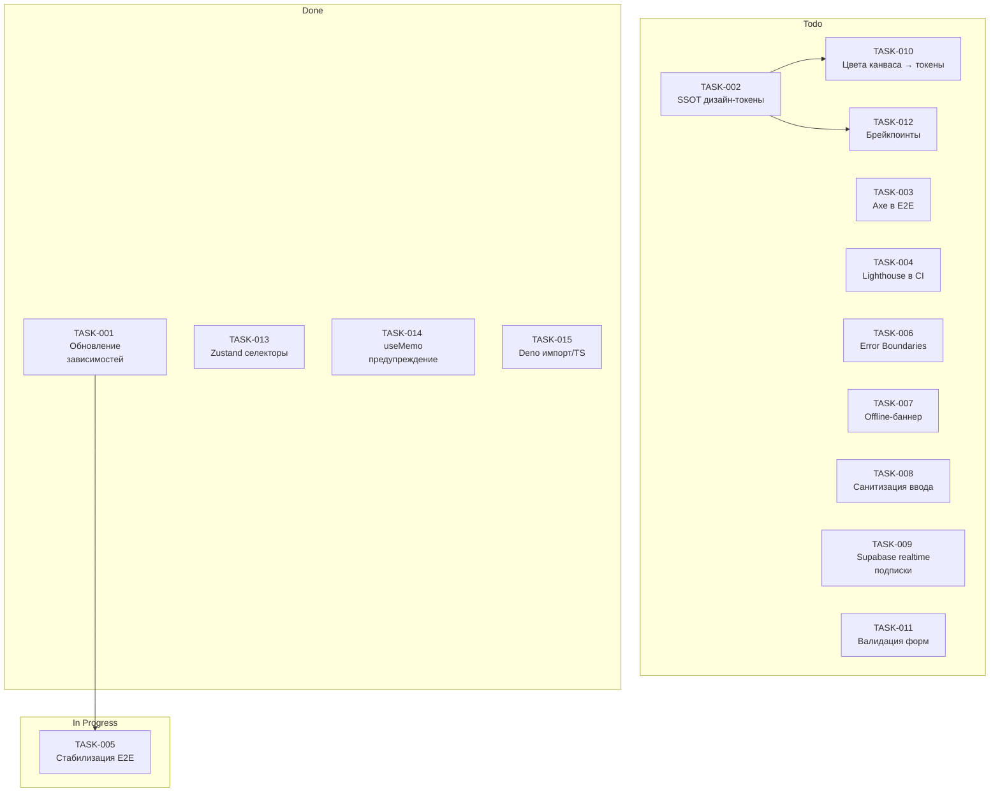

# Документация спринтов

Здесь фиксируются синхронизации статусов задач и итоги спринтов. Каждый отчёт содержит визуализацию доски (Mermaid), чек-листы и выводы по UX/перформансу.

## Структура

- `YYYY-MM-DD_sprint_sync.md` — отчёт синхронизации на конкретную дату

## Как обновлять

1. Обновите `TASKS.json` (статусы, даты, приоритеты, ответственные).
2. Создайте новый файл отчёта и заполните разделы: обзор статусов, доска спринта, чек-листы, решения.
3. Добавьте диаграмму Mermaid для визуализации.

## Шаблон диаграммы

