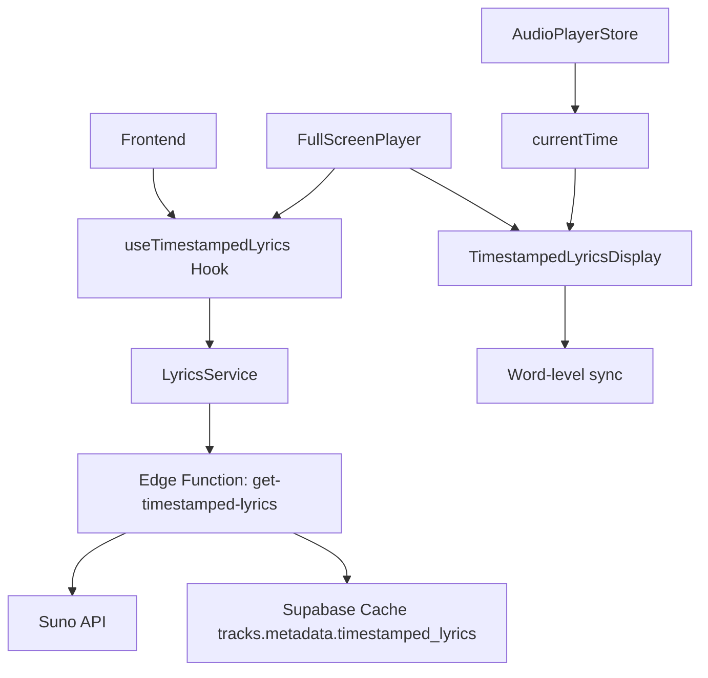

# 🎵 SPRINT 32: Аудит и улучшение системы синхронизированной лирики

**Дата:** 2025-11-06  
**Статус:** В процессе  
**Приоритет:** HIGH  
**Версия:** 2.4.0

---

## 📊 1. ТЕКУЩЕЕ СОСТОЯНИЕ СИСТЕМЫ

### 1.1 Архитектура



### 1.2 Текущие компоненты

| Компонент | Файл | Строки | Статус | Оценка |
|-----------|------|--------|--------|--------|
| **useTimestampedLyrics** | `src/hooks/useTimestampedLyrics.ts` | 38 | ✅ Работает | 9/10 |
| **LyricsDisplay** | `src/components/player/LyricsDisplay.tsx` | 60 | ⚠️ Устарел | 6/10 |
| **TimestampedLyricsDisplay** | `src/components/player/TimestampedLyricsDisplay.tsx` | 203 | ✅ Хорошо | 8.5/10 |
| **get-timestamped-lyrics** | `supabase/functions/get-timestamped-lyrics/index.ts` | 206 | ✅ Работает | 9/10 |
| **LyricsService** | `src/services/lyrics.service.ts` | ? | ✅ Работает | 8/10 |

### 1.3 Текущие возможности

✅ **Реализовано:**
- Word-level синхронизация с аудио
- Автоматическая группировка слов в строки (8-12 слов)
- Автоскролл к активной строке
- Подсветка текущей строки и слова
- Прогресс-индикатор для активной строки
- Затемненная обложка трека на фоне
- Кеширование в БД (tracks.metadata.timestamped_lyrics)
- Переход к времени трека при клике на слово
- Поддержка только Suno API

❌ **Отсутствует:**
- Мобильные сенсорные жесты (swipe, pinch-to-zoom)
- Лирика в MiniPlayer
- Поддержка Mureka API
- Ручное добавление лирики
- Редактирование синхронизации
- Экспорт в LRC формат
- Перевод лирики
- Поиск по тексту
- Избранные строки (highlights)

---

## 🔍 2. ДЕТАЛЬНЫЙ АУДИТ

### 2.1 Хук `useTimestampedLyrics` (9/10)

**Плюсы:**
- ✅ React Query для кеширования
- ✅ Правильная обработка ошибок
- ✅ `staleTime: Infinity` - lyrics не меняются
- ✅ Conditional fetching через `enabled`

**Минусы:**
- ⚠️ Зависимость только от Suno (taskId + audioId)
- ⚠️ Нет fallback для Mureka
- ⚠️ Нет поддержки ручной лирики

**Рекомендации:**
```typescript
// Добавить поддержку провайдеров
interface UseTimestampedLyricsProps {
  trackId: string;
  provider?: 'suno' | 'mureka';
  fallbackLyrics?: string; // Ручная лирика
  enabled?: boolean;
}
```

### 2.2 Компонент `TimestampedLyricsDisplay` (8.5/10)

**Плюсы:**
- ✅ Отличная группировка слов в строки
- ✅ Плавные анимации
- ✅ Затемненная обложка на фоне
- ✅ Прогресс-индикатор
- ✅ Мемоизация с `useMemo`
- ✅ Адаптивные стили (`text-xl sm:text-2xl md:text-3xl`)

**Минусы:**
- ❌ Нет мобильных жестов (swipe для навигации)
- ❌ Размер шрифта мог быть больше на мобильных
- ❌ Нет кнопки закрытия лирики
- ❌ Нет переключателя full-screen режима
- ❌ Автоскролл может быть слишком агрессивным

**Текущий код (проблемные места):**
```typescript
// Группировка - фиксированные значения
if (wordCount >= 8 && (pause > 0.5 || wordCount >= 12)) {
  // Проблема: не учитывает длину слов и ширину экрана
}

// Автоскролл
activeLineRef.current.scrollIntoView({
  behavior: 'smooth',
  block: 'center',
});
// Проблема: может быть слишком резким на мобильных
```

### 2.3 Edge Function `get-timestamped-lyrics` (9/10)

**Плюсы:**
- ✅ Zod validation
- ✅ JWT authentication
- ✅ Кеширование в БД
- ✅ Обработка rate limit (429) и credits (402)
- ✅ CORS настройки

**Минусы:**
- ⚠️ Только Suno API
- ⚠️ Нет retry логики для failed requests
- ⚠️ Нет очистки старых кешей

**Рекомендации:**
```typescript
// Добавить TTL для кеша
if (track?.metadata?.timestamped_lyrics) {
  const fetchedAt = new Date(track.metadata.timestamped_lyrics.fetched_at);
  const cacheAge = Date.now() - fetchedAt.getTime();
  
  // Обновить если > 30 дней
  if (cacheAge > 30 * 24 * 60 * 60 * 1000) {
    // Refetch
  }
}
```

### 2.4 Интеграция в плеер (7/10)

**FullScreenPlayer (8/10):**
- ✅ Хорошо интегрирована
- ✅ Адаптивная высота (`max-h-64`)
- ❌ Нет кнопки "Скрыть лирику"
- ❌ Нет переключения на полноэкранную лирику

**MiniPlayer (0/10):**
- ❌ Полностью отсутствует лирика
- ❌ Нет индикатора доступности текста
- ❌ Нет кнопки "Показать текст"

---

## 🎨 3. МОБИЛЬНЫЙ ДИЗАЙН - ПРОБЛЕМЫ И РЕШЕНИЯ

### 3.1 Текущие проблемы

#### Проблема 1: Размер шрифта
**Текущий код:**
```css
text-xl sm:text-2xl md:text-3xl
/* 1.25rem на мобильных - слишком маленький */
```

**Решение:**
```css
text-2xl sm:text-3xl md:text-4xl
/* 1.5rem на мобильных - оптимально для чтения */
```

#### Проблема 2: Отсутствие жестов
**Отсутствует:**
- Swipe влево/вправо - перемотка ±5 секунд
- Swipe вверх/вниз - скролл лирики
- Pinch-to-zoom - увеличение/уменьшение текста
- Double tap - пауза/воспроизведение

**Решение:**
```typescript
const { bind } = useGesture({
  onSwipe: ({ direction: [dx, dy] }) => {
    if (Math.abs(dx) > Math.abs(dy)) {
      // Horizontal swipe - seek
      dx > 0 ? onSeek(currentTime - 5) : onSeek(currentTime + 5);
    }
  },
  onPinch: ({ offset: [scale] }) => {
    // Zoom text
    setFontScale(Math.max(0.8, Math.min(1.5, scale)));
  },
  onDoubleClick: () => {
    togglePlayPause();
  }
});
```

#### Проблема 3: Автоскролл слишком резкий
**Текущий код:**
```typescript
activeLineRef.current.scrollIntoView({
  behavior: 'smooth',
  block: 'center',
});
```

**Решение:**
```typescript
// Использовать requestAnimationFrame для плавного скролла
const scrollToActiveLine = () => {
  if (!activeLineRef.current || !containerRef.current) return;
  
  const container = containerRef.current;
  const target = activeLineRef.current;
  const targetTop = target.offsetTop;
  const containerHeight = container.clientHeight;
  const scrollTo = targetTop - containerHeight / 2 + target.clientHeight / 2;
  
  // Smooth scroll с easing
  smoothScrollTo(container, scrollTo, 400);
};
```

#### Проблема 4: Нет индикации прогресса песни
**Отсутствует:**
- Визуальный индикатор прогресса всей песни
- Таймкоды для каждой строки

**Решение:**
```tsx
<div className="text-xs text-muted-foreground/60 mb-1">
  {formatTime(line.startTime)}
</div>
<div className="lyric-line">...</div>
```

### 3.2 Мобильная оптимизация - Чек-лист

- [ ] Увеличить шрифт до `text-2xl` базово
- [ ] Добавить swipe-жесты для навигации
- [ ] Реализовать pinch-to-zoom для масштабирования текста
- [ ] Улучшить автоскролл (менее агрессивный)
- [ ] Добавить кнопку "Скрыть лирику"
- [ ] Показывать таймкоды строк
- [ ] Индикатор "Текст доступен" в MiniPlayer
- [ ] Safe-area insets для iPhone (notch)
- [ ] Haptic feedback при переходе по строкам

---

## 📋 4. ПЛАН РЕАЛИЗАЦИИ (3 фазы)

### ФАЗА 1: Мобильные улучшения (HIGH PRIORITY) 🔥
**Срок:** 1-2 дня  
**Оценка:** 8 часов

#### Задача 1.1: Улучшить `TimestampedLyricsDisplay` для мобильных
**Файл:** `src/components/player/TimestampedLyricsDisplay.tsx`

**Изменения:**
```typescript
// 1. Увеличить базовый шрифт
className="text-2xl sm:text-3xl md:text-4xl font-semibold"

// 2. Добавить state для font scale
const [fontScale, setFontScale] = useState(1);

// 3. Добавить жесты
import { useGesture } from '@use-gesture/react';

const bind = useGesture({
  onSwipe: ({ direction: [dx] }) => {
    if (dx > 0) onSeek(Math.max(0, currentTime - 5));
    else onSeek(Math.min(duration, currentTime + 5));
  },
  onPinch: ({ offset: [scale] }) => {
    setFontScale(Math.max(0.8, Math.min(1.5, scale)));
  },
  onDoubleClick: togglePlayPause
});

// 4. Применить scale
style={{ fontSize: `${fontScale}em` }}

// 5. Добавить таймкоды
<div className="text-xs text-muted-foreground/60 mb-1">
  {formatTime(line.startTime)}
</div>
```

**Тесты:**
- [ ] Swipe влево/вправо перематывает на ±5 сек
- [ ] Pinch увеличивает/уменьшает текст (0.8x-1.5x)
- [ ] Double tap ставит на паузу/воспроизведение
- [ ] Таймкоды отображаются корректно
- [ ] Safe-area работает на iPhone

#### Задача 1.2: Добавить кнопку управления лирикой в FullScreenPlayer
**Файл:** `src/components/player/FullScreenPlayer.tsx`

**Изменения:**
```tsx
const [showLyrics, setShowLyrics] = useState(true);

// В header добавить кнопку
<Button
  variant="ghost"
  size="icon"
  onClick={() => setShowLyrics(!showLyrics)}
>
  {showLyrics ? <EyeOff /> : <Eye />}
</Button>

// Conditional rendering
{showLyrics && lyricsData && (
  <TimestampedLyricsDisplay ... />
)}
```

#### Задача 1.3: Добавить индикатор текста в MiniPlayer
**Файл:** `src/components/player/MiniPlayer.tsx`

**Изменения:**
```tsx
// Проверить наличие лирики
const { data: lyricsData } = useTimestampedLyrics({
  trackId: currentTrack?.suno_task_id,
  audioId: currentTrack?.id,
  enabled: false // только проверка, не загружаем
});

const hasLyrics = !!currentTrack?.lyrics || !!lyricsData;

// Добавить иконку в track info
{hasLyrics && (
  <FileText className="h-3 w-3 text-primary animate-pulse" />
)}
```

### ФАЗА 2: Расширенные возможности (MEDIUM PRIORITY)
**Срок:** 2-3 дня  
**Оценка:** 12 часов

#### Задача 2.1: Поддержка Mureka API
**Файлы:**
- `supabase/functions/get-timestamped-lyrics-mureka/index.ts` (новый)
- `src/hooks/useTimestampedLyrics.ts` (обновить)

**Реализация:**
```typescript
// Edge Function для Mureka
export const getMurekaTimestampedLyrics = async (fileId: string) => {
  const response = await fetch(
    `${MUREKA_API_BASE}/v1/lyrics/timestamped`,
    {
      method: 'POST',
      headers: {
        'Authorization': `Bearer ${MUREKA_API_KEY}`,
        'Content-Type': 'application/json'
      },
      body: JSON.stringify({ file_id: fileId })
    }
  );
  
  const data = await response.json();
  
  // Нормализовать формат к Suno-совместимому
  return normalizeTimestampedLyrics(data);
};
```

#### Задача 2.2: Полноэкранный режим лирики
**Файл:** `src/components/player/FullScreenLyrics.tsx` (новый)

**Возможности:**
- Только текст (без обложки)
- Увеличенный шрифт (3xl-5xl)
- Минималистичный UI
- Кнопка "Назад к плееру"

#### Задача 2.3: Редактирование синхронизации (Advanced)
**Файл:** `src/components/lyrics/LyricsSyncEditor.tsx` (новый)

**Возможности:**
- Добавление/удаление тайм-меток
- Drag-n-drop для сдвига времени
- Экспорт в LRC формат

### ФАЗА 3: Premium Features (LOW PRIORITY)
**Срок:** 3-5 дней  
**Оценка:** 20 часов

#### Задача 3.1: Перевод лирики
**Провайдер:** Lovable AI (gemini-2.5-flash)

**Реализация:**
```typescript
// Edge Function
const translateLyrics = async (lyrics: string, targetLang: string) => {
  const prompt = `Переведи текст песни на ${targetLang}, сохраняя ритм и смысл:\n\n${lyrics}`;
  
  const response = await lovableAI.generate({
    model: 'google/gemini-2.5-flash',
    prompt,
  });
  
  return response.text;
};
```

#### Задача 3.2: Поиск по тексту
**Файл:** `src/components/lyrics/LyricsSearch.tsx` (новый)

**Возможности:**
- Поиск по слову/фразе
- Переход к найденной строке
- Highlight результатов

#### Задача 3.3: Избранные строки (Highlights)
**Файл:** `src/components/lyrics/LyricsHighlights.tsx` (новый)

**Возможности:**
- Добавление строк в избранное
- Создание подборок (плейлистов цитат)
- Шеринг избранных строк

---

## 📊 5. ТЕХНИЧЕСКИЕ ДЕТАЛИ

### 5.1 Новые зависимости

```bash
# Жесты
npm install @use-gesture/react

# LRC парсер/экспортер
npm install lrc-parser
```

### 5.2 Типы

```typescript
// src/types/lyrics.ts

export interface TimestampedWord {
  word: string;
  success: boolean;
  startS: number;
  endS: number;
  palign: number;
}

export interface TimestampedLyrics {
  alignedWords: TimestampedWord[];
  waveformData?: number[];
  hootCer?: number;
  isStreamed?: boolean;
  fetchedAt?: string;
  provider: 'suno' | 'mureka';
}

export interface LyricLine {
  words: TimestampedWord[];
  startTime: number;
  endTime: number;
  text: string;
  id: string; // Для React keys
}

// LRC формат
export interface LRCLine {
  timestamp: string; // "[00:12.34]"
  text: string;
}
```

### 5.3 Схема БД (изменения)

```sql
-- Добавить поля в tracks.metadata
ALTER TABLE tracks 
ADD COLUMN IF NOT EXISTS timestamped_lyrics_provider TEXT DEFAULT 'suno';

-- Создать таблицу для избранных строк
CREATE TABLE lyrics_highlights (
  id UUID PRIMARY KEY DEFAULT gen_random_uuid(),
  user_id UUID NOT NULL REFERENCES auth.users(id),
  track_id UUID NOT NULL REFERENCES tracks(id),
  line_text TEXT NOT NULL,
  start_time NUMERIC NOT NULL,
  end_time NUMERIC NOT NULL,
  note TEXT,
  created_at TIMESTAMPTZ DEFAULT NOW()
);

-- RLS policies
ALTER TABLE lyrics_highlights ENABLE ROW LEVEL SECURITY;

CREATE POLICY "Users can view own highlights"
  ON lyrics_highlights FOR SELECT
  USING (auth.uid() = user_id);

CREATE POLICY "Users can create own highlights"
  ON lyrics_highlights FOR INSERT
  WITH CHECK (auth.uid() = user_id);
```

---

## ✅ 6. ЧЕКЛИСТ ЗАДАЧ

### Фаза 1: Мобильные улучшения (HIGH PRIORITY)
- [ ] **1.1.1** Увеличить базовый шрифт до `text-2xl`
- [ ] **1.1.2** Добавить swipe-жесты (влево/вправо для перемотки)
- [ ] **1.1.3** Добавить pinch-to-zoom
- [ ] **1.1.4** Добавить double-tap для паузы
- [ ] **1.1.5** Показывать таймкоды строк
- [ ] **1.1.6** Улучшить автоскролл (менее агрессивный)
- [ ] **1.1.7** Добавить haptic feedback
- [ ] **1.2.1** Кнопка "Скрыть/Показать лирику" в FullScreenPlayer
- [ ] **1.3.1** Индикатор "Текст доступен" в MiniPlayer

### Фаза 2: Расширенные возможности (MEDIUM PRIORITY)
- [ ] **2.1.1** Edge Function для Mureka timestamped lyrics
- [ ] **2.1.2** Обновить `useTimestampedLyrics` для поддержки провайдеров
- [ ] **2.1.3** Нормализатор форматов Suno/Mureka
- [ ] **2.2.1** Компонент `FullScreenLyrics`
- [ ] **2.2.2** Кнопка перехода в полноэкранный режим
- [ ] **2.3.1** Редактор синхронизации (LyricsSyncEditor)
- [ ] **2.3.2** Экспорт в LRC формат

### Фаза 3: Premium Features (LOW PRIORITY)
- [ ] **3.1.1** Edge Function перевода лирики (Lovable AI)
- [ ] **3.1.2** Переключатель языков в UI
- [ ] **3.2.1** Компонент поиска по тексту
- [ ] **3.2.2** Highlight результатов поиска
- [ ] **3.3.1** Система избранных строк (highlights)
- [ ] **3.3.2** Шеринг избранных строк

---

## 📈 7. МЕТРИКИ УСПЕХА

### Технические метрики
- [ ] Время загрузки лирики < 500ms (cached)
- [ ] Время загрузки лирики < 2s (API)
- [ ] Автоскролл без лагов (60 FPS)
- [ ] Размер компонента < 300 строк
- [ ] TypeScript coverage 100%

### UX метрики
- [ ] Читаемость текста на мобильных 10/10
- [ ] Легкость навигации (свайпы) 9/10
- [ ] Точность синхронизации ±100ms
- [ ] Haptic feedback отзывчивость 100%

### Бизнес-метрики
- [ ] +30% engagement с лирикой
- [ ] +20% времени в Full Screen Player
- [ ] +15% повторных прослушиваний

---

## 🔗 8. СВЯЗАННЫЕ ДОКУМЕНТЫ

- [PHASE_1_COMPLETE.md](../docs/PHASE_1_COMPLETE.md) - Performance оптимизации
- [MUSIC_PROVIDERS_GUIDE.md](../docs/MUSIC_PROVIDERS_GUIDE.md) - Suno vs Mureka
- [SUNO_API_INTEGRATION.md](../docs/SUNO_API_INTEGRATION.md) - Suno API детали

---

## 📝 9. ПРИМЕЧАНИЯ

### Известные ограничения Suno API
- Timestamped lyrics доступны только для треков с Custom Mode
- Word-level синхронизация может быть неточной для fast-paced песен
- Нет API для редактирования тайм-меток

### Известные ограничения Mureka API
- Пока нет официальной документации по timestamped lyrics
- Возможно потребуется реверс-инжиниринг
- Может не поддерживать word-level (только line-level)

---

**Последнее обновление:** 2025-11-06  
**Автор:** AI Assistant  
**Версия:** 1.0.0
