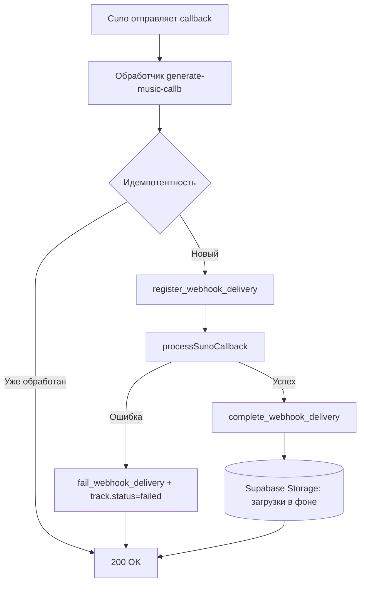

# Спринт 33: Вебхуки Suno, идемпотентность и очистка хранилища

Дата: 07–14 ноября 2025

## Цели спринта
- Обеспечить идемпотентную обработку вебхуков Suno.
- Улучшить устойчивость очистки хранилища Supabase.
- Расширить тесты и подтвердить работу в CI.

## Чек‑лист задач

### Завершено
- [x] Реализована идемпотентность вебхуков через `webhook_delivery_log` (RPC: check/register/complete/fail)
- [x] Обработчик `generate-music-callb` извлекает `x-delivery-id`/`x-webhook-id`, формирует детерминированный ID
- [x] Ошибочные колбэки (`code >= 400`, `callbackType === 'error'`) помечают трек как `failed` в `callback-processor.ts`
- [x] Добавлены юнит‑тесты обработки ошибок `callback-processor_test.ts`
- [x] Очистка хранилища: добавлена пагинация `listRecursive`, удалён `deleted_at` из запросов
- [x] CI подтверждает запуск Deno‑тестов Edge‑функций (`supabase-functions-tests.yml`)
- [x] Периодическая очистка кэшей через `setInterval` (каждые 5 минут) в `_shared/cache.ts`

### В процессе / Следующим шагом
- [ ] Документация по подписи вебхуков (при наличии заголовков подписи от Suno)
- [ ] Gantt/roadmap для треков: добавить `archived_at` и учесть в очистке
- [ ] Интеграционные тесты для повторной доставки одного и того же вебхука
- [ ] Набор метрик (observability): считать число дублей, ошибок, время обработки

## Диаграмма потока

## Связанные файлы и PR
- `supabase/functions/generate-music-callb/index.ts`
- `supabase/functions/_shared/callback-processor.ts`
- `supabase/functions/_shared/callback-processor_test.ts`
- `supabase/functions/cleanup-storage-objects/index.ts`
- `.github/workflows/supabase-functions-tests.yml`

## Критерии завершения спринта
- Повторная доставка одного и того же вебхука не приводит к дублированию записей.
- Ошибочные колбэки корректно маркируют трек как `failed`.
- Очистка хранилища работает на больших объёмах без таймаутов.
- Deno‑тесты успешно проходят в CI.