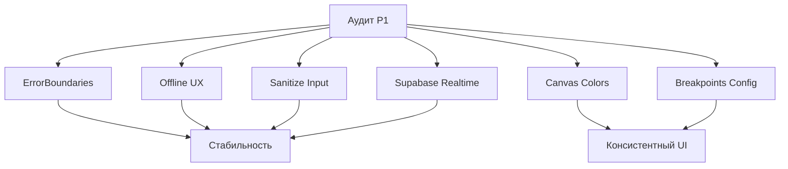

# Спринт 35: UI/UX P1 фиксы и подготовка DAW канваса

## Цели спринта

- Повысить стабильность и UX через внедрение Error Boundaries и оффлайн-индикации.
- Снизить риски безопасности: санитизация пользовательского ввода.
- Устранить утечки памяти в realtime-подписках Supabase.
- Подготовить основу для консистентного UI: токенизированные цвета канваса и общий конфиг брейкпоинтов.

## Область работ

- P1 проблемы из аудита: ошибки не должны крашить приложение, оффлайн-состояние должно быть прозрачно для пользователя, ввод безопасен, realtime-подписки без утечек, устранить хардкод цветов/брейкпоинтов.
- Подготовка утилит: `getCanvasColors` и `BREAKPOINTS`.

## Чек-лист выполнения

- [ ] TASK-006: Error Boundaries на ключевых страницах
- [ ] TASK-007: useNetworkStatus + оффлайн-баннер
- [ ] TASK-008: Санитизация ввода (промпт, тайтлы, комментарии)
- [ ] TASK-009: Отписка от Supabase realtime и устранение утечек
- [ ] TASK-010: getCanvasColors и интеграция в канвас-компоненты
- [ ] TASK-011: Валидация форм с inline-ошибками
- [ ] TASK-012: BREAKPOINTS конфиг и использование в FullScreenPlayer

## Критерии приема

- Ошибки в компонентах не приводят к падению приложения; логируются.
- При отсутствии сети отображается понятный баннер; блокируются недоступные действия.
- Все потенциально опасные поля проходят санитизацию; E2E/линтеры не находят XSS.
- Нет роста памяти при навигации/переподписках; профилирование стабильно.
- В канвас-компонентах отсутствуют хардкод-цвета; используются токены через утилиту.
- Brеakpoints задаются из единого источника; FullScreenPlayer отображается корректно на всех целевых ширинах.

## Диаграмма

## План

- День 1: ErrorBoundaries, useNetworkStatus, BREAKPOINTS.
- День 2: Санитизация ввода, Supabase подписки.
- День 3: getCanvasColors и частичная интеграция в MobileTimeline/DAW.
- День 4: Валидация форм и завершающие правки.

## Риски и меры

- Supabase подписки: тестировать в стейджинге, использовать профайлер.
- Санитизация: не ломать легитимные символы; тесты на edge-cases.
- Канвас цвета: проверить контрастность (WCAG AA) и светлую/темную тему.

## Связанные документы

- docs/audit/COMPREHENSIVE_AUDIT_2025-11-09.md
- TASKS.json (обновлен)