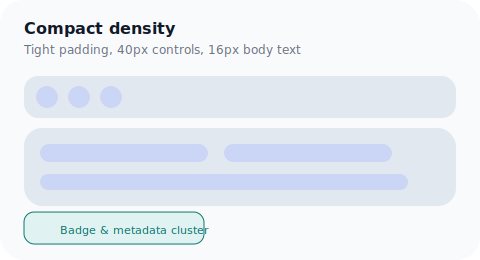
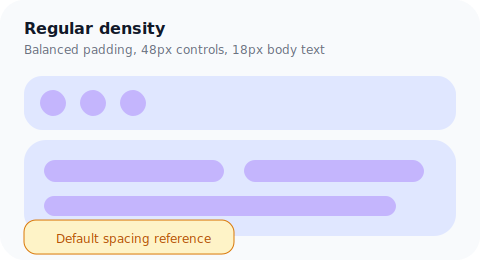
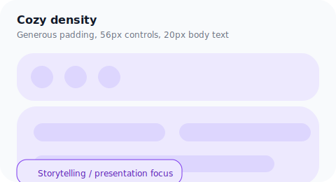

# Density Modes for Track Details

The track workspace now supports three density presets that align with the shared design tokens:

| Mode | Panel Padding | Control Height | Typical Use |
| ---- | ------------- | -------------- | ----------- |
| Compact | `var(--space-3)` | `var(--height-control-sm)` | High information density views such as the detail panel | 
| Regular | `var(--space-4)` | `var(--height-control-md)` | Default layouts outside of focused editing flows |
| Cozy | `var(--space-5)` | `var(--height-control-lg)` | Presentation or review contexts where airier spacing is preferred |

The presets live in `src/features/tracks/ui/density.ts` and expose helper utilities:

```ts
import { createTrackDensityVars, getTrackDensityClasses } from "@/features/tracks/ui/density";
```

The helpers provide a strongly typed way to bind CSS variables (spacing, padding, icon sizing) and the accompanying Tailwind classes for typography. Components can opt into a density by passing `densityMode` and spreading the resulting `style` object onto the root container.

## Visual reference





Each screenshot highlights how spacing scales while keeping iconography and typography in proportion. The compact preset is used in the track detail panel to ensure the quick actions and metadata sections stay concise without sacrificing readability.

## Testing notes

A lightweight visual check can be performed by toggling the `densityMode` prop on `DetailPanelContent` in Storybook (or a local playground) and confirming that:

- Section padding and accordion spacing respond to the chosen mode.
- Icon-only quick actions remain accessible with tooltip labels (hover/focus).
- Publish badges display when `is_public` is `true` for both cards and list tiles.

If Storybook is unavailable, the generated images above can serve as documentation for design reviews.
