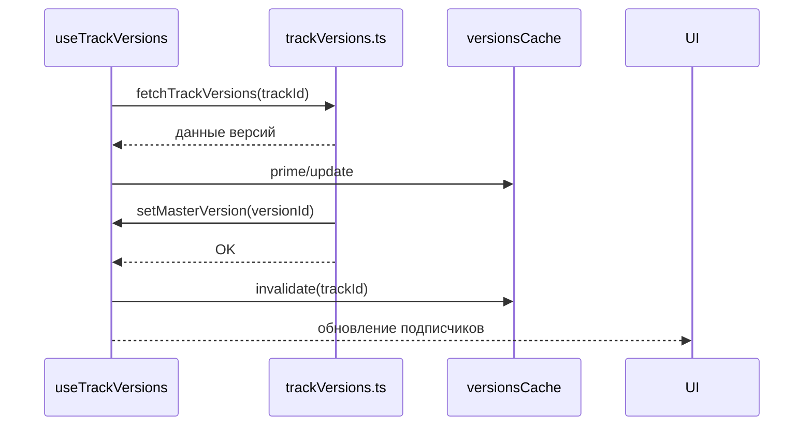

# API Reference — trackVersions.ts

Файл: `src/features/tracks/api/trackVersions.ts`

Основные функции:

1) getTrackWithVersions(trackId: string): Promise<TrackWithVersions>
- Описание: Загружает основную запись трека и связанные версии. Приоритет — `track_versions` (актуальные данные), затем дополняет из `metadata.suno_data` при необходимости.
- Возвращает: список `allVersions` c полями `id`, `audio_url`, `sourceVersionNumber`, `isMasterVersion`.
- Примечания производительности: избегайте дублирования при мердже данных; кэшируйте результат.

2) setMasterVersion(versionId: string): Promise<void>
- Описание: Сбрасывает `is_preferred_variant` у других версий трека и устанавливает флаг для выбранной версии.
- Требования корректности: операция должна быть атомарной. Рекомендуется выполнять в транзакции.
- Побочные эффекты: инвалидировать кэш версий и (при необходимости) обновить `useAudioPlayerStore`.
- Ошибки: бросает Exception; поверхность ошибок логируется в `logError`.

3) createTrackVersion(payload): Promise<Version>
- Описание: Добавляет новую версию для трека.
- Замечания: следить за уникальностью `sourceVersionNumber` и консистентностью связей `parent_track_id`.

4) updateTrackVersion(id, patch): Promise<Version>
- Описание: Обновляет поля версии.
- Примечания: при смене метаданных — инвалидировать кэш.

5) deleteTrackVersion(id): Promise<void>
- Описание: Удаляет версию. Нельзя удалять последнюю оставшуюся версию.
- UI‑логика: подтверждение удаления; если удалена мастер‑версия, UI выбирает ближайшую доступную.

События и кэш:
- После `setMasterVersion`, `createTrackVersion`, `deleteTrackVersion` вызывайте `invalidateTrackVersionsCache(trackId)`.

Диаграмма взаимодействий с кэшем:

