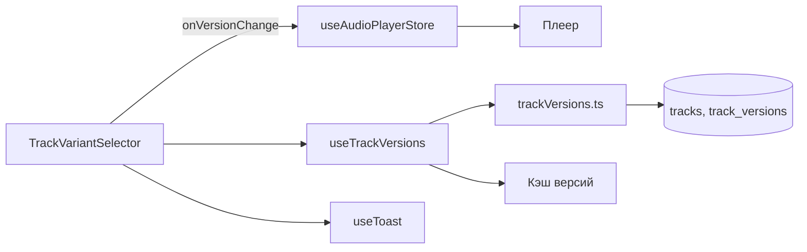
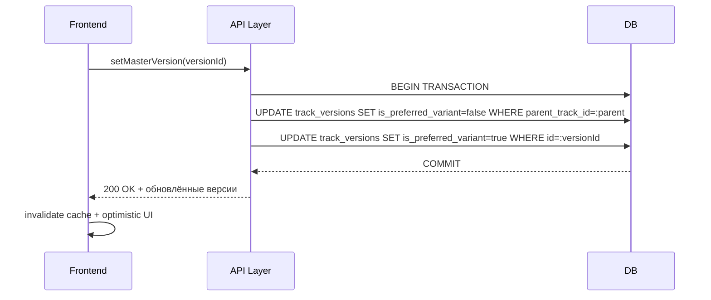

# Архитектура модуля версий треков

Слои:
- UI: `TrackVariantSelector`, `TrackVersions`, `MinimalVersionsList` — отображение и управление версиями.
- Hooks: `useTrackVersions`, `useSmartTrackPlay`, `useVersionNavigation`, `useTrackRollback` — загрузка, кэш, навигация, откат.
- API: `src/features/tracks/api/trackVersions.ts` — создание/обновление/удаление версий, установка мастер‑версии.
- Store: `useAudioPlayerStore` — состояние проигрывателя, текущая версия.
- Tests: Vitest + Testing Library — `tests/unit/components/TrackVariantSelector.test.tsx` и другие.

Структура данных:
- `tracks` — основная запись трека (основная версия).
- `track_versions` — варианты. Важные поля: `parent_track_id`, `sourceVersionNumber`, `is_preferred_variant`.

Индексы БД (рекомендации):
- `idx_track_versions_parent` на `parent_track_id`
- `idx_track_versions_preferred` на `is_preferred_variant`
- `idx_track_versions_variant_index` на `sourceVersionNumber`

Кэш и подписки:
- `useTrackVersions` хранит кэш версий и подписчики; предоставляет `subscribeToTrackVersions`, `invalidateTrackVersionsCache`, `fetchTrackVersions`.
- После `setMasterVersion` обязательно инвалидировать кэш, чтобы UI обновился.

Диаграмма компонентов:

Последовательность установки мастер‑версии — транзакционный план:

Обработка ошибок:
- Тосты с подробностями.
- Логирование `logError` и `TrackOperationsLogger`.
- Возврат к предыдущему состоянию при неудаче (оптимистический откат).