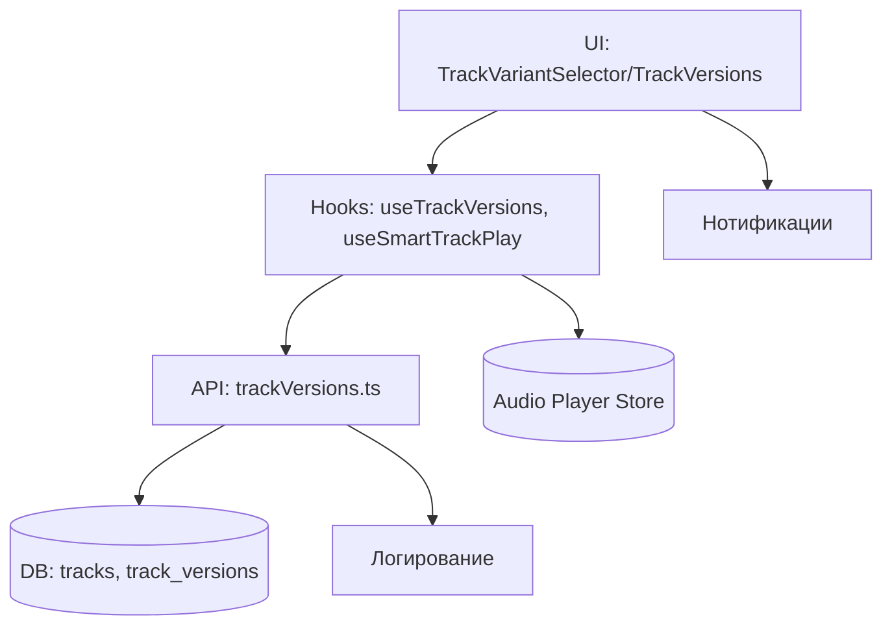
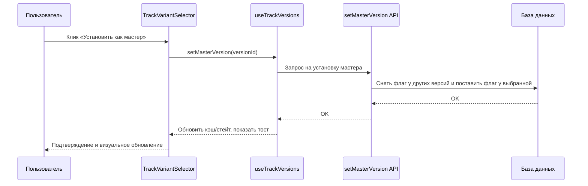

# Система версионирования треков — обзор

Цель: обеспечить надёжное хранение и управление версиями треков, быстрый выбор и переключение мастер‑версии, понятный UI и устойчивость к ошибкам.

Ключевые понятия:
- Основная версия (Оригинал): версия из таблицы `tracks` (sourceVersionNumber = 0). Не может быть назначена мастер‑версией напрямую.
- Варианты (track_versions): производные версии с индексом `sourceVersionNumber > 0`.
- Мастер‑версия: выделенный вариант в `track_versions`, помеченный флагом `is_preferred_variant = true` — используется как приоритетный источник для воспроизведения/загрузки.

Быстрый старт:
- Выбор версий — компонент `TrackVariantSelector` и `TrackVersions`.
- Переключение мастер‑версии — API `setMasterVersion(id)` с безопасной транзакционной логикой (план оптимизации ниже).
- Кэш и подгрузка — хук `useTrackVersions` (встроенный кэш, подписки, инвалидация).

Диаграмма архитектуры:

Диаграмма потока переключения мастер‑версии:

Команды (Windows PowerShell):

- Запуск дев‑сервера: `npm run dev`
- Запуск тестов (Vitest): `npm test`
- Линтинг: `npm run lint`

См. подробности в ARCHITECTURE.md и API_REFERENCE.md.