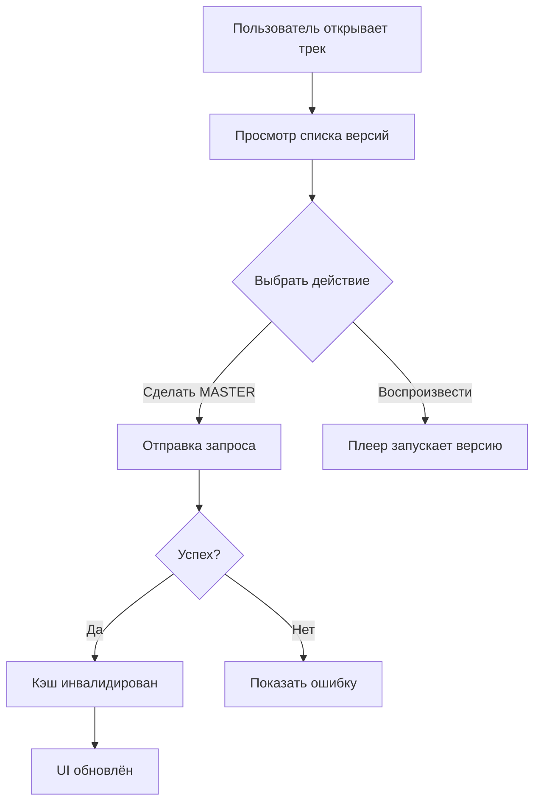

# Руководство пользователя — управление версиями треков

Этот гайд поможет быстро понимать и использовать интерфейс версий:

Основные элементы UI:
- Список версий: основная версия (из таблицы tracks) и варианты (из track_versions).
- Кнопка «Сделать мастер‑версией»: доступна только для вариантов, не для основной версии.
- Иконки и метки MASTER: визуально показывают текущую мастер‑версию.
- Быстрое воспроизведение: кнопка Play для каждой версии.

Как выбрать мастер‑версию:
1) Откройте список версий (например, компонент TrackVariantSelector).
2) Найдите нужный вариант и нажмите «Сделать мастер‑версией».
3) Успешная операция подтверждается уведомлением; список обновится.

Откат к предыдущей версии:
1) Используйте кнопку «Откатить» (если доступна) или соответствующую команду в интерфейсе.
2) Система установит выбранную версию как мастер и обновит кэш.

Ограничения:
- Нельзя назначить основную версию (из tracks) мастер‑версией в track_versions — это разные сущности.
- Нельзя удалять последнюю оставшуюся версию.

Состояния и уведомления:
- Успех/ошибка сопровождаются всплывающими уведомлениями.
- При ошибке мастер‑переключения — состояние возвращается.

Диаграмма потоков пользователя:

