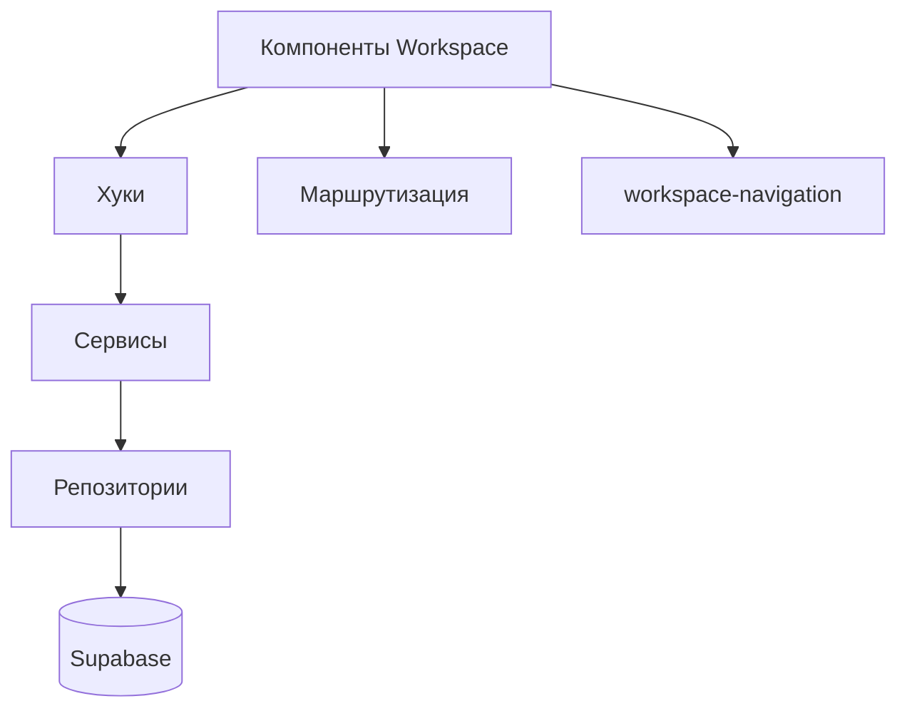

# План изменений в области «Workspace»

Цель: упорядочить и безопасно провести изменения в разделе Workspace, обеспечив корректный нейминг, стабильные импорты, проверяемость через тесты и аккуратную документацию.

## Этапы выполнения

1. Анализ и планирование
   - Сформировать список затрагиваемых файлов и модулей (`src/pages/workspace`, `src/components/workspace`, `src/hooks`, `src/config/workspace-navigation.ts`).
   - Определить границы ответственности и точки интеграции (контексты, сторы, репозитории, сервисы).
   - Согласовать критерии завершения изменений.

2. Нейминг и стиль
   - Применить правила CamelCase для переменных/функций и PascalCase для типов/компонентов.
   - Проверить соответствие имён экспортов и файлов (например, `WorkspaceHeader.tsx` → экспорт `WorkspaceHeader`).

3. Импорты и зависимости
   - Использовать алиасы `@/*` вместо глубоких относительных путей.
   - Исключить «ломающие» циклические зависимости и неявные re-export’ы.

4. Тестирование
   - Unit/Integration (Vitest) для изменённых компонентов и хуков.
   - E2E (Playwright) для ключевых пользовательских сценариев.

5. Документация
   - Обновить `README` разделов, добавить заметки в `ARCHITECTURE.md` при изменении связей.
   - Описать принятые решения (ADR при необходимости).

6. Финальная проверка
   - Линтер, типы, доки, сборка.
   - Подготовка PR с чек-листом и ссылками на тесты/репорты.

## Критерии завершения

- Нет ошибок линтера (`npm run lint:workspace`).
- Типы корректны (`npm run typecheck`).
- Обновлена документация по неймингу, импортам и тестам.
- Юнит-тесты зелёные (`npm test -- --coverage`).
- E2E-сценарии не упали на критичных путях (`npm run test:e2e`).

## Диаграмма архитектуры (Workspace)

