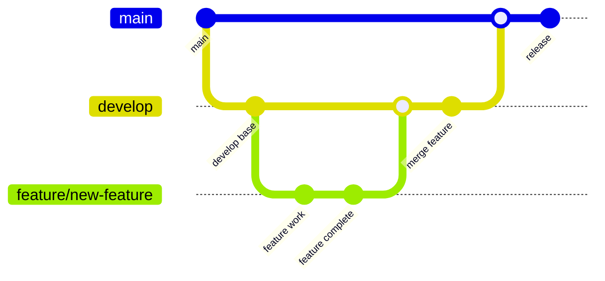

# 🤝 Руководство для участников проекта Albert3 Muse Synth Studio

*Добро пожаловать в команду разработки Albert3 Muse Synth Studio! Это руководство поможет вам эффективно работать с нашей системой управления проектом.*

## 🎯 Обзор

Наша система управления проектом основана на принципах Agile и использует GitHub как основную платформу для координации работы. Мы работаем 1-недельными спринтами и стремимся к высокому качеству кода и продукта.

## 🚀 Быстрый старт для новых участников

### 1. Получение доступов
- [ ] Доступ к GitHub репозиторию
- [ ] Приглашение в Slack канал #albert3-development
- [ ] Доступ к GitHub Projects (Kanban доска)
- [ ] Настройка локальной среды разработки

### 2. Изучение документации
- [ ] Прочитайте [README.md](README.md) - обзор системы
- [ ] Изучите [SETUP-GUIDE.md](SETUP-GUIDE.md) - настройка инструментов
- [ ] Ознакомьтесь с [workflows/development.md](workflows/development.md) - процессы разработки
- [ ] Просмотрите текущий [спринт](tasks/current-sprint.md) и [бэклог](tasks/backlog.md)

### 3. Первые шаги
- [ ] Настройте Git hooks и pre-commit проверки
- [ ] Выберите задачу с меткой "good first issue"
- [ ] Создайте свою первую ветку и Pull Request
- [ ] Пройдите процесс Code Review

## 📋 Как работать с задачами

### Создание новой задачи

1. **Используйте GitHub Issues** с соответствующими шаблонами:
   - [Bug Report](https://github.com/your-username/albert3-muse-synth-studio/issues/new?template=bug_report.yml) для багов
   - [Feature Request](https://github.com/your-username/albert3-muse-synth-studio/issues/new?template=feature_request.yml) для новых функций

2. **Заполните все обязательные поля**:
   - Четкое описание проблемы или требования
   - Критерии приемки (Acceptance Criteria)
   - Приоритет и оценка времени
   - Связанные задачи и зависимости

3. **Добавьте соответствующие метки**:
   - **Тип**: `bug`, `feature`, `enhancement`, `documentation`
   - **Приоритет**: `critical`, `high`, `medium`, `low`
   - **Компонент**: `frontend`, `backend`, `api`, `ui/ux`, `database`
   - **Статус**: `backlog`, `ready`, `in-progress`, `review`, `testing`

### Работа над задачей

1. **Переместите задачу в "In Progress"** на Kanban доске
2. **Создайте ветку** по соглашению: `feature/ISSUE-123-short-description`
3. **Регулярно обновляйте прогресс** в комментариях к задаче
4. **Следуйте Definition of Done** (см. ниже)

### Завершение задачи

1. **Создайте Pull Request** с описанием изменений
2. **Пройдите Code Review** (минимум 1 аппрув)
3. **Убедитесь, что все проверки прошли** (CI/CD pipeline)
4. **Переместите задачу в "Done"** после merge

## 🔄 Процесс разработки

### Git Workflow



### Соглашения по именованию веток

- **Feature branches**: `feature/ISSUE-123-short-description`
- **Bug fixes**: `bugfix/ISSUE-456-fix-description`
- **Hotfixes**: `hotfix/ISSUE-789-critical-fix`
- **Documentation**: `docs/update-readme`
- **Refactoring**: `refactor/improve-performance`

### Conventional Commits

Используйте стандарт [Conventional Commits](https://www.conventionalcommits.org/):

```
<type>[optional scope]: <description>

[optional body]

[optional footer(s)]
```

**Примеры:**
```
feat(auth): add JWT token validation
fix(api): resolve user registration bug
docs(readme): update installation instructions
test(utils): add unit tests for helper functions
refactor(components): optimize React components
```

**Типы коммитов:**
- `feat` - новая функциональность
- `fix` - исправление бага
- `docs` - изменения в документации
- `style` - форматирование кода
- `refactor` - рефакторинг без изменения функциональности
- `test` - добавление или изменение тестов
- `chore` - обновление зависимостей, конфигурации

## ✅ Definition of Done

### Для задач разработки

- [ ] **Код написан** и соответствует стандартам проекта
- [ ] **Unit тесты** написаны и проходят (coverage ≥ 80%)
- [ ] **Integration тесты** проходят
- [ ] **Code Review** пройден (минимум 1 аппрув)
- [ ] **CI/CD pipeline** проходит успешно
- [ ] **Документация** обновлена при необходимости
- [ ] **Критерии приемки** выполнены
- [ ] **Нет критических замечаний** от SonarQube
- [ ] **Performance** не ухудшилась
- [ ] **Security** проверки пройдены

### Для багов

- [ ] **Баг воспроизведен** и задокументирован
- [ ] **Root cause** найден и исправлен
- [ ] **Regression тесты** добавлены
- [ ] **Исправление протестировано** на разных окружениях
- [ ] **Документация** обновлена при необходимости

### Для спринта

- [ ] **Все задачи спринта** завершены или перенесены
- [ ] **Sprint Goal** достигнута
- [ ] **Demo** подготовлена для stakeholders
- [ ] **Retrospective** проведена
- [ ] **Metrics** собраны и проанализированы

## 🧪 Тестирование

### Пирамида тестирования

```
    /\
   /  \     E2E Tests (10%)
  /____\    
 /      \   Integration Tests (20%)
/________\  Unit Tests (70%)
```

### Типы тестов

1. **Unit Tests** - тестирование отдельных функций и компонентов
2. **Integration Tests** - тестирование взаимодействия между модулями
3. **E2E Tests** - тестирование пользовательских сценариев
4. **Performance Tests** - тестирование производительности
5. **Security Tests** - тестирование безопасности

### Запуск тестов

```bash
# Все тесты
npm test

# Unit тесты
npm run test:unit

# Integration тесты
npm run test:integration

# E2E тесты
npm run test:e2e

# Coverage отчет
npm run test:coverage
```

## 📊 Code Review

### Что проверять

#### Функциональность
- [ ] Код решает поставленную задачу
- [ ] Критерии приемки выполнены
- [ ] Нет регрессий в существующей функциональности

#### Качество кода
- [ ] Код читаемый и понятный
- [ ] Соблюдены соглашения проекта
- [ ] Нет дублирования кода
- [ ] Правильная обработка ошибок

#### Производительность
- [ ] Нет очевидных проблем с производительностью
- [ ] Эффективное использование ресурсов
- [ ] Оптимальные алгоритмы и структуры данных

#### Безопасность
- [ ] Нет уязвимостей безопасности
- [ ] Правильная валидация входных данных
- [ ] Безопасная обработка конфиденциальных данных

#### Тестирование
- [ ] Достаточное покрытие тестами
- [ ] Тесты проходят и имеют смысл
- [ ] Тестируются edge cases

### Как давать обратную связь

#### ✅ Хорошие примеры
```
💡 Suggestion: Consider using a Map instead of Object for better performance
🐛 Bug: This condition will always be true, check line 42
📚 Docs: Please add JSDoc comment for this function
✨ Nice: Great use of TypeScript generics here!
```

#### ❌ Плохие примеры
```
❌ "This is wrong"
❌ "Bad code"
❌ "Fix this"
```

#### 🎯 Принципы обратной связи
- **Будьте конструктивны** - предлагайте решения
- **Будьте конкретны** - указывайте на конкретные строки
- **Будьте вежливы** - помните, что за кодом стоит человек
- **Объясняйте "почему"** - не только что нужно изменить, но и почему

## 📈 Метрики и мониторинг

### Ключевые метрики разработчика

- **Velocity** - количество Story Points за спринт
- **Lead Time** - время от создания задачи до деплоя
- **Cycle Time** - время активной работы над задачей
- **Code Review Time** - время на ревью кода
- **Bug Rate** - количество багов на функцию
- **Test Coverage** - покрытие кода тестами

### Как улучшить метрики

#### Увеличить Velocity
- Лучше планировать задачи
- Устранять блокеры быстрее
- Автоматизировать рутинные процессы

#### Уменьшить Lead Time
- Делать задачи меньше
- Ускорить Code Review
- Автоматизировать тестирование и деплой

#### Улучшить качество
- Писать больше тестов
- Проводить тщательное Code Review
- Использовать статический анализ кода

## 🎯 Спринт процессы

### Sprint Planning (Понедельник, 9:00 UTC)

1. **Review прошлого спринта** (15 мин)
   - Что было завершено
   - Что не было завершено и почему
   - Lessons learned

2. **Планирование нового спринта** (45 мин)
   - Выбор задач из бэклога
   - Оценка задач в Story Points
   - Определение Sprint Goal
   - Распределение задач по участникам

### Daily Standup (Ежедневно, 10:00 UTC)

**Формат (5 минут на человека):**
- Что сделал вчера?
- Что планирую сделать сегодня?
- Есть ли блокеры?

**Правила:**
- Будьте краткими и конкретными
- Фокусируйтесь на задачах спринта
- Блокеры обсуждайте после standup

### Sprint Review (Пятница, 15:00 UTC)

1. **Demo** завершенных задач (30 мин)
2. **Обратная связь** от stakeholders (15 мин)
3. **Обновление** Product Backlog (15 мин)

### Sprint Retrospective (Пятница, 16:00 UTC)

**Формат "Start, Stop, Continue":**
- **Start** - что начать делать
- **Stop** - что перестать делать  
- **Continue** - что продолжить делать

**Action Items:**
- Конкретные действия для улучшения
- Ответственные и сроки
- Отслеживание в следующем спринте

## 🔧 Инструменты и настройки

### Обязательные инструменты

1. **Git** - система контроля версий
2. **Node.js** - среда выполнения JavaScript
3. **VS Code** - рекомендуемый редактор
4. **GitHub CLI** - для работы с GitHub из командной строки

### Рекомендуемые расширения VS Code

```json
{
  "recommendations": [
    "esbenp.prettier-vscode",
    "ms-vscode.vscode-eslint",
    "bradlc.vscode-tailwindcss",
    "ms-vscode.vscode-typescript-next",
    "github.vscode-pull-request-github",
    "ms-vscode.vscode-jest"
  ]
}
```

### Настройка pre-commit hooks

```bash
# Установка husky
npm install --save-dev husky

# Настройка pre-commit hook
npx husky add .husky/pre-commit "npm run lint && npm run test"
```

## 🆘 Получение помощи

### Каналы поддержки

1. **Slack #albert3-development** - общие вопросы и обсуждения
2. **GitHub Discussions** - технические вопросы
3. **Direct message** - личные вопросы
4. **Office Hours** - Среда 14:00-15:00 UTC

### Часто задаваемые вопросы

**Q: Как выбрать задачу для работы?**
A: Начните с задач в колонке "Ready" с меткой "good first issue" или обратитесь к Scrum Master.

**Q: Что делать, если задача блокирована?**
A: Сразу сообщите об этом в Slack и на Daily Standup. Переместите задачу в колонку "Blocked".

**Q: Как оценивать задачи в Story Points?**
A: Используйте последовательность Фибоначчи (1, 2, 3, 5, 8, 13). 1 SP = ~2 часа работы.

**Q: Что делать при конфликте в Git?**
A: Обратитесь к Tech Lead или используйте `git mergetool` для разрешения конфликтов.

## 📞 Контакты

### Команда проекта
- **Product Owner**: @product-owner - Приоритизация и требования
- **Scrum Master**: @scrum-master - Процессы и блокеры
- **Tech Lead**: @tech-lead - Технические вопросы
- **DevOps**: @devops-engineer - Инфраструктура и деплой

### Экстренные контакты
- **Production Issues**: @tech-lead, @devops-engineer
- **Security Issues**: @security-team
- **Business Questions**: @product-owner

---

*Добро пожаловать в команду! Мы рады, что вы с нами, и готовы помочь вам стать продуктивным участником проекта Albert3 Muse Synth Studio.*

*Последнее обновление: Декабрь 2024*