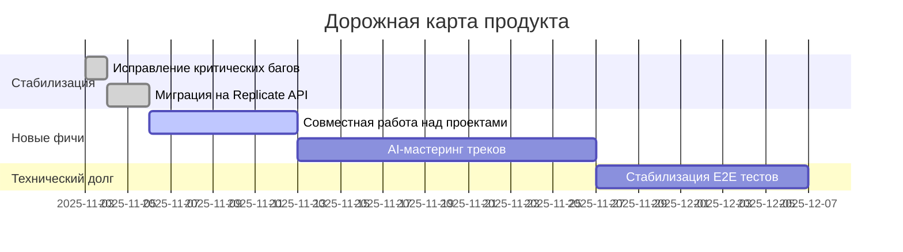

# 🎯 Дашборд управления проектом

Этот документ — центральный хаб для отслеживания прогресса разработки Albert3 Muse Synth Studio.

---

##  Sprint 32: Миграция на Replicate и Стабилизация

**Статус:** 🟢 **В процессе**
**Период:** 2025-11-03 – 2025-11-10

### Ключевые цели спринта:

| Задача | Приоритет | Статус | Ответственный |
| :--- | :--- | :--- | :--- |
| **Исправить баг с версиями треков** | 🔥 Критический | ✅ **Готово** | Jules |
| **Мигрировать `analyze-audio` на Replicate**| 🔥 Критический | ✅ **Готово** | Jules |
| Улучшить `README.md` и документацию | 💧 Средний | ✅ **Готово** | Jules |
| Визуализировать управление задачами | 💧 Средний | ✅ **Готово** | Jules |
| Покрыть тестами `useTrackVersions` | 🧊 Низкий | ⏳ В ожидании | - |

**Подробный план спринта:** [ `./SPRINT_32_PLAN.md`](./SPRINT_32_PLAN.md)
**Текущий статус:** [ `./SPRINT_32_STATUS.md`](./SPRINT_32_STATUS.md)

---

## 🗺️ Дорожная карта (Roadmap) на Q4 2025

**Полная дорожная карта:** [ `./DEVELOPMENT_ROADMAP.md`](./DEVELOPMENT_ROADMAP.md)

---

## 📚 Быстрые ссылки

| Раздел | Описание | Ссылка |
| :--- | :--- | :--- |
| 🗂️ **Бэклог** | Список всех задач и идей. | [ `./tasks/`](./tasks/) |
|  sprint **Планы спринтов** | Планы на текущий и будущие спринты. | [ `./sprints/`](./sprints/) |
| 📊 **Отчёты** | Отчёты о завершённых спринтах. | [ `./reports/`](./reports/) |
|  milestones **Вехи (Milestones)** | Ключевые точки в развитии проекта. | [ `./milestones/`](./milestones/) |
|  debt **Технический долг** | План по устранению техдолга. | [ `./TECHNICAL_DEBT_PLAN.md`](./TECHNICAL_DEBT_PLAN.md) |

---
