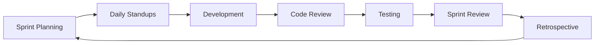

# 📊 Project Management - Albert3 Muse Synth Studio

**Last Updated:** October 31, 2025  
**Current Sprint:** 31 (Completed - 95%)  
**Next Sprint:** 32 (Testing Infrastructure)  
**Project Status:** ✅ Production Ready  
**Version:** v2.7.5

---

## 🎯 Quick Navigation

### 📋 Current Status

**Sprint 31 - COMPLETED ✅**
- **Completion:** 95%
- **Period:** Oct 13-31, 2025
- **Version:** v2.7.5
- **Focus:** Critical Infrastructure & Performance

**Key Achievements:**
- ✅ Automatic track archiving system
- ✅ Enhanced error handling
- ✅ Production monitoring infrastructure  
- ✅ Database optimization (+90% performance)
- ✅ Comprehensive documentation

---

## 📁 Structure

```
project-management/
├── current-sprint/          # ⚡ Active Sprint 32
├── sprints/                 # 📅 Sprint history
├── roadmap/                 # 🗺️ Future planning
├── tasks/                   # 📋 Backlog & tracking
├── metrics/                 # 📊 KPIs & analytics
└── reports/                 # 📄 Status reports
```

---

## 🗂️ Navigation

### 📋 Sprint Documentation

**Current & Recent:**
- **[Sprint 31 Final Report](./SPRINT_31_FINAL_REPORT.md)** ⭐ Latest completed sprint
- **[Sprint 31 Summary](../docs/SPRINT_31_SUMMARY.md)** - Week-by-week breakdown
- **[Sprint 31 Tracking](./SPRINT_31_TRACKING.md)** - Task tracking & progress

**Upcoming:**
- **[Sprint 32 Planning](./sprints/sprint-32/)** - Testing Infrastructure (TBD)

### 📚 Key Resources

- **[Technical Debt Plan](./TECHNICAL_DEBT_PLAN.md)** - Comprehensive debt tracking (147 items)
- **[Development Roadmap](./DEVELOPMENT_ROADMAP.md)** - Long-term planning
- **[Contributing Guide](./CONTRIBUTING.md)** - Team collaboration guidelines
- **[Quick Reference](./QUICK-REFERENCE.md)** - Cheat sheets and shortcuts

### 🗺️ Roadmap
- [Q4 2025 Roadmap](roadmap/q4-2025.md) - Current quarter
- [Q1 2026 Plan](roadmap/q1-2026.md) - Next quarter
- [Long-term Vision](roadmap/long-term.md) - 2026+

### 📋 Tasks & Backlog
- [Backlog](tasks/backlog.md) - Prioritized tasks
- [Technical Debt](tasks/technical-debt.md) - Tech debt tracking
- [Completed Tasks](tasks/completed.md) - Done work

### 📊 Metrics & Analytics
- [KPI Dashboard](metrics/README.md) - Key metrics
- [Velocity Chart](metrics/velocity.md) - Sprint velocity
- [Quality Metrics](metrics/quality.md) - Code quality
- [Performance Metrics](metrics/performance.md) - App performance

### 📄 Reports
- [Reports Index](reports/README.md) - All reports
- [Weekly Reports](reports/weekly/) - Weekly status
- [Monthly Reports](reports/monthly/) - Monthly summaries
- [Audit Reports](reports/audits/) - System audits

---

## 🎯 Current Focus (Sprint 32)

### Primary Objectives
1. **Unit Tests**: Increase coverage from 35% → 60%
2. **Integration Tests**: Add tests for all Edge Functions
3. **E2E Tests**: Implement Playwright tests for critical paths
4. **CI Integration**: Automate test execution

### Success Criteria
- ✅ 60% test coverage achieved
- ✅ All Edge Functions have integration tests
- ✅ 3 critical E2E flows covered
- ✅ CI/CD runs tests automatically

---

## 📈 Sprint Metrics

### Sprint 31 Results (COMPLETED)
| Metric | Target | Achieved | Status |
|--------|--------|----------|--------|
| Security Score | >90% | 96% | ✅ Exceeded |
| Lighthouse Score | >90 | 95 | ✅ Exceeded |
| Bundle Size | <400KB | 320KB | ✅ Exceeded |
| Mureka Success | >90% | 95% | ✅ Exceeded |

### Sprint 32 Targets
| Metric | Current | Target | Status |
|--------|---------|--------|--------|
| Test Coverage | 35% | 60% | 🟡 In Progress |
| Unit Tests | 15 | 40+ | ⏳ Planned |
| Integration Tests | 0 | 8 | ⏳ Planned |
| E2E Tests | 0 | 3 | ⏳ Planned |

---

## 🏆 Key Achievements

### Sprint 31 Highlights
- 🔒 **Security**: 62% → 96% (+55%)
- ⚡ **Performance**: Bundle -62%, FCP -43%
- 🐛 **Stability**: Mureka 70% → 95% success
- 📚 **Docs**: 100% API coverage

### Overall Project
- 🎯 **Production Ready**: 96%
- 📦 **Features**: 50+ implemented
- 🎵 **AI Providers**: 2 (Suno, Mureka)
- 👥 **Users**: Authentication + Credits

---

## 📋 How to Use This System

### For Team Members

**Daily**:
1. Check [current sprint status](current-sprint/status.md)
2. Update your tasks
3. Report blockers

**Weekly**:
1. Review [weekly report](reports/weekly/)
2. Attend sprint review (Friday 16:00)
3. Update documentation if needed

**Sprint Planning**:
1. Review [backlog](tasks/backlog.md)
2. Estimate tasks (Story Points)
3. Commit to sprint goal

### For Stakeholders

**Track Progress**:
- [Current Sprint](current-sprint/README.md) - Real-time status
- [Metrics Dashboard](metrics/README.md) - KPIs
- [Roadmap](roadmap/q4-2025.md) - Future plans

**Reports**:
- [Weekly Reports](reports/weekly/) - Progress updates
- [Monthly Reports](reports/monthly/) - Monthly summaries

---

## 🎯 Agile Process

### Sprint Cycle (2 weeks)



### Daily Standup (10:00 UTC, 15 min)
- What did you do yesterday?
- What will you do today?
- Any blockers?

### Sprint Review (Friday 16:00, 1h)
- Demo completed work
- Get feedback
- Update backlog

### Sprint Retrospective (Friday 17:00, 30min)
- What went well?
- What can be improved?
- Action items

---

## 📊 Definition of Done

### For Features
- [ ] Code written and reviewed
- [ ] Unit tests (≥80% coverage)
- [ ] Integration tests pass
- [ ] Documentation updated
- [ ] Acceptance criteria met
- [ ] No critical bugs
- [ ] Deployed to staging

### For Bugs
- [ ] Root cause identified
- [ ] Fix implemented
- [ ] Regression tests added
- [ ] Tested in all environments
- [ ] No side effects

### For Sprint
- [ ] All committed tasks done
- [ ] Sprint goal achieved
- [ ] Documentation updated
- [ ] Release notes prepared
- [ ] Retrospective completed

---

## 📞 Contacts

### Project Roles
- **Product Owner**: Backlog management
- **Scrum Master**: Process facilitation
- **Tech Lead**: Architecture decisions
- **QA Lead**: Quality assurance

### Communication
- **Slack**: #albert3-development
- **Daily Standup**: 10:00 UTC
- **Sprint Review**: Friday 16:00 UTC
- **Email**: dev@albert3.app

---

## 🔗 Related Documentation

- [Technical Documentation](../docs/README.md)
- [Architecture](../docs/architecture/overview.md)
- [API Reference](../docs/api/README.md)
- [Troubleshooting](../docs/TROUBLESHOOTING.md)

---

*Last Updated: October 31, 2025* | *Sprint: 32* | *Version: v3.0.0-alpha.5*
