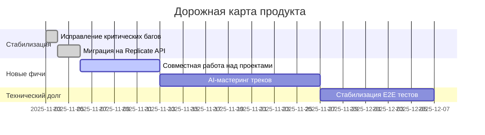

# 🎯 Дашборд управления проектом

Этот документ — центральный хаб для отслеживания прогресса разработки Albert3 Muse Synth Studio.

---

## 🏃 Текущий статус разработки (Ноябрь 2025)

**Последний спринт:** Sprint 32 (Тестирование и надёжность) - ✅ **ЗАВЕРШЁН**
**Дата обновления:** 06 ноября 2025

### Недавние достижения:

| Категория | Задача | Статус |
| :--- | :--- | :--- |
| 🔒 **Безопасность** | JWT аутентификация в Edge Functions | ✅ Завершено |
| 🔒 **Безопасность** | Централизованное логирование (30+ исправлений) | ✅ Завершено |
| 📦 **Зависимости** | Удаление устаревших зависимостей | ✅ Завершено |
| 🧹 **Чистота кода** | Удаление мёртвого кода | ✅ Завершено |
| 📚 **Документация** | Организация отчётов и спринтов | ✅ Завершено |

### Завершённые спринты:

- **Sprint 32:** Тестирование и надёжность → [Финальный отчёт](./sprints/sprint-32/SPRINT_32_FINAL_REPORT.md)
- **Sprint 31:** Критические исправления → [Итоги](./sprints/sprint-31/final-report.md)
- **Sprint 30:** Оптимизация и мониторинг → [Завершение](./sprints/sprint-30/completed.md)

**Все спринты:** [./sprints/](./sprints/)

---

## 🗺️ Дорожная карта (Roadmap) на Q4 2025

**Полная дорожная карта:** [ `./DEVELOPMENT_ROADMAP.md`](./DEVELOPMENT_ROADMAP.md)

---

## 📚 Быстрые ссылки

| Раздел | Описание | Ссылка |
| :--- | :--- | :--- |
| 🗂️ **Бэклог** | Список всех задач и идей. | [ `./tasks/`](./tasks/) |
|  sprint **Планы спринтов** | Планы на текущий и будущие спринты. | [ `./sprints/`](./sprints/) |
| 📊 **Отчёты** | Отчёты о завершённых спринтах. | [ `./reports/`](./reports/) |
|  milestones **Вехи (Milestones)** | Ключевые точки в развитии проекта. | [ `./milestones/`](./milestones/) |
|  debt **Технический долг** | План по устранению техдолга. | [ `./TECHNICAL_DEBT_PLAN.md`](./TECHNICAL_DEBT_PLAN.md) |

---
