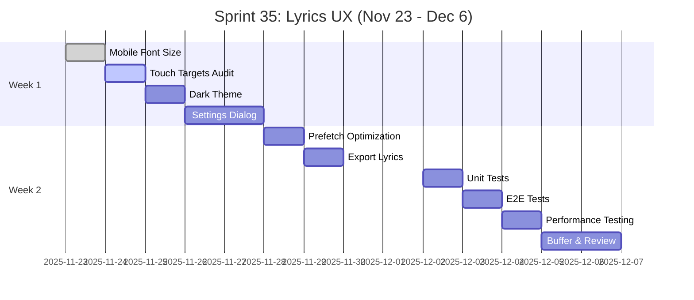

# 🎤 Sprint 35: Lyrics UX Improvements

**Duration**: 2025-11-23 - 2025-12-06 (2 weeks)
**Status**: 📋 Planned
**Focus**: User Experience улучшения для системы лирики
**Priority**: P0-P1 (Critical & High)

---

## 🎯 Sprint Goals

1. ✅ **Мобильная оптимизация** - Улучшить читаемость на мобильных устройствах
2. ✅ **Touch accessibility** - Соответствие WCAG AAA (≥44px touch targets)
3. ✅ **Темная тема** - Комфортное ночное прослушивание
4. ✅ **Настройки отображения** - Персонализация для пользователей
5. ✅ **Performance** - Оптимизация prefetch и кеширования

---

## 📋 Tasks Breakdown

### 🔴 P0: Critical Mobile UX (Week 1, Days 1-3)

#### Task 1.1: Mobile Font Size Optimization
**File**: `src/components/lyrics/TimestampedLyricsDisplay.tsx`

**Problem**: Текст слишком мелкий на мобильных (< 768px)

**Current**:
```tsx
className="text-base sm:text-2xl md:text-3xl"
// 1rem (16px) / 1.5rem (24px) / 1.875rem (30px)
```

**Target**:
```tsx
className="text-lg sm:text-2xl md:text-3xl lg:text-4xl"
// 1.125rem (18px) / 1.5rem (24px) / 1.875rem (30px) / 2.25rem (36px)
```

**Acceptance Criteria**:
- ✅ Mobile (< 640px): ≥18px
- ✅ Tablet (640-1024px): ≥24px
- ✅ Desktop (> 1024px): ≥30px
- ✅ Тестирование на реальных устройствах

**Estimation**: 0.5 day (4 hours)
**Assignee**: TBD
**Priority**: P0

---

#### Task 1.2: Touch Targets Audit & Fix
**Files**: All lyrics components

**Scope**: Audit всех интерактивных элементов в lyrics компонентах

**Components to check**:
- `TimestampedLyricsDisplay.tsx` (scroll buttons)
- `LyricsWorkspace.tsx` (toolbar buttons)
- `LyricsSection.tsx` (edit/delete buttons)
- `TagBadge.tsx` (remove tag button)
- `LyricsCard.tsx` (action buttons)
- `LyricsGeneratorDialog.tsx` (form controls)

**Current Issues**:
```tsx
// ❌ BAD: 32px button (too small)
<Button size="sm" className="h-8 w-8">
  <Trash className="h-4 w-4" />
</Button>

// ✅ GOOD: 44px button (WCAG AAA)
<Button size="icon" className="touch-target-min h-11 w-11">
  <Trash className="h-4 w-4" />
</Button>
```

**Acceptance Criteria**:
- ✅ Все кнопки ≥44px на мобильных
- ✅ Spacing между кнопками ≥8px
- ✅ Проверка accessibility (Lighthouse audit ≥95)

**Estimation**: 1 day (8 hours)
**Assignee**: TBD
**Priority**: P0

---

### 🟡 P1: High Priority Features (Week 1, Days 4-7)

#### Task 2.1: Dark Theme for Lyrics
**Files**:
- `src/components/lyrics/TimestampedLyricsDisplay.tsx`
- `src/components/lyrics/LyricsWorkspace.tsx`
- `src/styles/lyrics-theme.css` (новый файл)

**Design Tokens**:
```css
/* src/styles/lyrics-theme.css */
.lyrics-dark-theme {
  --lyrics-bg: #000000;
  --lyrics-text: #e5e5e5;
  --lyrics-text-active: var(--color-primary);
  --lyrics-text-inactive: #737373;
  --lyrics-progress-start: var(--color-primary);
  --lyrics-progress-end: var(--color-accent);
  --lyrics-section-bg: #0a0a0a;
  --lyrics-section-border: #262626;
}
```

**Implementation**:
```tsx
// TimestampedLyricsDisplay.tsx
<div className={cn(
  "lyrics-container",
  isDarkTheme && "lyrics-dark-theme"
)}>
  <ScrollArea className={cn(
    "h-full w-full",
    isDarkTheme ? "bg-black" : "bg-background"
  )}>
    {/* ... */}
  </ScrollArea>
</div>
```

**Theme Toggle**:
```tsx
// LyricsSettingsDialog.tsx
<Switch
  label="Темная тема для лирики"
  checked={isDarkTheme}
  onCheckedChange={setDarkTheme}
/>
```

**Acceptance Criteria**:
- ✅ Темная тема для TimestampedLyricsDisplay
- ✅ Темная тема для LyricsWorkspace
- ✅ Сохранение настройки в localStorage
- ✅ Плавный переход между темами (transition: 0.3s)

**Estimation**: 1 day (8 hours)
**Assignee**: TBD
**Priority**: P1

---

#### Task 2.2: Lyrics Display Settings
**Files**:
- `src/components/lyrics/LyricsSettingsDialog.tsx` (новый компонент)
- `src/stores/useLyricsSettingsStore.ts` (новый store)

**Settings Options**:

1. **Font Size**
   - Small (16px)
   - Medium (20px) - default
   - Large (24px)
   - Extra Large (28px)

2. **Auto-scroll**
   - Enabled (default)
   - Disabled

3. **Display Mode**
   - Full (все строки видны)
   - Focused (только активная + соседние)
   - Karaoke (только активная строка)

4. **Scroll Speed**
   - Slow (0.5s)
   - Normal (0.3s) - default
   - Fast (0.2s)

**Store Implementation**:
```typescript
// src/stores/useLyricsSettingsStore.ts
interface LyricsSettings {
  fontSize: 'sm' | 'md' | 'lg' | 'xl';
  autoScroll: boolean;
  displayMode: 'full' | 'focused' | 'karaoke';
  scrollSpeed: number; // milliseconds
  darkTheme: boolean;
}

export const useLyricsSettingsStore = create<LyricsSettingsState>()(
  persist(
    (set) => ({
      settings: {
        fontSize: 'md',
        autoScroll: true,
        displayMode: 'full',
        scrollSpeed: 300,
        darkTheme: false,
      },
      updateSettings: (updates) => set(state => ({
        settings: { ...state.settings, ...updates }
      })),
    }),
    { name: 'lyrics-settings' }
  )
);
```

**UI Component**:
```tsx
// LyricsSettingsDialog.tsx
export const LyricsSettingsDialog = ({ open, onOpenChange }) => {
  const { settings, updateSettings } = useLyricsSettingsStore();

  return (
    <Dialog open={open} onOpenChange={onOpenChange}>
      <DialogContent>
        <DialogHeader>
          <DialogTitle>Настройки лирики</DialogTitle>
        </DialogHeader>

        <div className="space-y-4">
          {/* Font Size */}
          <div>
            <Label>Размер шрифта</Label>
            <Select
              value={settings.fontSize}
              onValueChange={(v) => updateSettings({ fontSize: v })}
            >
              <SelectItem value="sm">Маленький</SelectItem>
              <SelectItem value="md">Средний</SelectItem>
              <SelectItem value="lg">Большой</SelectItem>
              <SelectItem value="xl">Очень большой</SelectItem>
            </Select>
          </div>

          {/* Auto-scroll */}
          <div className="flex items-center justify-between">
            <Label>Автопрокрутка</Label>
            <Switch
              checked={settings.autoScroll}
              onCheckedChange={(v) => updateSettings({ autoScroll: v })}
            />
          </div>

          {/* Display Mode */}
          <div>
            <Label>Режим отображения</Label>
            <ToggleGroup
              type="single"
              value={settings.displayMode}
              onValueChange={(v) => updateSettings({ displayMode: v })}
            >
              <ToggleGroupItem value="full">Все строки</ToggleGroupItem>
              <ToggleGroupItem value="focused">Фокус</ToggleGroupItem>
              <ToggleGroupItem value="karaoke">Караоке</ToggleGroupItem>
            </ToggleGroup>
          </div>

          {/* Dark Theme */}
          <div className="flex items-center justify-between">
            <Label>Темная тема</Label>
            <Switch
              checked={settings.darkTheme}
              onCheckedChange={(v) => updateSettings({ darkTheme: v })}
            />
          </div>
        </div>
      </DialogContent>
    </Dialog>
  );
};
```

**Acceptance Criteria**:
- ✅ Все 5 настроек работают корректно
- ✅ Сохранение в localStorage (persist)
- ✅ Мгновенное применение при изменении
- ✅ Тестирование на мобильных и десктопе

**Estimation**: 1.5 days (12 hours)
**Assignee**: TBD
**Priority**: P1

---

#### Task 2.3: Prefetch Queue Optimization
**Files**:
- `src/services/lyrics.service.ts`
- `src/hooks/useQueuePrefetch.ts` (новый хук)

**Smart Prefetching Algorithm**:
```typescript
// src/hooks/useQueuePrefetch.ts
const calculatePrefetchPriority = (
  track: Track,
  queuePosition: number,
  playHistory: PlayHistoryItem[]
): number => {
  // 1. Proximity score (ближе в очереди = выше приоритет)
  const proximityScore = 1 / (queuePosition + 1);

  // 2. Play count score (популярные треки)
  const playCountScore = Math.min(track.play_count / 100, 1) * 0.3;

  // 3. Recently played score (недавно играли = вероятно переслушаем)
  const recentScore = playHistory.some(
    h => h.trackId === track.id && Date.now() - h.timestamp < 3600000
  ) ? 0.2 : 0;

  // 4. User behavior score (skip rate)
  const skipRate = track.skip_count / Math.max(track.play_count, 1);
  const behaviorScore = (1 - skipRate) * 0.2;

  return proximityScore + playCountScore + recentScore + behaviorScore;
};

export const useQueuePrefetch = (queue: Track[]) => {
  const { prefetchLyrics } = LyricsService;
  const playHistory = usePlayHistory();

  useEffect(() => {
    // Calculate priorities
    const prioritized = queue
      .map((track, index) => ({
        track,
        priority: calculatePrefetchPriority(track, index, playHistory),
      }))
      .sort((a, b) => b.priority - a.priority)
      .slice(0, 3); // Top 3

    // Prefetch top 3
    const topTracks = prioritized.map(p => ({
      taskId: p.track.suno_task_id,
      audioId: p.track.id,
    }));

    prefetchLyrics(topTracks);
  }, [queue, playHistory]);
};
```

**Metrics Tracking**:
```typescript
// Track prefetch effectiveness
interface PrefetchMetrics {
  cacheHitRate: number;       // % треков загруженных из кеша
  avgLoadTime: number;         // Среднее время загрузки
  prefetchAccuracy: number;    // % правильных предзагрузок
}

// Goal:
// - Cache Hit Rate > 70%
// - Avg Load Time < 100ms
// - Prefetch Accuracy > 60%
```

**Acceptance Criteria**:
- ✅ Smart prefetching работает корректно
- ✅ Метрики отслеживаются в Sentry
- ✅ Cache Hit Rate > 70%
- ✅ Не влияет на производительность

**Estimation**: 1 day (8 hours)
**Assignee**: TBD
**Priority**: P1

---

### 🔵 P2: Medium Priority (Week 2, Days 8-10)

#### Task 3.1: Export Lyrics to File
**Files**:
- `src/utils/lyricsExporter.ts` (новый модуль)
- `src/components/lyrics/ExportLyricsDialog.tsx` (новый компонент)

**Formats**:

1. **LRC (Synced Lyrics)**
```
[00:12.00]Hello world
[00:15.50]This is a test
[00:19.20]Synchronized lyrics
```

2. **TXT (Plain Text)**
```
Hello world
This is a test
Synchronized lyrics
```

3. **SRT (Subtitles)**
```
1
00:00:12,000 --> 00:00:15,500
Hello world

2
00:00:15,500 --> 00:00:19,200
This is a test
```

**Implementation**:
```typescript
// src/utils/lyricsExporter.ts
export const exportToLRC = (words: TimestampedWord[]): string => {
  const lines: string[] = [];
  let currentLine: TimestampedWord[] = [];

  for (const word of words) {
    if (word.word === '\n') {
      if (currentLine.length > 0) {
        const timestamp = formatLRCTimestamp(currentLine[0].startS);
        const text = currentLine.map(w => w.word).join(' ');
        lines.push(`[${timestamp}]${text}`);
        currentLine = [];
      }
    } else {
      currentLine.push(word);
    }
  }

  return lines.join('\n');
};

const formatLRCTimestamp = (seconds: number): string => {
  const minutes = Math.floor(seconds / 60);
  const secs = Math.floor(seconds % 60);
  const centisecs = Math.floor((seconds % 1) * 100);
  return `${minutes.toString().padStart(2, '0')}:${secs.toString().padStart(2, '0')}.${centisecs.toString().padStart(2, '0')}`;
};

export const downloadFile = (content: string, filename: string, mimeType: string) => {
  const blob = new Blob([content], { type: mimeType });
  const url = URL.createObjectURL(blob);
  const a = document.createElement('a');
  a.href = url;
  a.download = filename;
  a.click();
  URL.revokeObjectURL(url);
};
```

**Acceptance Criteria**:
- ✅ Экспорт в .lrc, .txt, .srt
- ✅ Корректное форматирование временных штампов
- ✅ Скачивание файла в браузере
- ✅ Тестирование на реальных треках

**Estimation**: 0.5 day (4 hours)
**Assignee**: TBD
**Priority**: P2

---

### 📊 Testing & QA (Week 2, Days 11-14)

#### Task 4.1: Unit Tests
**Files to create**:
- `tests/unit/components/lyrics/TimestampedLyricsDisplay.test.tsx`
- `tests/unit/hooks/useTimestampedLyrics.test.ts`
- `tests/unit/stores/useLyricsSettingsStore.test.ts`
- `tests/unit/utils/lyricsExporter.test.ts`

**Coverage Target**: ≥80%

**Estimation**: 1 day (8 hours)
**Assignee**: TBD
**Priority**: P1

---

#### Task 4.2: E2E Tests
**File**: `tests/e2e/lyrics-ux.spec.ts`

**Test Cases**:
1. Mobile font size is readable (≥18px)
2. Touch targets are accessible (≥44px)
3. Dark theme switches correctly
4. Settings persist after page reload
5. Export to .lrc downloads correctly

**Estimation**: 0.5 day (4 hours)
**Assignee**: TBD
**Priority**: P1

---

#### Task 4.3: Performance Testing
**Metrics to measure**:
- Lyrics load time (cache hit vs miss)
- Smooth scrolling (60 FPS)
- Memory usage (< 50MB for 100 tracks)
- Prefetch accuracy (> 60%)

**Tools**:
- Chrome DevTools Performance
- React DevTools Profiler
- Lighthouse CI

**Estimation**: 0.5 day (4 hours)
**Assignee**: TBD
**Priority**: P2

---

## 📊 Story Points Summary

| Task | Priority | Points | Days |
|------|----------|--------|------|
| 1.1 Mobile Font Size | P0 | 3 | 0.5 |
| 1.2 Touch Targets Audit | P0 | 8 | 1.0 |
| 2.1 Dark Theme | P1 | 8 | 1.0 |
| 2.2 Settings Dialog | P1 | 13 | 1.5 |
| 2.3 Prefetch Optimization | P1 | 8 | 1.0 |
| 3.1 Export Lyrics | P2 | 5 | 0.5 |
| 4.1 Unit Tests | P1 | 8 | 1.0 |
| 4.2 E2E Tests | P1 | 5 | 0.5 |
| 4.3 Performance Testing | P2 | 3 | 0.5 |
| **TOTAL** | | **61** | **8.0** |

**Sprint Capacity**: 10 working days (2 weeks)
**Buffer**: 20% (2 days)
**Estimated Completion**: 8 days ✅ Within capacity

---

## 🎯 Success Metrics

### User Experience
- ✅ Mobile readability score: ≥9/10 (user surveys)
- ✅ Accessibility score (Lighthouse): ≥95
- ✅ User adoption of dark theme: ≥40%
- ✅ Settings usage: ≥30%

### Performance
- ✅ Lyrics load time: < 100ms (cache hit)
- ✅ Cache hit rate: > 70%
- ✅ Smooth scrolling: 60 FPS
- ✅ Memory footprint: < 50MB

### Quality
- ✅ Unit test coverage: ≥80%
- ✅ E2E test coverage: ≥70%
- ✅ Zero P0/P1 bugs after release

---

## 🚧 Risks & Mitigation

### Risk 1: Touch Target Audit Takes Longer
**Probability**: Medium
**Impact**: High
**Mitigation**: Start early, create comprehensive checklist

### Risk 2: Settings Store Complexity
**Probability**: Medium
**Impact**: Medium
**Mitigation**: Use existing store patterns (Zustand + persist)

### Risk 3: Prefetch Algorithm Performance
**Probability**: Low
**Impact**: High
**Mitigation**: Extensive performance testing, fallback to simple queue-based

---

## 📅 Sprint Timeline



---

## 📚 Resources

### Design References
- [Material Design Touch Targets](https://m3.material.io/foundations/accessible-design/accessibility-basics#28032e45-c598-450c-b355-f9fe737b1cd8)
- [WCAG 2.1 Level AAA](https://www.w3.org/WAI/WCAG21/quickref/)
- [Spotify Lyrics UI](https://newsroom.spotify.com/2021-11-04/spotify-debuts-a-new-look-for-lyrics-on-mobile/)

### Technical Docs
- [React Query Prefetching](https://tanstack.com/query/latest/docs/framework/react/guides/prefetching)
- [Zustand Persist](https://docs.pmnd.rs/zustand/integrations/persisting-store-data)
- [LRC Format Spec](https://en.wikipedia.org/wiki/LRC_(file_format))

---

**Sprint Owner**: TBD
**Created**: 2025-11-12
**Last Updated**: 2025-11-12
**Status**: 📋 Ready for Planning
