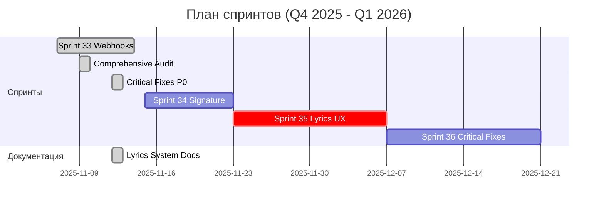

# Статус спринтов

Актуальная сводка по состоянию спринтов проекта.

## Обзор

| Спринт | Даты | Статус | Ключевые результаты | Ссылки |
|---|---|---|---|---|
| Sprint 33: Webhooks Idempotency & Storage Cleanup | 07–14 ноя 2025 | ✅ Завершён | Идемпотентность вебхуков; обработка ошибок; пагинация очистки; CI Deno‑тесты | [Документ спринта](../docs/sprints/SPRINT_33_WEBHOOKS_IDEMPOTENCY_AND_STORAGE_CLEANUP.md) |
| **Comprehensive Audit 2025-11-09** | 09 ноя 2025 | ✅ Завершён | Z-index fixes (P0/P1), security verification, UI/UX audit, functional testing | [Audit Report](../docs/audit/COMPREHENSIVE_AUDIT_2025-11-09.md) |
| **Audit Tech Debt Closure** | 12 ноя 2025 | ✅ Завершён | Lyrics fix (P0), Title & Status fix (P1), Version indicator & Replicate restore (P2) | [Отчет о закрытии](reports/SPRINT_AUDIT_CLOSURE_REPORT_2025-11-12.md) |
| Sprint 34: Webhook Signature & Archival | 15–22 ноя 2025 | ⏳ Запланирован | Документация подписи вебхуков; `archived_at`; интеграционные тесты; метрики | [Документ спринта](../docs/sprints/SPRINT_34_WEBHOOK_SIGNATURE_AND_ARCHIVAL.md) |
| Sprint 35: Lyrics UX Improvements | 23 ноя–06 дек 2025 | 📋 Новый | Mobile optimization, touch accessibility, dark theme, settings dialog, prefetch optimization | [Sprint Plan](SPRINT_35_LYRICS_UX.md) |
| Sprint 36: Critical Fixes & UX | 07–20 дек 2025 | 📋 Запланирован | Error boundaries, network detection, input sanitization, memory leaks (P1 fixes) | [Audit 2025-11-09](../docs/audit/COMPREHENSIVE_AUDIT_2025-11-09.md#phase-2-high-priority-p1---next-sprint) |

## Диаграмма (Mermaid)

