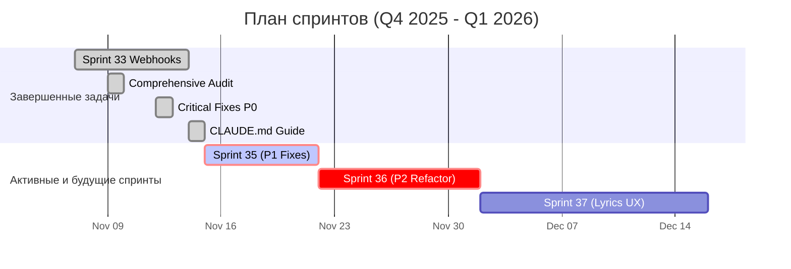

# Статус спринтов

**Последнее обновление:** 15 ноября 2025 г.

> ℹ️ Этот документ отражает историю спринтов. Для актуального обзора и планов, пожалуйста, обратитесь к [**главной панели управления**](./README.md).

---

## Обзор

| Спринт | Даты | Статус | Ключевые результаты | Ссылки |
|---|---|---|---|---|
| **Спринт 36: Music Classification (Phase 1)** | 🟢 **Активен** | 17–24 ноя | Database Foundation для MTG/Discogs классификаторов | `docs/MUSIC_CLASSIFICATION_GUIDE.md` |
| Спринт 35: Критические исправления (P1) | ✅ Завершён | 15–21 ноя | Закрытие всех P1 задач из аудита от 9 ноября | `sprints/SPRINT_35_P1_AUDIT_FIXES.md` |
| Спринт 34: Подпись веб-хуков | ❌ **Отменен** | 15–22 ноя | Приоритет отдан закрытию технического долга | `archive/sprints/SPRINT_34_PLAN.md` |
| Sprint 33: Webhooks Idempotency & Storage Cleanup | ✅ Завершён | 07–14 ноя 2025 | Идемпотентность вебхуков; обработка ошибок; CI Deno‑тесты | [Отчет](../docs/sprints/SPRINT_33_WEBHOOKS_IDEMPOTENCY_AND_STORAGE_CLEANUP.md) |
| Спринт 32: Инфраструктура тестирования | ❌ **Отменен** | 01–28 ноя | Устаревший план, заменен комплексным аудитом | `archive/sprints/sprint-32-obsolete/README.md` |
| **Комплексный аудит** | ✅ Завершён | 09 ноя 2025 | Z-index fixes (P0/P1), security verification, UI/UX audit | [Отчет](../docs/audit/COMPREHENSIVE_AUDIT_2025-11-09.md) |
| **Закрытие тех. долга по аудиту** | ✅ Завершён | 12 ноя 2025 | Lyrics fix (P0), Title & Status fix (P1), Version indicator & Replicate restore (P2) | [Отчет](reports/SPRINT_AUDIT_CLOSURE_REPORT_2025-11-12.md) |

## Диаграмма Ганта (История и План)

