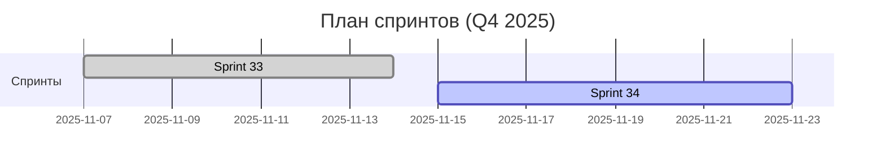

# Статус спринтов

Актуальная сводка по состоянию спринтов проекта.

## Обзор

| Спринт | Даты | Статус | Ключевые результаты | Ссылки |
|---|---|---|---|---|
| Sprint 33: Webhooks Idempotency & Storage Cleanup | 07–14 ноя 2025 | ✅ Завершён | Идемпотентность вебхуков; обработка ошибок; пагинация очистки; CI Deno‑тесты | [Документ спринта](../docs/sprints/SPRINT_33_WEBHOOKS_IDEMPOTENCY_AND_STORAGE_CLEANUP.md) |
| Sprint 34: Webhook Signature & Archival | 15–22 ноя 2025 | ⏳ Запланирован | Документация подписи вебхуков; `archived_at`; интеграционные тесты; метрики | (будет добавлено) |

## Диаграмма (Mermaid)

