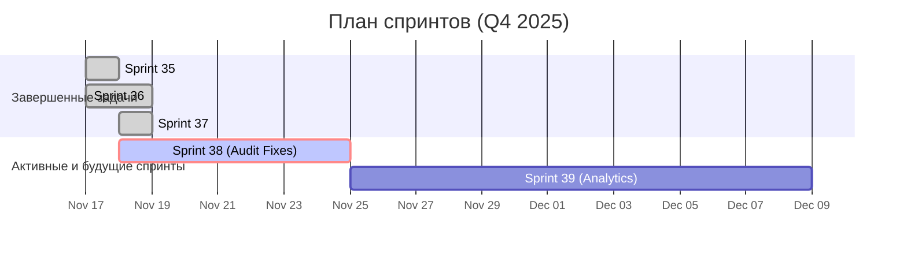

# Статус спринтов

**Последнее обновление:** 17 ноября 2025 г.

> ℹ️ Этот документ отражает историю спринтов. Для актуального обзора и планов, пожалуйста, обратитесь к [**главной панели управления**](./README.md).

---

## Обзор

| Спринт | Даты | Статус | Ключевые результаты | Ссылки |
|---|---|---|---|---|
| **Спринт 38: Audit Implementation** | 🟢 **Активен** | 18–25 ноя | Реализация результатов аудита, фокус на Mobile First. | `sprints/SPRINT_38_AUDIT_IMPLEMENTATION.md` |
| **Спринт 37: Optimization & UI Polish** | ✅ Завершен (Заменен) | 18 ноя | Заменен Спринтом 38 после аудита. | `reports/SPRINT_37_REPORT.md` |
| **Спринт 36: DAW & Bulk Ops** | ✅ Завершен | 17–18 ноя | Интеграция UI для DAW проектов и функция экспорта в ZIP. | `sprints/SPRINT_36_DAW_BULK_OPS.md` |
| **Спринт 35: AI-First Foundation** | ✅ Завершен | 17 ноя | Внедрение системы подписок и лимитов генерации. | `sprints/SPRINT_35_AI_FOUNDATION.md` |
| Спринт 34: Подпись веб-хуков | ❌ **Отменен** | 15–22 ноя | Приоритет отдан закрытию технического долга | `archive/sprints/SPRINT_34_PLAN.md` |
| Sprint 33: Webhooks Idempotency & Storage Cleanup | ✅ Завершён | 07–14 ноя 2025 | Идемпотентность вебхуков; обработка ошибок; CI Deno‑тесты | [Отчет](../docs/sprints/SPRINT_33_WEBHOOKS_IDEMPOTENCY_AND_STORAGE_CLEANUP.md) |
| **Комплексный аудит** | ✅ Завершён | 09 ноя 2025 | UI/UX аудит с фокусом на мобильные устройства. | [Отчет](../docs/audit/COMPREHENSIVE_AUDIT_2024-11-10.md) |
| **Закрытие тех. долга по аудиту** | ✅ Завершён | 12 ноя 2025 | Исправление критических багов по результатам аудита. | [Отчет](reports/SPRINT_AUDIT_CLOSURE_REPORT_2025-11-12.md) |

## Диаграмма Ганта (История и План)

