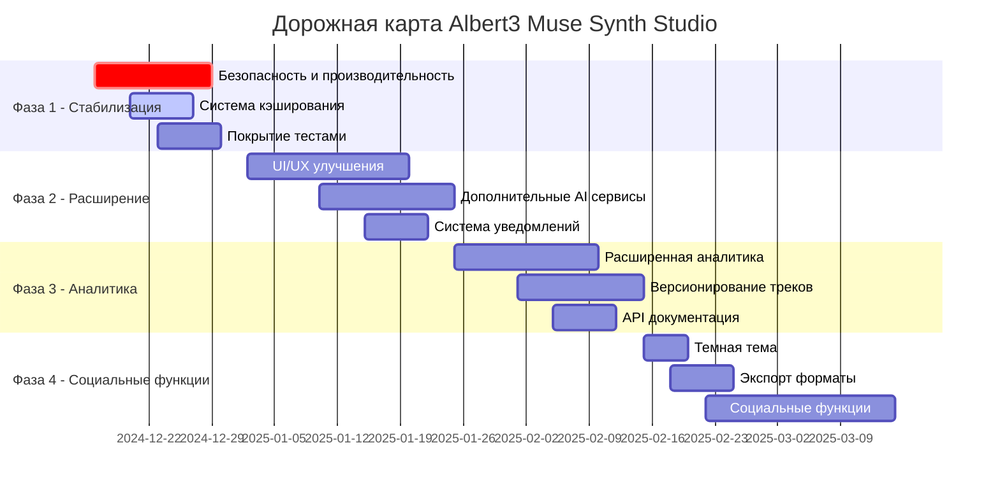

# 🗺️ Дорожная карта Albert3 Muse Synth Studio

*Последнее обновление: Декабрь 2024*

## 🎯 Видение проекта

Albert3 Muse Synth Studio - это передовая платформа для создания музыки с использованием искусственного интеллекта, которая объединяет мощь Suno API с интуитивным пользовательским интерфейсом для создания профессиональной музыки.

## 📅 Временная шкала

## 🏁 Основные вехи

### 🎯 Веха 1: Стабильная платформа (v1.0) - 29 декабря 2024

**Цель**: Создать стабильную, безопасную и производительную основу

#### Ключевые результаты:
- ✅ Устранены все критические уязвимости безопасности
- ✅ Оптимизирована производительность генерации музыки (сокращение времени на 40%)
- ✅ Внедрена система кэширования с Redis
- ✅ Покрытие тестами достигло 80%
- ✅ Настроен CI/CD pipeline

#### Критерии успеха:
- Время отклика API < 2 секунд
- Uptime > 99.5%
- Нет критических уязвимостей
- Все тесты проходят успешно

---

### 🎯 Веха 2: Улучшенный пользовательский опыт (v1.1) - 25 января 2025

**Цель**: Значительно улучшить UX и расширить возможности AI

#### Ключевые результаты:
- ✅ Полностью обновленный UI/UX дизайн
- ✅ Интеграция с OpenAI, Anthropic для генерации текстов
- ✅ Система push-уведомлений
- ✅ Мобильная адаптивность
- ✅ Fallback механизмы для AI сервисов

#### Критерии успеха:
- Пользовательские оценки > 4.5/5
- Время на выполнение задач сокращено на 30%
- Поддержка всех основных устройств
- Доступность 3+ AI провайдеров

---

### 🎯 Веха 3: Аналитика и управление (v1.2) - 15 февраля 2025

**Цель**: Добавить мощные инструменты аналитики и управления контентом

#### Ключевые результаты:
- ✅ Детальная аналитика использования
- ✅ Система версионирования треков
- ✅ Интерактивная API документация
- ✅ Дашборд для мониторинга
- ✅ Автоматические отчеты

#### Критерии успеха:
- Полная видимость метрик производительности
- Возможность отката к любой версии трека
- Самодокументируемое API
- Автоматизированные еженедельные отчеты

---

### 🎯 Веха 4: Социальная платформа (v2.0) - 15 марта 2025

**Цель**: Превратить платформу в социальную сеть для музыкантов

#### Ключевые результаты:
- ✅ Темная тема и персонализация
- ✅ Экспорт в множество форматов (FLAC, OGG, AAC)
- ✅ Система шаринга и комментариев
- ✅ Лайки и рейтинги треков
- ✅ Профили пользователей

#### Критерии успеха:
- Активное сообщество пользователей
- Ежедневное создание и шаринг контента
- Поддержка всех популярных аудио форматов
- Вовлеченность пользователей > 60%

## 🚀 Долгосрочные цели (2025-2026)

### Q2 2025: Мобильное приложение
- Нативные iOS и Android приложения
- Синхронизация с веб-платформой
- Оффлайн режим для воспроизведения

### Q3 2025: Коммерциализация
- Система подписок и платежей
- Премиум функции
- API для разработчиков

### Q4 2025: AI Улучшения
- Собственные AI модели
- Персонализированные рекомендации
- Автоматическое мастеринг

### Q1 2026: Интеграции
- Интеграция с Spotify, Apple Music
- Плагины для DAW (Ableton, FL Studio)
- Коллаборативные функции

## 📊 Ключевые метрики успеха

### Технические метрики
- **Производительность**: Время отклика < 2с, Uptime > 99.9%
- **Качество**: Покрытие тестами > 90%, Bugs < 1/1000 запросов
- **Безопасность**: 0 критических уязвимостей, SOC2 compliance

### Продуктовые метрики
- **Пользователи**: 10K+ активных пользователей к концу 2025
- **Контент**: 100K+ созданных треков
- **Вовлеченность**: 70%+ пользователей возвращаются еженедельно

### Бизнес метрики
- **Конверсия**: 15%+ free-to-paid конверсия
- **Retention**: 80%+ месячный retention
- **NPS**: > 50 Net Promoter Score

## 🔄 Процесс планирования

### Ежемесячное планирование
- Ревью прогресса по вехам
- Корректировка приоритетов
- Планирование следующего месяца

### Квартальное планирование
- Стратегический ревью
- Обновление дорожной карты
- Планирование ресурсов

### Годовое планирование
- Определение стратегических целей
- Бюджетирование
- Планирование команды

## 🎯 Критерии готовности (Definition of Done)

### Для каждой вехи:
- [ ] Все запланированные функции реализованы
- [ ] Покрытие тестами соответствует стандартам
- [ ] Проведен security audit
- [ ] Обновлена документация
- [ ] Проведено пользовательское тестирование
- [ ] Получено одобрение stakeholders

### Для релиза:
- [ ] Все критические баги исправлены
- [ ] Performance тесты пройдены
- [ ] Готов rollback план
- [ ] Команда поддержки проинформирована
- [ ] Мониторинг настроен

## 📞 Ответственные

- **Product Owner**: [Указать контакт]
- **Tech Lead**: [Указать контакт]
- **Engineering Manager**: [Указать контакт]
- **Design Lead**: [Указать контакт]
- **QA Lead**: [Указать контакт]

---

*Дорожная карта пересматривается ежемесячно и обновляется по мере необходимости*