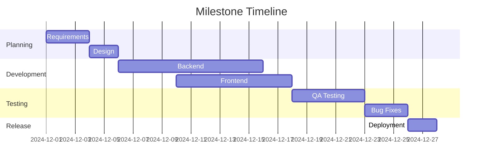
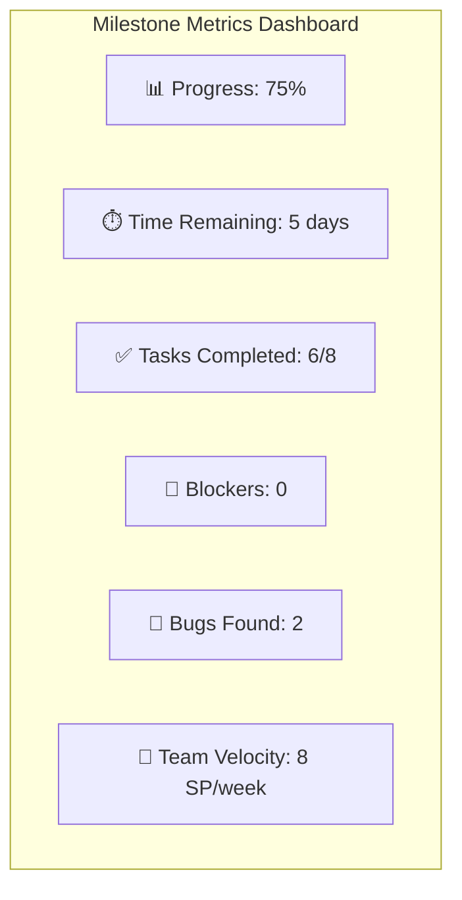

# 🎯 Система отслеживания вех и релизов

*Последнее обновление: Декабрь 2024*

## 🎯 Обзор системы

Система отслеживания вех и релизов обеспечивает структурированный подход к планированию, мониторингу и доставке ключевых функций Albert3 Muse Synth Studio.

## 📋 Структура вех

### Типы вех

#### 🚀 Major Milestones (Крупные вехи)
- **Частота**: Каждые 2-3 месяца
- **Содержание**: Значительные новые функции или архитектурные изменения
- **Примеры**: Новый UI, интеграция с AI, мобильная версия

#### 🔧 Minor Milestones (Малые вехи)
- **Частота**: Каждые 2-4 недели
- **Содержание**: Улучшения существующих функций, исправления
- **Примеры**: Оптимизация производительности, новые настройки

#### 🐛 Hotfix Milestones (Критические исправления)
- **Частота**: По необходимости
- **Содержание**: Критические баги, уязвимости безопасности
- **Примеры**: Исправление критических ошибок, патчи безопасности

## 📊 Шаблон вехи

### Структура документа вехи
```markdown
# Milestone: [Название] v[Версия]

## 📋 Основная информация
- **Версия**: v1.2.0
- **Тип**: Major/Minor/Hotfix
- **Дата начала**: 2024-12-01
- **Планируемая дата завершения**: 2024-12-31
- **Ответственный**: @username
- **Статус**: Planning/In Progress/Testing/Completed/Cancelled

## 🎯 Цели и задачи
### Основная цель
Краткое описание главной цели вехи

### Ключевые задачи
- [ ] Задача 1 - описание
- [ ] Задача 2 - описание
- [ ] Задача 3 - описание

## 📈 Критерии успеха
- Метрика 1: Целевое значение
- Метрика 2: Целевое значение
- Метрика 3: Целевое значение

## 🔗 Связанные Issues
- #123 - Название задачи
- #124 - Название задачи

## 📊 Прогресс
- **Общий прогресс**: 45%
- **Завершенные задачи**: 3/8
- **Заблокированные задачи**: 1
- **Критические проблемы**: 0

## 🚫 Риски и проблемы
### Выявленные риски
1. **Риск 1**: Описание и план митигации
2. **Риск 2**: Описание и план митигации

### Текущие блокеры
- Блокер 1: Описание и план решения

## 📅 Timeline


## 📝 Заметки и решения
- Дата: Важное решение или заметка
```

## 🔄 Процесс управления вехами

### Планирование вехи

#### 1. Создание вехи (Planning)
```bash
# Создание через GitHub CLI
gh milestone create "v1.2.0 - Enhanced Audio Processing" --due-date "2024-12-31" --description "Улучшение обработки аудио и новые эффекты"
```

#### 2. Планирование задач
- Декомпозиция целей на конкретные задачи
- Оценка сложности и времени
- Назначение ответственных
- Определение зависимостей

#### 3. Создание Issues
```bash
# Создание задач для вехи
gh issue create --title "Реализация нового аудио эффекта" --milestone "v1.2.0" --label "enhancement,audio" --assignee "@developer1"
```

### Мониторинг прогресса

#### Еженедельные обновления
```markdown
## Weekly Milestone Update - Week [Номер]

### 📊 Статистика
- **Прогресс**: 65% (было 45%)
- **Завершено задач**: 5/8 (было 3/8)
- **Новые задачи**: 1
- **Заблокированные**: 0 (было 1)

### ✅ Достижения недели
- Завершена интеграция с новым API
- Исправлены критические баги
- Обновлена документация

### 🚫 Проблемы и блокеры
- Задержка с получением API ключей (решено)
- Нужна дополнительная проверка безопасности

### 📅 План на следующую неделю
- Завершить тестирование новых функций
- Подготовить релизные заметки
- Провести финальное QA тестирование
```

### Завершение вехи

#### Критерии готовности к релизу
- [ ] Все задачи завершены
- [ ] Code review пройден
- [ ] Тесты проходят (unit, integration, e2e)
- [ ] QA тестирование завершено
- [ ] Документация обновлена
- [ ] Релизные заметки подготовлены
- [ ] Backup план готов

## 📈 Метрики и KPI

### Основные метрики вех

#### Планирование
- **Accuracy**: Точность оценок времени
- **Scope Creep**: Изменение объема в процессе
- **Resource Utilization**: Использование ресурсов команды

#### Выполнение
- **Velocity**: Скорость выполнения задач
- **Burndown Rate**: Скорость сжигания задач
- **Blocker Resolution Time**: Время решения блокеров

#### Качество
- **Bug Escape Rate**: Баги, найденные после релиза
- **Rollback Rate**: Частота откатов релизов
- **Customer Satisfaction**: Удовлетворенность пользователей

### Дашборд метрик


## 🔄 Автоматизация отслеживания

### GitHub Actions для мониторинга

#### Автоматическое обновление прогресса
```yaml
# .github/workflows/milestone-tracking.yml
name: Milestone Tracking

on:
  issues:
    types: [closed, reopened]
  pull_request:
    types: [closed, merged]

jobs:
  update-milestone-progress:
    runs-on: ubuntu-latest
    steps:
      - name: Calculate milestone progress
        run: |
          # Скрипт для расчета прогресса вехи
          MILESTONE_ID=$(gh issue view ${{ github.event.issue.number }} --json milestone --jq '.milestone.number')
          TOTAL_ISSUES=$(gh issue list --milestone $MILESTONE_ID --json number | jq length)
          CLOSED_ISSUES=$(gh issue list --milestone $MILESTONE_ID --state closed --json number | jq length)
          PROGRESS=$((CLOSED_ISSUES * 100 / TOTAL_ISSUES))
          echo "Milestone progress: $PROGRESS%"
      
      - name: Update milestone description
        run: |
          # Обновление описания вехи с текущим прогрессом
          gh milestone edit $MILESTONE_ID --description "Progress: $PROGRESS% ($CLOSED_ISSUES/$TOTAL_ISSUES tasks completed)"
```

#### Уведомления о критических событиях
```yaml
# Уведомления в Slack
- name: Notify milestone completion
  if: ${{ env.PROGRESS == 100 }}
  run: |
    curl -X POST -H 'Content-type: application/json' \
    --data '{"text":"🎉 Milestone completed: ${{ env.MILESTONE_TITLE }}"}' \
    ${{ secrets.SLACK_WEBHOOK_URL }}

- name: Alert milestone at risk
  if: ${{ env.DAYS_REMAINING < 3 && env.PROGRESS < 80 }}
  run: |
    curl -X POST -H 'Content-type: application/json' \
    --data '{"text":"⚠️ Milestone at risk: ${{ env.MILESTONE_TITLE }} - ${{ env.PROGRESS }}% complete with ${{ env.DAYS_REMAINING }} days left"}' \
    ${{ secrets.SLACK_WEBHOOK_URL }}
```

### Автоматические отчеты

#### Еженедельный отчет по вехам
```python
# scripts/milestone-report.py
import requests
import json
from datetime import datetime, timedelta

def generate_milestone_report():
    # Получение данных о вехах через GitHub API
    milestones = get_active_milestones()
    
    report = {
        "date": datetime.now().isoformat(),
        "milestones": []
    }
    
    for milestone in milestones:
        milestone_data = {
            "title": milestone["title"],
            "progress": calculate_progress(milestone),
            "due_date": milestone["due_on"],
            "days_remaining": calculate_days_remaining(milestone["due_on"]),
            "risk_level": assess_risk(milestone),
            "completed_tasks": count_completed_tasks(milestone),
            "total_tasks": count_total_tasks(milestone)
        }
        report["milestones"].append(milestone_data)
    
    # Создание GitHub Issue с отчетом
    create_report_issue(report)

def assess_risk(milestone):
    progress = calculate_progress(milestone)
    days_remaining = calculate_days_remaining(milestone["due_on"])
    
    if days_remaining < 7 and progress < 80:
        return "HIGH"
    elif days_remaining < 14 and progress < 60:
        return "MEDIUM"
    else:
        return "LOW"
```

## 📋 Шаблоны и чек-листы

### Чек-лист планирования вехи
```markdown
## Milestone Planning Checklist

### Подготовка
- [ ] Определены цели и задачи
- [ ] Проведен анализ требований
- [ ] Оценены ресурсы и время
- [ ] Выявлены риски и зависимости
- [ ] Назначены ответственные

### Создание
- [ ] Создана веха в GitHub
- [ ] Созданы все необходимые Issues
- [ ] Настроены метки и приоритеты
- [ ] Обновлен roadmap
- [ ] Команда проинформирована

### Документация
- [ ] Создан документ вехи
- [ ] Обновлена архитектурная документация
- [ ] Подготовлены acceptance criteria
- [ ] Созданы тест-планы
```

### Чек-лист завершения вехи
```markdown
## Milestone Completion Checklist

### Разработка
- [ ] Все задачи завершены
- [ ] Code review пройден
- [ ] Merge в main ветку выполнен
- [ ] CI/CD pipeline успешен

### Тестирование
- [ ] Unit тесты проходят
- [ ] Integration тесты проходят
- [ ] E2E тесты проходят
- [ ] Performance тесты проходят
- [ ] Security scan пройден

### Документация
- [ ] API документация обновлена
- [ ] User guide обновлен
- [ ] Changelog подготовлен
- [ ] Release notes созданы

### Релиз
- [ ] Staging деплой успешен
- [ ] Production деплой готов
- [ ] Rollback план подготовлен
- [ ] Мониторинг настроен
```

## 📊 Отчетность и аналитика

### Ежемесячный анализ вех
```markdown
# Monthly Milestone Analysis - [Месяц Год]

## 📈 Общая статистика
- **Запланированных вех**: 4
- **Завершенных вех**: 3
- **Просроченных вех**: 1
- **Средняя точность оценок**: 85%

## 🎯 Выполнение по типам
- **Major Milestones**: 2/2 (100%)
- **Minor Milestones**: 1/2 (50%)
- **Hotfix Milestones**: 0/0 (N/A)

## 📊 Ключевые метрики
- **Average Lead Time**: 18 дней
- **Planning Accuracy**: 85%
- **Scope Creep**: 15%
- **Team Velocity**: 32 SP/месяц

## 🔍 Анализ проблем
### Основные причины задержек
1. Недооценка сложности задач (40%)
2. Внешние зависимости (30%)
3. Изменение требований (20%)
4. Технические проблемы (10%)

### Улучшения на следующий месяц
- Более детальная декомпозиция задач
- Раннее выявление зависимостей
- Буферное время для непредвиденных задач
```

## 🔧 Инструменты и интеграции

### Рекомендуемые инструменты

#### Планирование
- **GitHub Milestones**: Основной инструмент
- **GitHub Projects**: Kanban доски
- **Miro/Figma**: Диаграммы и планирование

#### Мониторинг
- **GitHub Actions**: Автоматизация
- **Slack**: Уведомления
- **Google Sheets**: Дополнительная аналитика

#### Отчетность
- **GitHub API**: Сбор данных
- **Python/Node.js**: Скрипты анализа
- **Markdown**: Документация

### Интеграция с внешними системами
```yaml
# Пример интеграции с Jira (если используется)
jira_integration:
  sync_milestones: true
  create_epics: true
  update_status: true
  
# Интеграция с Slack
slack_integration:
  milestone_updates: "#dev-team"
  risk_alerts: "#management"
  completion_notifications: "#general"
```

---

*Система отслеживания вех обеспечивает прозрачность, предсказуемость и качество доставки продукта*