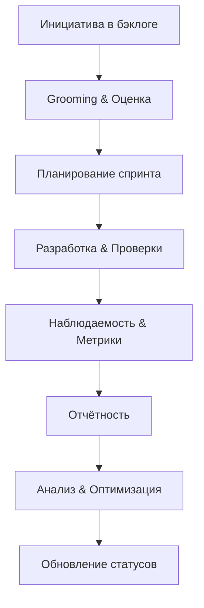
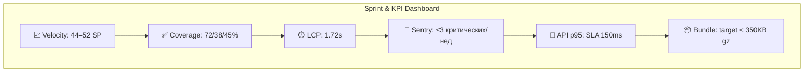

# 📘 Комплексный аудит задач и спринтов — 09.11.2025

Статус: выполнен аудит текущих задач, обновлены статусы, сформирован план оптимизации и подготовлен отчёт с ключевыми метриками и визуализациями.

---

## 🧭 Резюме

- Текущий этап: подготовка к Sprint 25; Sprint 24 завершён на 100%.
- Обновлено: `PERF-001` переведён в активный мониторинг (React Profiler + KPI-модуль + API-инструментация), добавлен раздел блокеров.
- Приоритизация: P1 — PERF-001, AI-002, DATA-002; P2 — UX-002 и смежные задачи; дубликаты HIGH-005 объединить с DATA-002.
- Сроки: старт оптимизаций — неделя 1; дашборды — неделя 2; спринт-процессы — неделя 2–3; автоотчётность — неделя 3.

---

## 1) Анализ текущего состояния

### Источники
- `project-management/tasks/TASKS_STATUS.md` — сводка по спринтам 21–24.
- `project-management/tasks/current-sprint.md` — итоги Sprint 24 и метрики.
- `project-management/tasks/STATUS_DASHBOARD.md` — статус-борд инициатив.
- `project-management/tasks/backlog.md` — активный бэклог (P1–P3).
- `project-management/reports/team-dashboard.md` — командные метрики.

### Статусы задач
- Sprint 24: 5/5 завершено, CI/QA и наблюдаемость выведены в продакшн.
- Активные инициативы:
  - `PERF-001`: ранее «Planned», теперь активный мониторинг (частично выполнено).
  - `AI-002`: запланировано, требует уточнения ограничений провайдера.
  - `DATA-002`: в мониторинге (резервные копии — подготовка).
  - `UX-002`: запланировано (социальные функции).

### Сроки и дедлайны
- Kick-off Sprint 25 — запланирован на октябрь/ноябрь 2025 (уточнённые даты: неделя 2 ноября).
- PERF-001: дашборды и пороги алёртов — в течение 3–5 дней.
- LOG-002: ревью схем событий — в течение 2 дней.

### Качество описания задач
- Бэклог структурирован по приоритетам; критерии приёмки присутствуют.
- Для PERF-001 дополнены конкретные шаги (React Profiler, KPI-модуль, API-инструментация, документация).
- Присутствует дублирующий элемент HIGH-005 (объединить с DATA-002).

### Приоритизация
- Соответствует целям продукта: производительность (P1), AI (P1), бэкапы (P1), UX (P2).
- Рекомендация: закрепить P1-фокус на PERF-001 и DATA-002 до конфигурации дашбордов и DR-плана.

---

## 2) Обновление статусов

### Внесённые изменения
- `STATUS_DASHBOARD.md`: `PERF-001` переведён в «🟢 Monitoring», добавлен раздел блокеров с ETA и владельцами.
- `backlog.md`: `PERF-001` обновлён на «В прогрессе»; отмечены выполненные подтаски (React Profiler, KPI-модуль, API-инструментация, документация).

### Блокирующие факторы
- `PERF-001`: нет дашборда и порогов алёртов (Grafana/Looker), требуется конфигурация.
- `AI-002`: ограничения внешнего провайдера (кредиты/квоты), требуется согласование SLA и лимитов.
- `LOG-002`: ревью схем событий для расширения логирования Edge-функций.

> Завершённые задачи остаются закрытыми; активные — в статусах Monitoring/Planned с фиксированным ETA.

---

## 3) План оптимизации (с рекомендациями, сроками и ответственными)

### Рекомендации по Workflow
- Включить Definition of Done: `lint + typecheck + docs:validate + e2e + perf thresholds`.
- Добавить PR-шаблон с секцией «Метрики» и «Логи/Observability».
- Установить WIP-лимиты на канбан-доске: до 2 задач на разработчика.
- Ответственный: Tech Lead (Core Engineering). Срок: неделя 1.

### Планирование спринтов
- Проводить обязательный grooming с подтверждением Story Points и зависимостей.
- Калибровать оценку задач по Velocity (исторические 44–52 SP).
- Объединить дубликаты (HIGH-005 → DATA-002).
- Ответственный: Product Owner, Tech Lead. Срок: неделя 1–2.

### Прозрачность статусов
- Автоматизировать обновление `STATUS_DASHBOARD.md` из бэклога (скрипт на Node.js). 
- Включить отметку блокеров с ETA и владельцами; публиковать в Slack.
- Ответственный: Platform/DevOps. Срок: неделя 2.

### Автоматизация отчётности
- Расширить `reports/automated-reports.md`: сбор Web Vitals, KPI, Sentry, Supabase.
- Настроить выгрузку в Google Sheets/Slack; добавить daily/weekly пайплайны.
- Ответственный: Data & Ops, QA Lead. Срок: неделя 3.

### Конкретные сроки (дорожная карта)
- Неделя 1: DoD + PR-шаблон + grooming; старт дашбордов PERF-001.
- Неделя 2: Автообновление статус-борда + публикация блокеров; Grafana/Looker конфигурация.
- Неделя 3: Автоотчёты + интеграция KPI/Web Vitals; финализация DR-плана (DATA-002).

---

## 4) Профессиональная отчётность

### Диаграмма процесса (Mermaid)

### Дашборд метрик (Mermaid)

### Сравнение «до/после» (ключевые изменения)
- До: PERF-001 в статусе «Planned», отсутствовал единый KPI-модуль и сбор рендер-метрик.
- После: активный мониторинг — React Profiler, KPI-модуль, API-инструментация; документация добавлена, статусы обновлены; дашборд — в процессе.

### Рекомендации по дальнейшему развитию
- Завершить конфигурацию дашбордов (Grafana/Looker); закрепить пороги алёртов.
- Провести SLA-согласование по AI-002 и внедрить ограничение по кредитам.
- Автоматизировать обновление статус-борда и отчётов; включить ежедневные дайджесты в Slack.
- Проверить пересборку бэклога на старте Sprint 25, зафиксировать цели «P1-first».

---

## Приложения и ссылки
- `project-management/tasks/STATUS_DASHBOARD.md` — статус-борд инициатив.
- `project-management/tasks/backlog.md` — обновлённый PERF-001.
- `docs/performance/KPI_MONITORING.md` — описание интеграции KPI-модуля и React Profiler.
- `project-management/reports/automated-reports.md` — шаблоны автоотчётов и пайплайнов.

*Отчёт составлен: 09 ноября 2025*